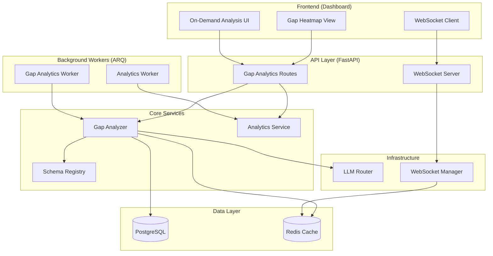
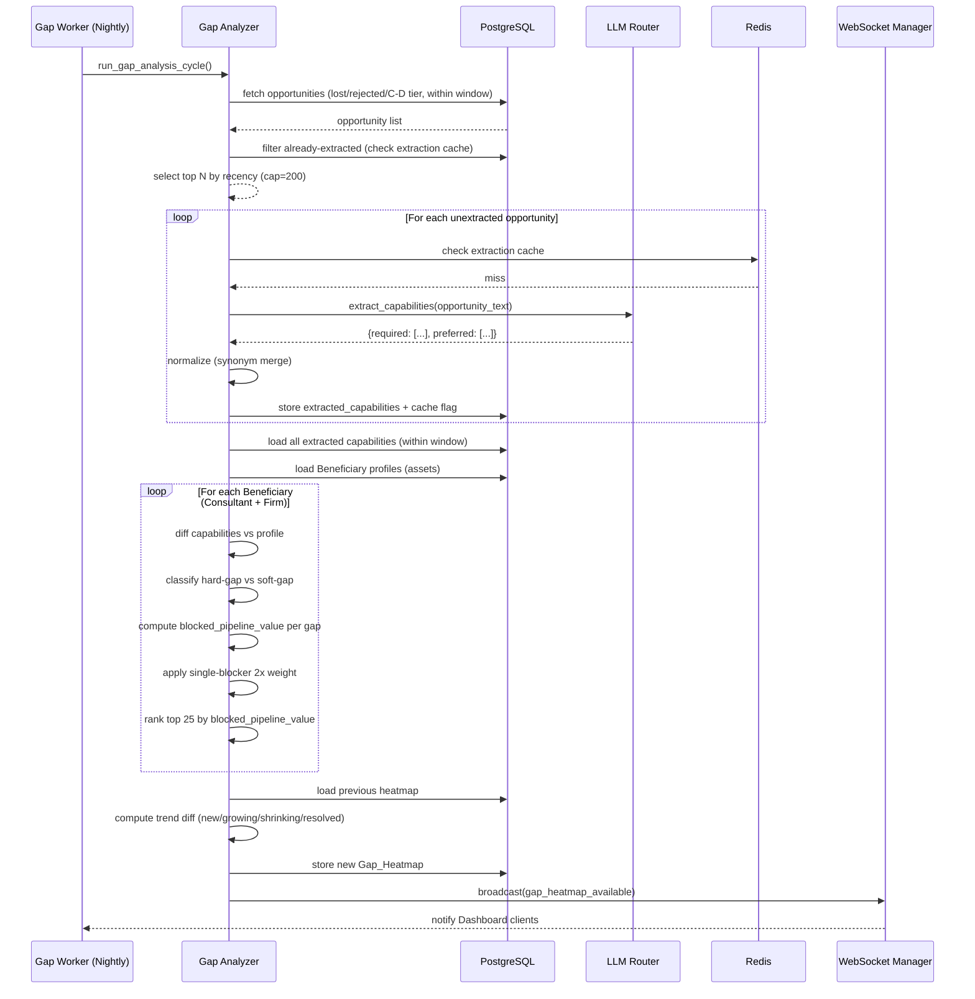
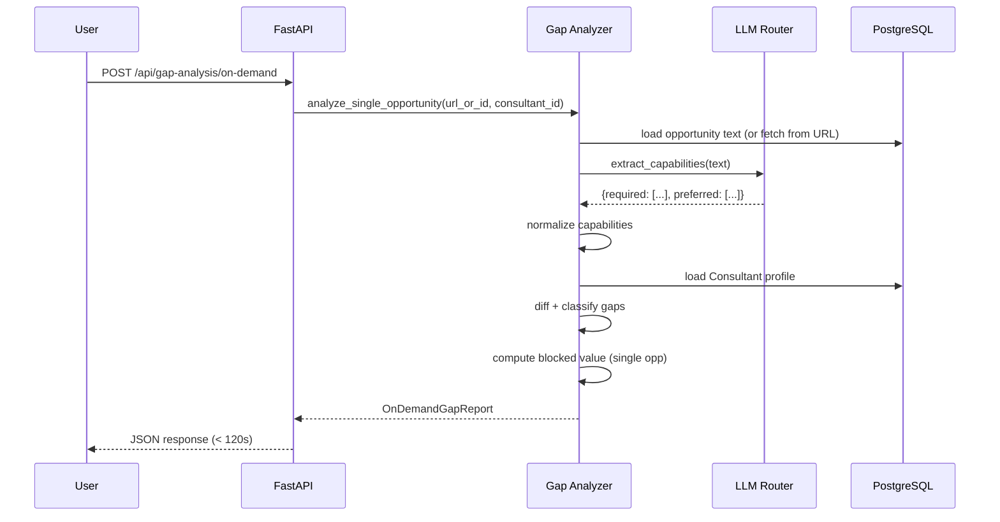
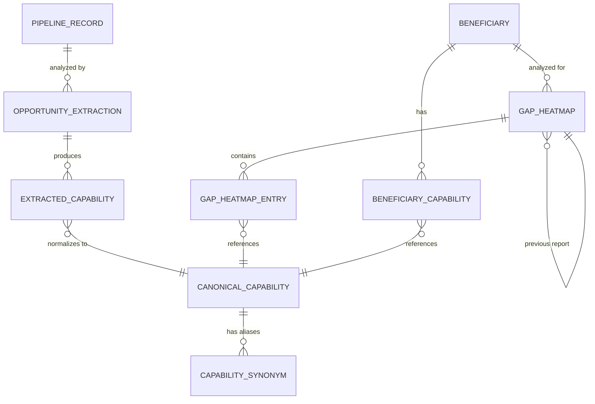

# Technical Design Document: Capability Gap Analytics

## Overview

Capability Gap Analytics extends the existing Analytics_Service to answer the question that conversion metrics cannot: *why* are opportunities being lost or scored low, and which missing capabilities would unlock the most pipeline value if acquired? The feature introduces a **Gap_Analyzer** component that extracts required capabilities from lost/rejected/low-tier opportunities via the LLM_Router, diffs them against Beneficiary capability profiles, and produces a prioritized gap heatmap with estimated blocked pipeline value.

### Design Goals

1. **Data-driven capability investment** — Replace guesswork with pipeline-backed evidence for which skills to acquire
2. **Dual-level analysis** — Individual Consultant gaps and firm-level aggregate gaps from the union of all profiles
3. **Efficient LLM usage** — Extract-once-cache-forever pattern with configurable batch caps and carry-forward
4. **Actionable reporting** — Ranked heatmap with trend diffs (new/growing/shrinking/resolved) and learning recommendations
5. **Real-time notification** — WebSocket push when new heatmaps are available, consistent with existing Dashboard patterns

### Key Architectural Decisions

| Decision | Rationale |
|----------|-----------|
| Component within Analytics_Service | Gap analysis is analytical computation; co-locates with existing funnel/conversion analytics |
| LLM-based extraction over keyword matching | Requirements are expressed in natural language; keyword approaches miss semantic synonyms |
| Extraction caching per opportunity | Opportunity text is immutable once lost/rejected; no need to re-extract |
| Synonym normalization via canonical capability table | Enables aggregation across varied naming (K8s = Kubernetes) |
| Nightly batch with configurable cap (default 200) | Bounds LLM cost per cycle; most-recent-first ensures freshest data processed first |
| Carry-forward queue | Unprocessed opportunities roll to next cycle — no data loss under cap pressure |
| Single-blocker 2x weighting | Surfaces the highest-leverage gaps where one capability would have qualified |
| On-demand analysis within 120s SLA | Supports real-time decision-making during opportunity triage |


## Architecture

### High-Level Component Diagram




### Gap Analysis Data Flow




### On-Demand Single-Opportunity Flow




## Components and Interfaces

### 1. Gap Analyzer (`app/core/gap_analyzer.py`)

The core component that orchestrates capability extraction, normalization, diffing, and heatmap generation.

```python
from dataclasses import dataclass, field
from datetime import date, datetime
from enum import Enum
from typing import Optional


class GapClassification(str, Enum):
    """Classification of a capability gap."""
    HARD = "hard"      # Capability completely absent from profile
    SOFT = "soft"      # Capability present but junior/unevidenced


class GapTrend(str, Enum):
    """Trend classification for a gap between consecutive heatmap reports."""
    NEW = "new"             # Not in previous report
    GROWING = "growing"     # Higher blocked value or frequency than previous
    SHRINKING = "shrinking" # Lower blocked value or frequency than previous
    RESOLVED = "resolved"   # Was in previous report, now absent (capability acquired)


class CapabilityLevel(str, Enum):
    """Level qualifier for an extracted capability requirement."""
    REQUIRED = "required"
    PREFERRED = "preferred"


@dataclass(frozen=True)
class ExtractedCapability:
    """A single capability extracted from an opportunity description."""
    raw_name: str               # Original text from LLM extraction
    canonical_name: str         # Normalized canonical name after synonym merge
    level: CapabilityLevel      # Required or preferred
    opportunity_id: str         # Source opportunity


@dataclass(frozen=True)
class GapEntry:
    """A single gap in the heatmap."""
    canonical_name: str
    classification: GapClassification
    opportunity_count: int          # Number of opportunities requiring this
    blocked_pipeline_value: float   # Sum of estimated blocked value
    is_single_blocker: bool         # Was sole unmet required capability in any opp
    weighted_rank_score: float      # blocked_value * (2 if single_blocker else 1)
    trend: GapTrend | None          # Compared to previous report


@dataclass
class GapHeatmap:
    """The full gap heatmap report for a single Beneficiary or firm-level."""
    id: str
    beneficiary_id: str             # Consultant ID or "__firm__" for firm-level
    generated_at: datetime
    analysis_window_days: int
    gaps: list[GapEntry]            # Top 25, ranked by weighted_rank_score desc
    total_opportunities_analyzed: int
    total_blocked_value: float
    previous_heatmap_id: str | None


@dataclass
class ExtractionResult:
    """Result of LLM-based capability extraction from a single opportunity."""
    opportunity_id: str
    required_capabilities: list[str]    # Raw names before normalization
    preferred_capabilities: list[str]   # Raw names before normalization
    extracted_at: datetime
    cached: bool                        # True if served from cache


@dataclass
class OnDemandGapReport:
    """Result of a single-opportunity gap analysis against one Consultant."""
    opportunity_id: str | None
    opportunity_url: str | None
    consultant_id: str
    required_gaps: list[GapEntry]
    preferred_gaps: list[GapEntry]
    total_required: int
    total_matched: int
    gap_percentage: float               # required_gaps / total_required * 100
    generated_at: datetime


@dataclass
class LearningRecommendation:
    """LLM-generated learning recommendation for a specific gap."""
    canonical_name: str
    resources: list[str]                # Suggested study resources
    effort_estimate: str                # e.g., "2-4 weeks part-time"
    advisory_note: str                  # Disclaimer: "This is advisory only"
    generated_at: datetime


@dataclass
class GapAnalysisConfig:
    """Configuration for gap analysis behavior."""
    analysis_window_days: int = 90
    max_extractions_per_cycle: int = 200
    max_heatmap_entries: int = 25
    single_blocker_weight: float = 2.0
    on_demand_timeout_seconds: int = 120
    default_opportunity_value: float = 10000.0  # Used when opp value unknown


class GapAnalyzer:
    """Orchestrates capability gap analysis: extraction, normalization, diffing, ranking.

    Integrates with:
    - LLM_Router: For capability extraction and learning recommendations
    - SchemaRegistry: For Beneficiary profile access
    - PostgreSQL: For opportunity data, extraction cache, and heatmap storage
    - Redis: For extraction result caching
    - WebSocketManager: For Dashboard notifications
    """

    TIER_WEIGHT_MAP = {
        "A-tier": 1.0,   # Not analyzed (high score)
        "B-tier": 1.0,   # Not analyzed (mid-high score)
        "C-tier": 0.5,   # Lower estimated value weight
        "D-tier": 0.25,  # Lowest estimated value weight
    }

    def __init__(
        self,
        config: GapAnalysisConfig,
        llm_router: "LLMRouter",
        schema_registry: "SchemaRegistry",
        db_session,
        redis_client,
        ws_manager: "WebSocketManager",
    ) -> None:
        self._config = config
        self._llm = llm_router
        self._schema = schema_registry
        self._db = db_session
        self._redis = redis_client
        self._ws = ws_manager


    async def run_nightly_cycle(self) -> dict:
        """Execute the full nightly gap analysis cycle.

        Steps:
        1. Fetch eligible opportunities (lost/rejected/C-D tier, within window)
        2. Filter already-extracted opportunities
        3. Extract capabilities from up to max_extractions_per_cycle opps (most recent first)
        4. Carry forward remainder to next cycle
        5. Generate heatmaps for each Consultant and firm-level
        6. Compute trend diffs against previous reports
        7. Notify Dashboard via WebSocket

        Returns:
            Summary dict with counts: extracted, carried_forward, heatmaps_generated.
        """
        ...

    async def extract_capabilities(
        self, opportunity_id: str, opportunity_text: str
    ) -> ExtractionResult:
        """Extract capabilities from an opportunity description via LLM.

        Uses Redis cache keyed by opportunity_id. If cached, returns immediately.
        Otherwise, calls LLM_Router and stores result in both Redis and PostgreSQL.

        Args:
            opportunity_id: UUID of the opportunity/pipeline_record.
            opportunity_text: Full text description of the opportunity.

        Returns:
            ExtractionResult with required and preferred capabilities.
        """
        ...

    def normalize_capability(self, raw_name: str) -> str:
        """Normalize a capability name to its canonical form.

        Applies:
        - Lowercasing
        - Synonym lookup from canonical_capabilities table
        - Whitespace normalization

        Args:
            raw_name: Raw capability name from LLM extraction.

        Returns:
            Canonical capability name string.
        """
        ...


    def compute_gaps(
        self,
        demanded_capabilities: list[ExtractedCapability],
        profile_capabilities: set[str],
        opportunity_values: dict[str, float],
    ) -> list[GapEntry]:
        """Compute gaps by diffing demanded capabilities against a profile.

        Pure computation — no I/O. Suitable for property-based testing.

        Args:
            demanded_capabilities: All extracted capabilities from analyzed opportunities.
            profile_capabilities: Set of canonical capability names the Beneficiary has.
            opportunity_values: Map of opportunity_id -> estimated value.

        Returns:
            List of GapEntry objects, unsorted (caller applies ranking/truncation).
        """
        ...

    def classify_gap(
        self, canonical_name: str, profile_capabilities: set[str],
        profile_levels: dict[str, str]
    ) -> GapClassification:
        """Classify a gap as hard (absent) or soft (present but insufficient).

        Args:
            canonical_name: The canonical capability name.
            profile_capabilities: Set of capabilities the profile declares.
            profile_levels: Map of capability -> level ("senior", "mid", "junior").

        Returns:
            HARD if capability absent, SOFT if present but junior/unevidenced.
        """
        ...

    def rank_gaps(
        self, gaps: list[GapEntry], max_entries: int = 25
    ) -> list[GapEntry]:
        """Rank gaps by weighted_rank_score descending, truncate to max_entries.

        weighted_rank_score = blocked_pipeline_value * (2.0 if single_blocker else 1.0)

        Args:
            gaps: Unranked gap entries.
            max_entries: Maximum entries to return (default 25).

        Returns:
            Top N gaps sorted by weighted_rank_score descending.
        """
        ...


    def compute_trend(
        self, current_gaps: list[GapEntry], previous_gaps: list[GapEntry] | None
    ) -> list[GapEntry]:
        """Compute trend annotations by diffing against previous heatmap.

        Classification rules:
        - NEW: capability not in previous report
        - GROWING: blocked_pipeline_value increased
        - SHRINKING: blocked_pipeline_value decreased
        - RESOLVED: was in previous report but no longer a gap

        Args:
            current_gaps: Current cycle's gap entries.
            previous_gaps: Previous heatmap's gap entries (None if first report).

        Returns:
            Current gaps with trend field populated.
        """
        ...

    def detect_single_blockers(
        self,
        demanded_capabilities: list[ExtractedCapability],
        profile_capabilities: set[str],
    ) -> set[str]:
        """Identify capabilities that were the sole unmet required capability.

        For each opportunity, if exactly one required capability is unmet,
        that capability is a single-blocker.

        Args:
            demanded_capabilities: All extracted capabilities (required only).
            profile_capabilities: Set of canonical names the profile has.

        Returns:
            Set of canonical capability names that are single-blockers.
        """
        ...

    async def analyze_on_demand(
        self,
        opportunity_text: str,
        consultant_id: str,
        opportunity_id: str | None = None,
        opportunity_url: str | None = None,
    ) -> OnDemandGapReport:
        """Perform on-demand gap analysis for a single opportunity.

        Must complete within on_demand_timeout_seconds (default 120s).

        Args:
            opportunity_text: Full text of the opportunity.
            consultant_id: Beneficiary ID to diff against.
            opportunity_id: Optional pipeline record ID.
            opportunity_url: Optional source URL.

        Returns:
            OnDemandGapReport with all identified gaps.
        """
        ...


    async def generate_learning_recommendation(
        self, canonical_name: str
    ) -> LearningRecommendation:
        """Generate an LLM-based learning recommendation for a gap.

        Calls LLM_Router with capability context. Result is advisory only.

        Args:
            canonical_name: The canonical capability name to recommend for.

        Returns:
            LearningRecommendation with resources and effort estimate.
        """
        ...
```


### 2. Gap Analytics Worker (`app/workers/gap_worker.py`)

ARQ task function that triggers the nightly gap analysis cycle, scheduled after the existing analytics daily job.

```python
import logging
from datetime import datetime

logger = logging.getLogger(__name__)


async def run_gap_analysis_cycle(ctx: dict) -> dict:
    """ARQ task: Execute nightly gap analysis cycle.

    Scheduled at 02:30 UTC (after run_analytics_daily at 02:00 UTC).
    Configured via GapAnalysisConfig with defaults:
    - analysis_window_days: 90
    - max_extractions_per_cycle: 200

    Args:
        ctx: ARQ worker context containing shared resources.

    Returns:
        Summary dict: {
            "extracted": int,
            "carried_forward": int,
            "heatmaps_generated": int,
            "duration_seconds": float,
            "timestamp": str
        }
    """
    ...
```


### 3. Gap Analytics API Routes (`app/api/gap_routes.py`)

FastAPI routes for heatmap retrieval, on-demand analysis, and learning recommendations.

```python
from fastapi import APIRouter, Depends, HTTPException, Query
from pydantic import BaseModel, Field
from datetime import datetime

router = APIRouter(prefix="/api/gap-analysis", tags=["gap-analysis"])


class HeatmapResponse(BaseModel):
    """Response model for the gap heatmap endpoint."""
    id: str
    beneficiary_id: str
    generated_at: datetime
    analysis_window_days: int
    gaps: list["GapEntryResponse"]
    total_opportunities_analyzed: int
    total_blocked_value: float


class GapEntryResponse(BaseModel):
    """Single gap entry in the heatmap response."""
    canonical_name: str
    classification: str  # "hard" or "soft"
    opportunity_count: int
    blocked_pipeline_value: float
    is_single_blocker: bool
    weighted_rank_score: float
    trend: str | None  # "new", "growing", "shrinking", "resolved"


class OnDemandRequest(BaseModel):
    """Request body for on-demand gap analysis."""
    opportunity_url: str | None = None
    pipeline_record_id: str | None = None
    consultant_id: str


class OnDemandResponse(BaseModel):
    """Response model for on-demand gap analysis."""
    opportunity_id: str | None
    opportunity_url: str | None
    consultant_id: str
    required_gaps: list[GapEntryResponse]
    preferred_gaps: list[GapEntryResponse]
    total_required: int
    total_matched: int
    gap_percentage: float
    generated_at: datetime


class LearningRecommendationResponse(BaseModel):
    """Response model for learning recommendation."""
    canonical_name: str
    resources: list[str]
    effort_estimate: str
    advisory_note: str
    generated_at: datetime


@router.get("/heatmap/{beneficiary_id}", response_model=HeatmapResponse)
async def get_heatmap(
    beneficiary_id: str,
    opportunity_type: str | None = Query(None, description="Filter by opportunity type"),
) -> HeatmapResponse:
    """Retrieve the latest gap heatmap for a Beneficiary.

    Returns top 25 gaps ranked by blocked pipeline value.
    Supports filtering by opportunity type.
    """
    ...


@router.post("/on-demand", response_model=OnDemandResponse)
async def analyze_on_demand(request: OnDemandRequest) -> OnDemandResponse:
    """Trigger on-demand gap analysis for a single opportunity.

    Must complete within 120 seconds. Provide either opportunity_url
    or pipeline_record_id (not both).
    """
    ...


@router.get("/recommendation/{capability_name}", response_model=LearningRecommendationResponse)
async def get_learning_recommendation(
    capability_name: str,
) -> LearningRecommendationResponse:
    """Generate a learning recommendation for a specific capability gap.

    LLM-generated, clearly labeled as advisory.
    """
    ...


@router.get("/heatmap/{beneficiary_id}/history")
async def get_heatmap_history(
    beneficiary_id: str,
    limit: int = Query(10, ge=1, le=50),
) -> list[dict]:
    """Retrieve historical heatmap summaries for trend tracking."""
    ...
```


### 4. Capability Normalizer (`app/core/capability_normalizer.py`)

Handles synonym resolution and canonical name mapping for extracted capabilities.

```python
from dataclasses import dataclass


@dataclass(frozen=True)
class SynonymMapping:
    """A synonym-to-canonical mapping entry."""
    alias: str              # The synonym or variant spelling
    canonical_name: str     # The canonical capability name


class CapabilityNormalizer:
    """Normalizes raw capability names to canonical forms using synonym mappings.

    Synonym mappings are loaded from the database at startup and cached.
    New unknown capabilities are stored as-is (self-canonical) and flagged
    for manual review/grouping.

    This is a pure computation class for the normalization logic itself.
    """

    def __init__(self, synonym_map: dict[str, str]) -> None:
        """Initialize with a pre-loaded synonym map.

        Args:
            synonym_map: Dict of lowercase alias -> canonical_name.
        """
        self._synonyms = synonym_map

    def normalize(self, raw_name: str) -> str:
        """Normalize a raw capability name to its canonical form.

        Steps:
        1. Strip whitespace, lowercase
        2. Lookup in synonym map
        3. If not found, return the cleaned name (self-canonical)

        Args:
            raw_name: Raw capability name from LLM extraction.

        Returns:
            Canonical capability name.
        """
        cleaned = raw_name.strip().lower()
        return self._synonyms.get(cleaned, cleaned)

    def batch_normalize(self, raw_names: list[str]) -> list[str]:
        """Normalize a batch of capability names.

        Args:
            raw_names: List of raw capability names.

        Returns:
            List of canonical names (same order).
        """
        return [self.normalize(name) for name in raw_names]

    def add_synonym(self, alias: str, canonical_name: str) -> None:
        """Register a new synonym mapping (in-memory; caller persists).

        Args:
            alias: The new alias to register.
            canonical_name: The canonical name it maps to.
        """
        self._synonyms[alias.strip().lower()] = canonical_name.strip().lower()

    def is_known(self, raw_name: str) -> bool:
        """Check if a capability name has a known canonical mapping.

        Args:
            raw_name: Raw capability name.

        Returns:
            True if the name (or a synonym) is in the mapping.
        """
        cleaned = raw_name.strip().lower()
        return cleaned in self._synonyms
```


### 5. WebSocket Integration

Extends the existing WebSocketManager with a new broadcast type for gap heatmap availability.

```python
# Addition to app/core/websocket_manager.py

async def broadcast_heatmap_available(
    self, beneficiary_id: str, heatmap_id: str, generated_at: str
) -> None:
    """Broadcast notification that a new gap heatmap is available.

    Message format:
    {
        "type": "gap_heatmap_available",
        "beneficiary_id": "consultant_1",
        "heatmap_id": "uuid",
        "generated_at": "2024-01-15T02:30:00Z"
    }

    Published to Redis pub/sub channel "gap_updates" for
    multi-worker broadcast.
    """
    message = json.dumps({
        "type": "gap_heatmap_available",
        "beneficiary_id": beneficiary_id,
        "heatmap_id": heatmap_id,
        "generated_at": generated_at,
    })
    await self._redis.publish("gap_updates", message)
    await self._send_to_all(message)
```


## Data Models

### Entity-Relationship Diagram




### PostgreSQL Schema

```sql
-- Canonical capability registry (source of truth for normalized names)
CREATE TABLE canonical_capabilities (
    id UUID PRIMARY KEY DEFAULT gen_random_uuid(),
    canonical_name VARCHAR(200) NOT NULL UNIQUE,
    category VARCHAR(100),  -- e.g., "language", "framework", "methodology", "domain", "certification"
    created_at TIMESTAMPTZ NOT NULL DEFAULT NOW()
);

CREATE INDEX idx_canonical_capabilities_name ON canonical_capabilities(canonical_name);
CREATE INDEX idx_canonical_capabilities_category ON canonical_capabilities(category);

-- Synonym mappings for capability normalization
CREATE TABLE capability_synonyms (
    id UUID PRIMARY KEY DEFAULT gen_random_uuid(),
    alias VARCHAR(200) NOT NULL UNIQUE,
    canonical_id UUID NOT NULL REFERENCES canonical_capabilities(id) ON DELETE CASCADE,
    created_at TIMESTAMPTZ NOT NULL DEFAULT NOW()
);

CREATE INDEX idx_capability_synonyms_alias ON capability_synonyms(alias);

-- Extraction results cached per opportunity (extracted at most once)
CREATE TABLE opportunity_extractions (
    id UUID PRIMARY KEY DEFAULT gen_random_uuid(),
    pipeline_record_id UUID NOT NULL REFERENCES pipeline_records(id),
    extracted_at TIMESTAMPTZ NOT NULL DEFAULT NOW(),
    extraction_model VARCHAR(100),  -- LLM model used for extraction
    UNIQUE(pipeline_record_id)
);

CREATE INDEX idx_opportunity_extractions_record ON opportunity_extractions(pipeline_record_id);


-- Individual extracted capabilities from each opportunity
CREATE TABLE extracted_capabilities (
    id UUID PRIMARY KEY DEFAULT gen_random_uuid(),
    extraction_id UUID NOT NULL REFERENCES opportunity_extractions(id) ON DELETE CASCADE,
    canonical_id UUID NOT NULL REFERENCES canonical_capabilities(id),
    raw_name VARCHAR(200) NOT NULL,
    level VARCHAR(20) NOT NULL CHECK (level IN ('required', 'preferred')),
    created_at TIMESTAMPTZ NOT NULL DEFAULT NOW()
);

CREATE INDEX idx_extracted_capabilities_extraction ON extracted_capabilities(extraction_id);
CREATE INDEX idx_extracted_capabilities_canonical ON extracted_capabilities(canonical_id);
CREATE INDEX idx_extracted_capabilities_level ON extracted_capabilities(level);

-- Beneficiary capability profiles (what each Consultant/team can do)
CREATE TABLE beneficiary_capabilities (
    id UUID PRIMARY KEY DEFAULT gen_random_uuid(),
    beneficiary_id VARCHAR(50) NOT NULL,
    canonical_id UUID NOT NULL REFERENCES canonical_capabilities(id),
    proficiency_level VARCHAR(20) NOT NULL DEFAULT 'senior'
        CHECK (proficiency_level IN ('senior', 'mid', 'junior')),
    evidence TEXT,  -- Optional evidence/context for this capability
    updated_at TIMESTAMPTZ NOT NULL DEFAULT NOW(),
    UNIQUE(beneficiary_id, canonical_id)
);

CREATE INDEX idx_beneficiary_capabilities_ben ON beneficiary_capabilities(beneficiary_id);

-- Gap heatmap reports (one per Beneficiary per cycle)
CREATE TABLE gap_heatmaps (
    id UUID PRIMARY KEY DEFAULT gen_random_uuid(),
    beneficiary_id VARCHAR(50) NOT NULL,
    generated_at TIMESTAMPTZ NOT NULL DEFAULT NOW(),
    analysis_window_days INT NOT NULL DEFAULT 90,
    total_opportunities_analyzed INT NOT NULL DEFAULT 0,
    total_blocked_value NUMERIC(12, 2) NOT NULL DEFAULT 0,
    previous_heatmap_id UUID REFERENCES gap_heatmaps(id),
    opportunity_type_filter VARCHAR(50),  -- NULL means all types
    created_at TIMESTAMPTZ NOT NULL DEFAULT NOW()
);

CREATE INDEX idx_gap_heatmaps_beneficiary ON gap_heatmaps(beneficiary_id, generated_at DESC);
CREATE INDEX idx_gap_heatmaps_generated ON gap_heatmaps(generated_at DESC);


-- Individual gap entries within a heatmap
CREATE TABLE gap_heatmap_entries (
    id UUID PRIMARY KEY DEFAULT gen_random_uuid(),
    heatmap_id UUID NOT NULL REFERENCES gap_heatmaps(id) ON DELETE CASCADE,
    canonical_id UUID NOT NULL REFERENCES canonical_capabilities(id),
    classification VARCHAR(10) NOT NULL CHECK (classification IN ('hard', 'soft')),
    opportunity_count INT NOT NULL DEFAULT 0,
    blocked_pipeline_value NUMERIC(12, 2) NOT NULL DEFAULT 0,
    is_single_blocker BOOLEAN NOT NULL DEFAULT FALSE,
    weighted_rank_score NUMERIC(12, 2) NOT NULL DEFAULT 0,
    trend VARCHAR(20) CHECK (trend IN ('new', 'growing', 'shrinking', 'resolved')),
    rank_position INT NOT NULL,
    UNIQUE(heatmap_id, canonical_id)
);

CREATE INDEX idx_gap_entries_heatmap ON gap_heatmap_entries(heatmap_id, rank_position);
CREATE INDEX idx_gap_entries_canonical ON gap_heatmap_entries(canonical_id);
CREATE INDEX idx_gap_entries_blocker ON gap_heatmap_entries(is_single_blocker)
    WHERE is_single_blocker = TRUE;

-- Carry-forward queue for opportunities not yet processed (over batch cap)
CREATE TABLE gap_extraction_queue (
    id UUID PRIMARY KEY DEFAULT gen_random_uuid(),
    pipeline_record_id UUID NOT NULL REFERENCES pipeline_records(id),
    queued_at TIMESTAMPTZ NOT NULL DEFAULT NOW(),
    priority_score NUMERIC(10, 2) NOT NULL DEFAULT 0,  -- Higher = more recent
    processed BOOLEAN NOT NULL DEFAULT FALSE,
    processed_at TIMESTAMPTZ,
    UNIQUE(pipeline_record_id)
);

CREATE INDEX idx_gap_queue_unprocessed
    ON gap_extraction_queue(priority_score DESC)
    WHERE processed = FALSE;

-- Gap analysis configuration (singleton row pattern)
CREATE TABLE gap_analysis_config (
    id UUID PRIMARY KEY DEFAULT gen_random_uuid(),
    analysis_window_days INT NOT NULL DEFAULT 90,
    max_extractions_per_cycle INT NOT NULL DEFAULT 200,
    max_heatmap_entries INT NOT NULL DEFAULT 25,
    single_blocker_weight NUMERIC(3, 1) NOT NULL DEFAULT 2.0,
    on_demand_timeout_seconds INT NOT NULL DEFAULT 120,
    default_opportunity_value NUMERIC(10, 2) NOT NULL DEFAULT 10000.00,
    updated_at TIMESTAMPTZ NOT NULL DEFAULT NOW()
);
```


## Correctness Properties

*A property is a characteristic or behavior that should hold true across all valid executions of a system — essentially, a formal statement about what the system should do. Properties serve as the bridge between human-readable specifications and machine-verifiable correctness guarantees.*

### Property 1: Opportunity eligibility selection

*For any* set of pipeline records with varying pipeline states (Rejected, Lost, Won, Active, etc.), varying Account_Score tiers (A through D), and varying timestamps, the Gap_Analyzer's selection function SHALL return exactly those records that satisfy: (pipeline_state IN ('rejected', 'lost') OR tier IN ('C-tier', 'D-tier')) AND (record timestamp is within the configured Analysis_Window). No eligible record shall be excluded, and no ineligible record shall be included.

**Validates: Requirements 1.1**

### Property 2: Synonym normalization convergence

*For any* synonym mapping where multiple aliases map to the same canonical name, normalizing any alias in the group SHALL produce the identical canonical string. Additionally, normalization SHALL be idempotent: normalizing an already-canonical name SHALL return itself unchanged.

**Validates: Requirements 1.2**

### Property 3: Extraction caching idempotence

*For any* opportunity that has been previously extracted, a subsequent extraction request for the same opportunity_id SHALL return cached=True and produce the identical ExtractionResult (same required and preferred capabilities) without invoking the LLM_Router.

**Validates: Requirements 1.2**


### Property 4: Batch cap enforcement with recency ordering

*For any* set of N eligible opportunities and a configured max_extractions_per_cycle cap C where N > C, the Gap_Analyzer SHALL process exactly C opportunities, those C opportunities SHALL be the C most-recent by timestamp, and the remaining (N - C) opportunities SHALL appear in the carry-forward queue for the next cycle.

**Validates: Requirements 1.3**

### Property 5: Gap computation as set difference

*For any* set of demanded canonical capabilities D and a Beneficiary's profile capability set P, the individual-level gaps SHALL equal exactly D \ P (set difference: capabilities in demand but not in profile). For firm-level analysis, the gaps SHALL equal D \ U where U is the union of all individual Consultant profiles plus Team capability assets.

**Validates: Requirements 2.1**

### Property 6: Gap aggregation, classification, and single-blocker weighting

*For any* collection of extracted capabilities from multiple opportunities, and a Beneficiary profile with proficiency levels, each computed GapEntry SHALL have: (a) opportunity_count equal to the number of distinct opportunities requiring that capability, (b) blocked_pipeline_value equal to the sum of estimated values of those opportunities, (c) classification of "hard" if the capability is absent from the profile or "soft" if present at junior level, (d) is_single_blocker=True if and only if there exists at least one opportunity where this was the sole unmet required capability, and (e) weighted_rank_score equal to blocked_pipeline_value × 2.0 if is_single_blocker else blocked_pipeline_value × 1.0.

**Validates: Requirements 2.2, 2.3**


### Property 7: Heatmap ranking sorted and capped

*For any* list of GapEntry objects of arbitrary length, the rank_gaps function SHALL return at most max_entries (default 25) entries, and those entries SHALL be sorted by weighted_rank_score in strictly non-increasing order. If the input has fewer than max_entries, all entries are returned (still sorted).

**Validates: Requirements 3.1**

### Property 8: Trend diff classification

*For any* pair of gap entry lists (previous_gaps, current_gaps), the trend annotation for each entry in current_gaps SHALL be: "new" if the canonical_name was not present in previous_gaps; "growing" if it was present and its blocked_pipeline_value has increased; "shrinking" if it was present and its blocked_pipeline_value has decreased. Any entry from previous_gaps not present in current_gaps SHALL generate a "resolved" entry appended to the report.

**Validates: Requirements 3.2**


## Error Handling

### LLM Extraction Failures

| Scenario | Strategy | Max Retries | Backoff | Terminal State |
|----------|----------|-------------|---------|----------------|
| LLM timeout (>30s) | Queue for retry | 3 | 5 minutes | Skip opportunity, carry-forward to next cycle |
| LLM rate limit (429) | Exponential backoff | 5 | 1s, 2s, 4s, 8s, 16s | Suspend extraction, process remaining from cache |
| LLM malformed response (unparseable JSON) | Retry with stricter prompt | 2 | Immediate | Log and skip opportunity |
| LLM authentication failure | Immediate alert | 0 | N/A | Abort cycle, notify via Dashboard |
| Extraction produces empty capabilities | Accept (valid result — opp may not have specific skill requirements) | 0 | N/A | Store empty extraction as cached |

### Batch Processing Failures

| Scenario | Strategy | Impact |
|----------|----------|--------|
| Database connection lost mid-cycle | Commit per-opportunity (transaction per extraction) | Partial progress preserved |
| Redis cache unavailable | Fall through to DB lookup | Slower but functional |
| Worker timeout (>10 min) | ARQ job_timeout terminates | Carry-forward preserves unprocessed |
| Concurrent cycle execution | ARQ `unique=True` on cron | Second invocation skipped |

### On-Demand Analysis Failures

| Scenario | Strategy |
|----------|----------|
| URL fetch fails | Return 422 with "unable to fetch opportunity text" |
| LLM extraction timeout (>60s of 120s budget) | Return partial result with warning |
| Consultant profile not found | Return 404 |
| Opportunity text too short (<50 chars) | Return 422 with "insufficient text for analysis" |

### Graceful Degradation Rules

1. **LLM unavailable during nightly cycle**: Skip all new extractions, generate heatmaps from previously-cached extractions only. Log warning, do not fail the entire cycle.
2. **Synonym table empty/unavailable**: Use raw capability names as-is (self-canonical). Heatmap quality degrades but generation succeeds.
3. **No previous heatmap exists**: Set all trends to "new" for the first report. No error raised.
4. **Zero eligible opportunities in window**: Generate empty heatmap (gaps: []). Notify Dashboard with empty report indicator.
5. **Partial extraction cache**: Generate heatmap from whatever extractions are available. Flag heatmap as `is_partial=True` if <50% of eligible opportunities have been extracted.

### Error Propagation

```python
class GapAnalysisError(BaseServiceError):
    """Base error for gap analysis operations."""
    def __init__(self, message: str, retryable: bool = True):
        super().__init__(message, integration="gap_analyzer", retryable=retryable)


class ExtractionError(GapAnalysisError):
    """LLM extraction failed for a specific opportunity."""
    def __init__(self, opportunity_id: str, reason: str):
        super().__init__(
            f"Extraction failed for {opportunity_id}: {reason}",
            retryable=True
        )
        self.opportunity_id = opportunity_id


class NormalizationError(GapAnalysisError):
    """Capability normalization encountered an unexpected state."""
    def __init__(self, raw_name: str, reason: str):
        super().__init__(
            f"Normalization failed for '{raw_name}': {reason}",
            retryable=False
        )
        self.raw_name = raw_name


class OnDemandTimeoutError(GapAnalysisError):
    """On-demand analysis exceeded the 120-second SLA."""
    def __init__(self, elapsed_seconds: float):
        super().__init__(
            f"On-demand analysis timed out after {elapsed_seconds:.1f}s",
            retryable=False
        )
        self.elapsed_seconds = elapsed_seconds
```


## Testing Strategy

### Overview

The testing strategy uses a dual approach: property-based tests (PBT) for universal invariants in the pure computation layer (gap diffing, ranking, normalization, batch logic), and example-based unit tests for specific scenarios and integration points (LLM interaction, WebSocket notification, on-demand flow).

### Property-Based Testing

**Library:** [Hypothesis](https://hypothesis.readthedocs.io/) (Python)

**Configuration:**
- Minimum 100 examples per property test (via `@settings(max_examples=100)`)
- Each test tagged with a comment referencing the design property
- Tag format: `# Feature: capability-gap-analytics, Property {N}: {title}`

**Key Properties to Test with PBT:**

| Property | Module Under Test | Generator Strategy |
|----------|-------------------|-------------------|
| P1: Eligibility selection | `gap_analyzer.py` | Random pipeline records with varied states, tiers, and timestamps |
| P2: Synonym normalization | `capability_normalizer.py` | Random synonym maps + random raw names from alias pools |
| P3: Extraction caching | `gap_analyzer.py` | Random opportunity IDs, mock LLM responses |
| P4: Batch cap enforcement | `gap_analyzer.py` | Random opportunity lists (size 1-500), random caps (1-200) |
| P5: Set difference gaps | `gap_analyzer.py` | Random capability sets for demand and profile |
| P6: Aggregation + classification | `gap_analyzer.py` | Random extracted capability collections with opportunity values |
| P7: Ranking sort + cap | `gap_analyzer.py` | Random GapEntry lists (size 0-100) with random scores |
| P8: Trend diff | `gap_analyzer.py` | Random pairs of gap entry lists |

### Unit Tests (Example-Based)

**Framework:** pytest

**Coverage Targets:**
- LLM extraction prompt construction and response parsing
- On-demand analysis end-to-end (mocked LLM, within timeout)
- Learning recommendation generation (mocked LLM, advisory labeling)
- WebSocket notification payload structure
- Database query construction for eligible opportunities
- Edge cases: empty opportunity text, zero gaps, single opportunity in window
- Configuration validation: window days, cap values, weight multiplier

### Integration Tests

**Approach:** Mock LLM_Router using `unittest.mock.AsyncMock`, mock Redis with `fakeredis`

**Scope:**
- Full nightly cycle with mocked LLM → verify heatmap stored in DB
- On-demand analysis → verify response within timeout budget
- WebSocket notification published after heatmap generation
- Carry-forward queue populated when batch exceeds cap
- Synonym table reload after new mappings added


### Test Organization

```
tests/
├── unit/
│   ├── test_gap_analyzer.py          # Properties 1, 3, 4, 5, 6
│   ├── test_capability_normalizer.py  # Property 2
│   ├── test_gap_ranking.py           # Property 7
│   ├── test_gap_trend.py             # Property 8
│   └── test_gap_routes.py            # API route validation
├── integration/
│   ├── test_gap_nightly_cycle.py     # Full cycle with mocked LLM
│   ├── test_gap_on_demand.py         # On-demand with timeout verification
│   └── test_gap_websocket.py         # WebSocket notification delivery
├── property/
│   ├── test_gap_properties.py        # PBT: all 8 properties
│   └── conftest.py                   # Shared generators and fixtures
└── conftest.py                        # Shared fixtures, factories
```

### Example Property Test

```python
from hypothesis import given, settings, strategies as st
from app.core.gap_analyzer import GapAnalyzer, GapEntry, GapClassification

# Feature: capability-gap-analytics, Property 5: Gap computation as set difference
@given(
    demanded=st.frozensets(st.text(min_size=1, max_size=30, alphabet=st.characters(
        whitelist_categories=('L', 'N'), min_codepoint=97, max_codepoint=122
    )), min_size=0, max_size=20),
    profile=st.frozensets(st.text(min_size=1, max_size=30, alphabet=st.characters(
        whitelist_categories=('L', 'N'), min_codepoint=97, max_codepoint=122
    )), min_size=0, max_size=20),
)
@settings(max_examples=200)
def test_gap_computation_is_set_difference(demanded, profile):
    """Gaps should be exactly the set of demanded capabilities not in the profile."""
    analyzer = GapAnalyzer(config=GapAnalysisConfig(), llm_router=None,
                           schema_registry=None, db_session=None,
                           redis_client=None, ws_manager=None)

    # Build extracted capabilities (all required, one dummy opportunity)
    from app.core.gap_analyzer import ExtractedCapability, CapabilityLevel
    extracted = [
        ExtractedCapability(
            raw_name=cap, canonical_name=cap,
            level=CapabilityLevel.REQUIRED, opportunity_id="opp-1"
        )
        for cap in demanded
    ]
    opportunity_values = {"opp-1": 10000.0}

    gaps = analyzer.compute_gaps(extracted, profile, opportunity_values)
    gap_names = {g.canonical_name for g in gaps}

    expected_gaps = demanded - profile
    assert gap_names == expected_gaps


# Feature: capability-gap-analytics, Property 7: Heatmap ranking sorted and capped
@given(
    scores=st.lists(
        st.floats(min_value=0, max_value=1_000_000, allow_nan=False, allow_infinity=False),
        min_size=0, max_size=100
    ),
    max_entries=st.integers(min_value=1, max_value=50)
)
@settings(max_examples=200)
def test_heatmap_ranking_sorted_and_capped(scores, max_entries):
    """Ranked output should be sorted descending and respect the cap."""
    analyzer = GapAnalyzer(config=GapAnalysisConfig(), llm_router=None,
                           schema_registry=None, db_session=None,
                           redis_client=None, ws_manager=None)

    gaps = [
        GapEntry(
            canonical_name=f"cap_{i}",
            classification=GapClassification.HARD,
            opportunity_count=1,
            blocked_pipeline_value=score,
            is_single_blocker=False,
            weighted_rank_score=score,
            trend=None,
        )
        for i, score in enumerate(scores)
    ]

    ranked = analyzer.rank_gaps(gaps, max_entries=max_entries)

    # Capped
    assert len(ranked) <= max_entries
    # Sorted descending
    for i in range(len(ranked) - 1):
        assert ranked[i].weighted_rank_score >= ranked[i + 1].weighted_rank_score
    # Contains only entries from input
    assert len(ranked) == min(len(gaps), max_entries)
```
