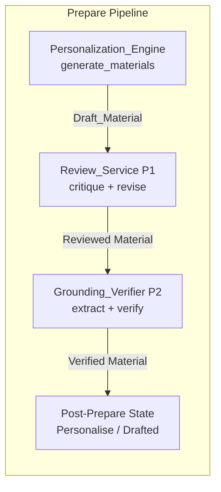
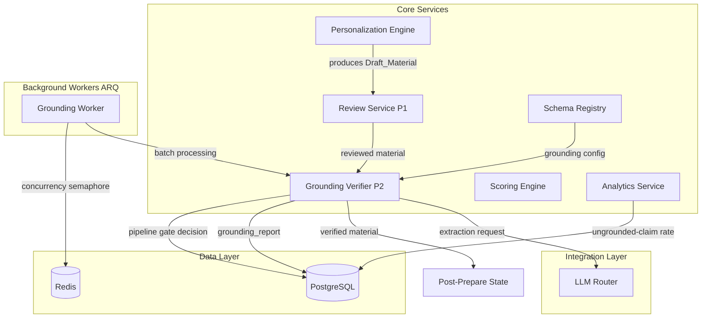
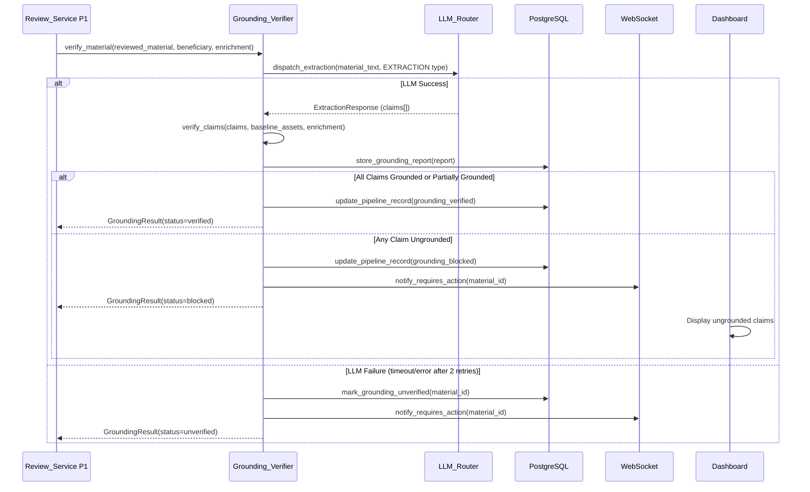
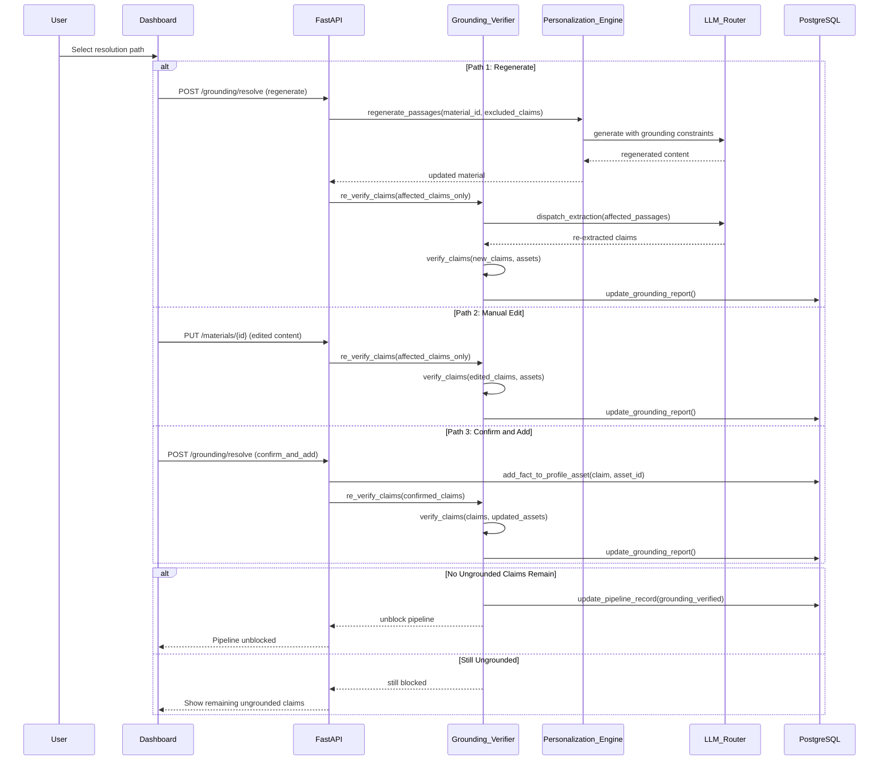
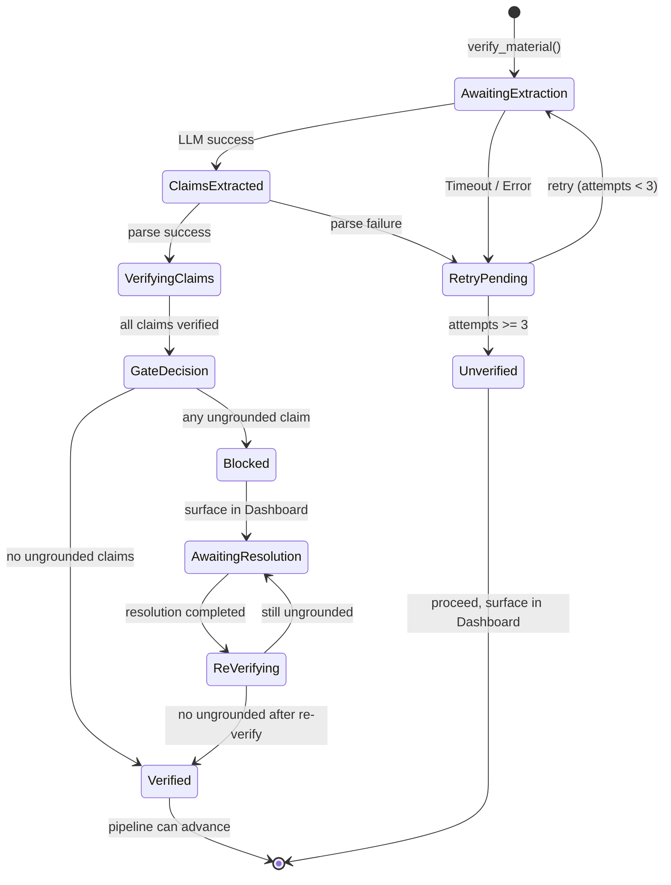

# Design Document: Claim Grounding Verification

## Overview

Claim Grounding Verification (P2) adds a deterministic truthfulness gate to the prepare pipeline. Every generated outreach material — tailored CV, cover letter, cold email, proposal — passes through the Grounding_Verifier after the Review_Service (P1) has completed its critique loop. The Grounding_Verifier extracts discrete factual claims about the Beneficiary, verifies each against the Beneficiary's profile assets (or the Enrichment_Record for prospect-side facts), and blocks pipeline advancement when ungrounded claims are detected.

The design follows existing system-redesign-v2 patterns: dataclasses for domain models, enums for fixed states, async/await with httpx for I/O, ARQ background workers for batch processing, Schema_Registry YAML for declarative wiring, and LLM_Router for provider-agnostic LLM dispatch. The grounding_report is stored in reasoning_log tables following the same convention established by the Review_Service (P1).

The pipeline flow is: **Personalization_Engine → Review_Service (P1) → Grounding_Verifier (P2) → post-prepare state**.

## Architecture

### Pipeline Insertion Point



### Grounding_Verifier Position in the System



### Grounding Verification Sequence



### Resolution and Re-verification Sequence



## Components and Interfaces

### 1. Grounding_Verifier (`app/core/grounding_verifier.py`)

The primary service that orchestrates claim extraction, verification, pipeline gating, and re-verification flows.

```python
from dataclasses import dataclass, field
from enum import Enum
from datetime import datetime
import asyncio


class GroundingStatus(str, Enum):
    GROUNDED = "grounded"
    PARTIALLY_GROUNDED = "partially_grounded"
    UNGROUNDED = "ungrounded"


class ClaimCategory(str, Enum):
    SKILL_TECHNOLOGY = "skill_technology"
    ACHIEVEMENT_OUTCOME = "achievement_outcome"
    QUANTIFIED_METRIC = "quantified_metric"
    CREDENTIAL_CERTIFICATION = "credential_certification"
    NAMED_CLIENT_EMPLOYER = "named_client_employer"
    EXPERIENCE_DURATION = "experience_duration"


class MaterialGroundingStatus(str, Enum):
    GROUNDING_VERIFIED = "grounding_verified"
    GROUNDING_BLOCKED = "grounding_blocked"
    GROUNDING_UNVERIFIED = "grounding_unverified"


class ResolutionPath(str, Enum):
    REGENERATE = "regenerate"
    MANUAL_EDIT = "manual_edit"
    CONFIRM_AND_ADD = "confirm_and_add"


@dataclass
class SourcePointer:
    """Points to the supporting evidence in a profile asset."""
    asset_type: str  # resume, cover_letter, consultant_profiles, company_profile, etc.
    asset_id: str
    passage: str  # exact supporting text from the asset
    confidence: float  # 0.0-1.0


@dataclass
class Claim:
    """A discrete factual assertion extracted from a material."""
    id: str  # UUID
    material_id: str
    category: ClaimCategory
    claim_text: str  # the factual assertion as stated
    source_span: str  # exact text span in the material where claim appears
    source_span_start: int  # character offset start in material
    source_span_end: int  # character offset end in material
    grounding_status: GroundingStatus | None = None
    source_pointer: SourcePointer | None = None
    discrepancy: str | None = None  # for partially_grounded: what differs
    is_prospect_side: bool = False  # true if claim is about the prospect, not beneficiary


@dataclass
class GroundingReport:
    """Complete verification report for a material."""
    id: str  # UUID
    material_id: str
    pipeline_record_id: str
    claims: list[Claim]
    total_claims: int
    grounded_count: int
    partially_grounded_count: int
    ungrounded_count: int
    material_grounding_status: MaterialGroundingStatus
    extraction_duration_ms: int
    verification_duration_ms: int
    created_at: datetime
    updated_at: datetime


@dataclass
class GroundingResult:
    """Final output of the grounding verification process."""
    material_id: str
    material_grounding_status: MaterialGroundingStatus
    grounding_report: GroundingReport
    blocked_states: list[str]  # states the material cannot transition to
    requires_action: bool


class GroundingVerifier:
    """Orchestrates claim extraction, verification, and pipeline gating."""

    EXTRACTION_TIMEOUT = 60.0  # seconds
    VERIFICATION_TIMEOUT = 30.0  # seconds for re-verification
    MAX_RETRIES = 2
    BATCH_CONCURRENCY = 3

    # Pipeline states that are blocked when ungrounded claims exist
    GATED_STATES = ["Approve", "Applied", "Sent", "Proposal Submitted"]

    def __init__(
        self,
        llm_router: "LLMRouter",
        schema_registry: "SchemaRegistry",
        db_repo: "GroundingRepository",
        personalization_engine: "PersonalizationEngine",
    ):
        self._llm = llm_router
        self._schema = schema_registry
        self._db = db_repo
        self._personalization = personalization_engine
        self._semaphore = asyncio.Semaphore(self.BATCH_CONCURRENCY)

    async def verify_material(
        self,
        reviewed_material: "ReviewedMaterial",
        beneficiary: "Beneficiary",
        enrichment: "EnrichmentRecord",
    ) -> GroundingResult:
        """Execute claim extraction and verification on a reviewed material.

        Preconditions:
        - reviewed_material has completed Review_Service (P1) or generation
          where no review technique is configured
        - beneficiary has baseline_assets loaded
        - enrichment is the prospect's current EnrichmentRecord

        Postconditions:
        - Returns GroundingResult with status in {verified, blocked, unverified}
        - grounding_report is persisted to database
        - If blocked: pipeline transitions to gated states are prevented
        - Total extraction completes within 60 seconds
        """
        ...

    async def extract_claims(
        self,
        material_text: str,
        material_id: str,
    ) -> list[Claim]:
        """Extract all factual claims from material via LLM_Router EXTRACTION call.

        Preconditions:
        - material_text is non-empty
        - LLM_Router has EXTRACTION evaluation type configured

        Postconditions:
        - Returns list of Claims with category, claim_text, source_span populated
        - grounding_status is None (not yet verified)
        - Completes within EXTRACTION_TIMEOUT (60s)
        - On failure after MAX_RETRIES: raises ExtractionError

        Categories extracted:
        - skill_technology, achievement_outcome, quantified_metric,
          credential_certification, named_client_employer, experience_duration
        """
        ...

    def verify_claims(
        self,
        claims: list[Claim],
        baseline_assets: dict[str, str],
        offerings_assets: dict[str, str],
        enrichment: "EnrichmentRecord",
    ) -> list[Claim]:
        """Verify each claim against profile sources or enrichment.

        Verification logic:
        1. If claim.is_prospect_side: verify against EnrichmentRecord fields
           (company size, industry, tech stack, intent topics)
        2. If claim.category == QUANTIFIED_METRIC: check if underlying
           achievement exists in assets; if number differs, mark partially_grounded
        3. Otherwise: search baseline_assets and offerings_assets for supporting
           passage; assign grounded/ungrounded based on match

        Preconditions:
        - claims have been extracted (category and claim_text populated)
        - baseline_assets contains all Beneficiary profile text content
        - enrichment contains prospect-side data

        Postconditions:
        - Every claim has grounding_status set (grounded/partially_grounded/ungrounded)
        - Grounded and partially_grounded claims have source_pointer populated
        - Partially_grounded claims with quantified metrics have discrepancy set
        """
        ...

    def _is_prospect_side_claim(
        self,
        claim: Claim,
        enrichment: "EnrichmentRecord",
    ) -> bool:
        """Determine if a claim refers to prospect-side facts.

        Prospect-side facts include: company size, industry, technology stack,
        intent topics, company name, funding stage.
        These are verified against EnrichmentRecord, not Beneficiary assets.
        """
        ...

    def _verify_against_enrichment(
        self,
        claim: Claim,
        enrichment: "EnrichmentRecord",
    ) -> Claim:
        """Verify a prospect-side claim against the EnrichmentRecord.

        Checks claim_text against enrichment fields:
        - employee_count, revenue_range, industry
        - tech_stack entries
        - funding_stage, headquarters_city, headquarters_country
        """
        ...

    def _verify_against_assets(
        self,
        claim: Claim,
        baseline_assets: dict[str, str],
        offerings_assets: dict[str, str],
    ) -> Claim:
        """Verify a Beneficiary claim against profile assets.

        Uses semantic matching: the claim_text must be supported by
        content in at least one asset. For quantified metrics, checks
        if the achievement exists but the specific number may differ.
        """
        ...

    def apply_pipeline_gate(
        self,
        grounding_report: GroundingReport,
    ) -> tuple[bool, list[str]]:
        """Determine if pipeline should be blocked.

        Returns:
        - (True, []) if no ungrounded claims → pipeline can advance
        - (False, blocked_states) if any ungrounded → pipeline blocked

        Rules:
        - ANY claim with status "ungrounded" → block GATED_STATES
        - Only "partially_grounded" with no "ungrounded" → allow with warning
        - All "grounded" → allow freely
        """
        has_ungrounded = grounding_report.ungrounded_count > 0
        if has_ungrounded:
            return (False, self.GATED_STATES)
        return (True, [])

    async def re_verify_claims(
        self,
        material_id: str,
        affected_claim_ids: list[str],
        updated_material_text: str | None = None,
        updated_assets: dict[str, str] | None = None,
    ) -> GroundingResult:
        """Re-verify only the affected claims after resolution.

        Preconditions:
        - affected_claim_ids is a non-empty subset of the original report's claims
        - At least one of updated_material_text or updated_assets is provided

        Postconditions:
        - Only affected claims are re-extracted/re-verified
        - Completes within VERIFICATION_TIMEOUT (30 seconds)
        - Updates existing grounding_report in database
        - Returns updated GroundingResult with new gate decision
        """
        ...

    async def resolve_regenerate(
        self,
        material_id: str,
        ungrounded_claim_ids: list[str],
    ) -> GroundingResult:
        """Resolution path: regenerate flagged passages with grounding constraints.

        Instructs PersonalizationEngine to regenerate ONLY the passages
        containing ungrounded claims, with an explicit constraint excluding
        the ungrounded content.
        """
        ...

    async def resolve_confirm_and_add(
        self,
        material_id: str,
        claim_id: str,
        supporting_fact: str,
        target_asset_id: str,
    ) -> GroundingResult:
        """Resolution path: confirm claim is true and add to profile asset.

        Adds the supporting_fact to the specified profile asset, then
        re-verifies the claim against the updated assets.
        """
        ...

    async def verify_batch(
        self,
        materials: list["ReviewedMaterial"],
        beneficiary: "Beneficiary",
        enrichment: "EnrichmentRecord",
    ) -> list[GroundingResult]:
        """Process a batch of materials with bounded concurrency (max 3)."""
        tasks = [
            self._verify_with_semaphore(m, beneficiary, enrichment)
            for m in materials
        ]
        return await asyncio.gather(*tasks)

    async def _verify_with_semaphore(
        self,
        material: "ReviewedMaterial",
        beneficiary: "Beneficiary",
        enrichment: "EnrichmentRecord",
    ) -> GroundingResult:
        async with self._semaphore:
            return await self.verify_material(material, beneficiary, enrichment)
```

### 2. LLM_Router Extension for Extraction (`app/integrations/llm_router.py`)

```python
class EvaluationType(str, Enum):
    MATCHING = "matching"
    GENERATION = "generation"
    RESEARCH = "research"
    CRITIQUE = "critique"       # P1: fresh-context review
    REVISION = "revision"       # P1: narrative finding revision
    EXTRACTION = "extraction"   # P2: claim extraction from materials


class LLMRouter:
    # ... existing code ...

    async def dispatch_extraction(
        self,
        prompt: str,
        timeout: float = 60.0,
    ) -> dict:
        """Dispatch a claim extraction request using EXTRACTION evaluation type.

        Returns raw JSON response containing extracted claims array.
        Raises APITimeoutError after timeout.
        """
        config = self._configs[EvaluationType.EXTRACTION]
        return await self._call_llm(prompt, config, timeout=timeout)
```

### 3. Extraction Prompt Design (`app/core/grounding_prompts.py`)

```python
CLAIM_EXTRACTION_PROMPT = """
You are a factual claim extractor. Analyze the following outreach material and
extract every discrete factual claim about the Beneficiary (the person or company
the material represents).

MATERIAL:
{material_text}

INSTRUCTIONS:
1. Extract claims in these categories ONLY:
   - skill_technology: Any assertion of a skill or technology proficiency
   - achievement_outcome: Any stated achievement or outcome
   - quantified_metric: Any claim with a specific number, percentage, or duration
   - credential_certification: Any certification, degree, or formal credential
   - named_client_employer: Any named company, client, or employer
   - experience_duration: Any claim about years/months of experience

2. For each claim, record:
   - The factual assertion (claim_text)
   - The exact text span in the material where it appears (source_span)
   - The character offset start and end of the span
   - Whether the claim is about the prospect (is_prospect_side=true) or the
     beneficiary (is_prospect_side=false)

3. Prospect-side claims are those about the target company: their size, industry,
   technology stack, funding, or intent signals. These are NOT beneficiary claims.

4. Do NOT extract:
   - Opinions or subjective statements
   - Future intentions or proposals
   - Generic statements without specific claims

Return a JSON array of claim objects.
"""

GROUNDING_CONSTRAINT_INJECTION = """
CRITICAL GROUNDING CONSTRAINT:
All claims about the Beneficiary MUST be traceable to the provided profile assets below.
Do NOT invent, embellish, or fabricate skills, achievements, metrics, credentials,
client names, or experience durations.

If the opportunity requires a skill or experience the Beneficiary does not possess,
you MUST:
1. Acknowledge the gap honestly
2. Reframe using adjacent or transferable experience from the profile
3. Never paper over the gap with invented content

BENEFICIARY PROFILE ASSETS:
{profile_assets_text}
"""
```

### 4. PersonalizationEngine Extension (`app/core/personalization_engine.py`)

```python
class PersonalizationEngine:
    # ... existing code ...

    async def generate_materials(
        self,
        prospect_id: str,
        beneficiary_id: str,
        material_type: str,
        contact: "Contact | None" = None,
    ) -> PersonalizationResult:
        """Generate personalized outreach material with grounding constraints.

        The generation prompt now includes GROUNDING_CONSTRAINT_INJECTION
        with the full Beneficiary profile assets, instructing the LLM to
        only make traceable claims.
        """
        ...

    def _build_generation_prompt(
        self,
        material_type: str,
        prospect: dict,
        beneficiary: "Beneficiary",
        enrichment: "EnrichmentRecord",
        contact: "Contact | None",
    ) -> str:
        """Build the generation prompt with grounding constraints injected.

        Includes:
        - Material type instructions
        - Prospect context (enrichment, intent)
        - Beneficiary profile assets (full text)
        - GROUNDING_CONSTRAINT_INJECTION (always appended)
        - Tone determination based on contact seniority
        """
        ...

    async def regenerate_passages(
        self,
        material_id: str,
        excluded_claims: list["Claim"],
        beneficiary: "Beneficiary",
    ) -> str:
        """Regenerate only the passages containing ungrounded claims.

        The regeneration prompt explicitly excludes the ungrounded content
        and constrains the LLM to use only verifiable profile assets.

        Returns the full material text with flagged passages replaced.
        """
        ...
```

### 5. Grounding Worker (`app/workers/grounding_worker.py`)

```python
from arq import cron

class GroundingWorker:
    """ARQ worker for processing queued grounding verification requests."""

    BATCH_SIZE = 10
    CONCURRENCY_LIMIT = 3

    def __init__(self, grounding_verifier: "GroundingVerifier", redis_pool):
        self._verifier = grounding_verifier
        self._redis = redis_pool

    async def process_grounding_queue(self, ctx: dict) -> dict:
        """Process pending grounding verification requests from the queue.

        Respects CONCURRENCY_LIMIT via the GroundingVerifier's semaphore.
        Returns summary of processed items.
        """
        pending = await self._fetch_pending_verifications(limit=self.BATCH_SIZE)
        if not pending:
            return {"processed": 0}

        results = await self._verifier.verify_batch(
            materials=[r.reviewed_material for r in pending],
            beneficiary=pending[0].beneficiary,
            enrichment=pending[0].enrichment,
        )

        return {
            "processed": len(results),
            "verified": sum(
                1 for r in results
                if r.material_grounding_status == MaterialGroundingStatus.GROUNDING_VERIFIED
            ),
            "blocked": sum(
                1 for r in results
                if r.material_grounding_status == MaterialGroundingStatus.GROUNDING_BLOCKED
            ),
            "unverified": sum(
                1 for r in results
                if r.material_grounding_status == MaterialGroundingStatus.GROUNDING_UNVERIFIED
            ),
        }

    async def _fetch_pending_verifications(self, limit: int) -> list:
        """Fetch pending grounding requests from database queue."""
        ...
```

### 6. Pipeline Gate Service (`app/core/pipeline_gate.py`)

```python
class PipelineGateService:
    """Enforces grounding verification gate on pipeline state transitions."""

    GATED_STATES = {"Approve", "Applied", "Sent", "Proposal Submitted"}

    def __init__(self, db_repo: "GroundingRepository"):
        self._db = db_repo

    async def can_transition(
        self,
        pipeline_record_id: str,
        target_state: str,
    ) -> tuple[bool, list["Claim"] | None]:
        """Check if a pipeline record can transition to target_state.

        Returns:
        - (True, None) if target_state is not gated or no ungrounded claims
        - (False, ungrounded_claims) if transition is blocked

        This method is called by the pipeline state machine before
        any state transition to a gated state.
        """
        if target_state not in self.GATED_STATES:
            return (True, None)

        report = await self._db.get_latest_grounding_report(pipeline_record_id)
        if report is None:
            # No grounding report exists — material hasn't been verified
            return (False, [])

        if report.material_grounding_status == MaterialGroundingStatus.GROUNDING_BLOCKED:
            ungrounded = [
                c for c in report.claims
                if c.grounding_status == GroundingStatus.UNGROUNDED
            ]
            return (False, ungrounded)

        return (True, None)

    async def get_warning_badge(
        self,
        pipeline_record_id: str,
    ) -> bool:
        """Check if pipeline record should display warning badge.

        Returns True if material has partially_grounded claims
        but no ungrounded claims (pipeline can advance with warning).
        """
        report = await self._db.get_latest_grounding_report(pipeline_record_id)
        if report is None:
            return False
        return (
            report.partially_grounded_count > 0
            and report.ungrounded_count == 0
        )
```

### 7. Analytics Extension (`app/core/analytics_service.py`)

```python
@dataclass
class UngroundedClaimRate:
    """Weekly ungrounded-claim rate per prepare technique."""
    prepare_technique_id: str
    week_start: date
    week_end: date
    total_claims_extracted: int
    ungrounded_claims: int
    partially_grounded_claims: int
    ungrounded_rate: float  # ungrounded / total_claims_extracted
    partially_grounded_rate: float


class AnalyticsService:
    # ... existing code ...

    async def compute_ungrounded_claim_rates(
        self,
        period_weeks: int = 4,
    ) -> list[UngroundedClaimRate]:
        """Compute ungrounded-claim rate per prepare technique per week.

        Groups grounding reports by prepare_technique and ISO week,
        then computes ungrounded/total ratio for each group.

        Used in Dashboard Reports stage to detect prompt regressions.
        """
        ...

    async def get_grounding_trend(
        self,
        prepare_technique_id: str,
        weeks: int = 12,
    ) -> list[UngroundedClaimRate]:
        """Get weekly ungrounded rate trend for a specific technique.

        Returns one entry per week for the trailing N weeks,
        zero-filling weeks with no data.
        """
        ...
```

### 8. Schema_Registry Extensions (`config/schema.yaml`)

New `grounding_technique` configuration:

```yaml
# ─── GROUNDING TECHNIQUES ─────────────────────────────────────────────────────

grounding_techniques:
  - id: standard_grounding
    service_class: GroundingVerifier
    description: "Extract and verify factual claims against profile assets"
    claim_categories:
      - skill_technology
      - achievement_outcome
      - quantified_metric
      - credential_certification
      - named_client_employer
      - experience_duration
    extraction_timeout_seconds: 60
    verification_timeout_seconds: 30
    max_retries: 2
```

Updated prepare techniques with `grounding_technique` reference:

```yaml
prepare_techniques:
  - id: cv_and_cover_letter
    service_class: CVGeneratorService
    description: "Generates tailored CV and cover letter via LLM"
    review_technique: standard_material_review
    grounding_technique: standard_grounding    # ← NEW
    inputs:
      - resume
      - cover_letter
      - instructions
      - consultant_profiles
    outputs:
      - tailored_cv
      - tailored_cover_letter
      - reasoning_log

  - id: cold_email_composition
    service_class: ColdEmailComposerService
    description: "Drafts personalized cold emails"
    review_technique: email_review
    grounding_technique: standard_grounding    # ← NEW
    inputs:
      - cold_email_instructions
      - consultant_profiles
      - enrichment_record
    outputs:
      - draft_email

  - id: proposal_composition
    service_class: ProposalCompositionService
    description: "Generates project proposals"
    review_technique: standard_material_review
    grounding_technique: standard_grounding    # ← NEW
    inputs:
      - company_profile
      - company_documents
      - enrichment_record
    outputs:
      - proposal_document
      - executive_summary
```

### 9. Schema_Registry Dataclass Extensions

```python
@dataclass
class GroundingTechnique:
    """Schema-declared grounding technique configuration."""
    id: str
    service_class: str
    description: str
    claim_categories: list[str]  # maps to ClaimCategory enum values
    extraction_timeout_seconds: int  # default 60
    verification_timeout_seconds: int  # default 30
    max_retries: int  # default 2


@dataclass
class PrepareTechnique:
    """Extended with optional grounding_technique reference."""
    id: str
    service_class: str
    description: str
    inputs: list[str] = field(default_factory=list)
    outputs: list[str] = field(default_factory=list)
    review_technique: str | None = None
    grounding_technique: str | None = None  # ← NEW: references GroundingTechnique.id


class SchemaRegistry:
    # ... existing code ...

    def _validate_grounding_technique_references(self) -> None:
        """Validate that every prepare_technique.grounding_technique resolves
        to a declared grounding_technique id."""
        grounding_ids = {gt['id'] for gt in self._raw.get('grounding_techniques', [])}
        for pt in self._raw.get('prepare_techniques', []):
            ref = pt.get('grounding_technique')
            if ref and ref not in grounding_ids:
                raise SchemaValidationError(
                    f"PrepareTechnique '{pt['id']}' references unknown "
                    f"grounding_technique '{ref}'",
                    entity_id=pt['id']
                )

    def get_grounding_technique(self, grounding_technique_id: str) -> GroundingTechnique | None:
        return next(
            (gt for gt in self.grounding_techniques if gt.id == grounding_technique_id),
            None
        )

    def get_grounding_technique_for_prepare(self, prepare_technique_id: str) -> GroundingTechnique | None:
        """Get the grounding technique wired to a prepare technique, or None."""
        pt = next(
            (p for p in self.prepare_techniques if p.id == prepare_technique_id),
            None
        )
        if not pt or not pt.grounding_technique:
            return None
        return self.get_grounding_technique(pt.grounding_technique)
```


## Data Models

### PostgreSQL Schema Extensions

```sql
-- Grounding reports (one row per material grounding verification lifecycle)
CREATE TABLE grounding_reports (
    id UUID PRIMARY KEY DEFAULT gen_random_uuid(),
    material_id UUID NOT NULL,
    pipeline_record_id UUID NOT NULL REFERENCES pipeline_records(id),
    prepare_technique_id VARCHAR(50) NOT NULL,
    grounding_technique_id VARCHAR(50) NOT NULL,
    total_claims INT NOT NULL DEFAULT 0,
    grounded_count INT NOT NULL DEFAULT 0,
    partially_grounded_count INT NOT NULL DEFAULT 0,
    ungrounded_count INT NOT NULL DEFAULT 0,
    material_grounding_status VARCHAR(30) NOT NULL,  -- grounding_verified, grounding_blocked, grounding_unverified
    extraction_duration_ms INT NOT NULL,
    verification_duration_ms INT NOT NULL,
    created_at TIMESTAMPTZ NOT NULL DEFAULT NOW(),
    updated_at TIMESTAMPTZ NOT NULL DEFAULT NOW()
);

CREATE INDEX idx_grounding_reports_pipeline ON grounding_reports(pipeline_record_id);
CREATE INDEX idx_grounding_reports_status ON grounding_reports(material_grounding_status);
CREATE INDEX idx_grounding_reports_material ON grounding_reports(material_id);
CREATE INDEX idx_grounding_reports_technique_week
    ON grounding_reports(prepare_technique_id, created_at);

-- Individual claims within a grounding report
CREATE TABLE grounding_claims (
    id UUID PRIMARY KEY DEFAULT gen_random_uuid(),
    grounding_report_id UUID NOT NULL REFERENCES grounding_reports(id) ON DELETE CASCADE,
    category VARCHAR(30) NOT NULL,  -- skill_technology, achievement_outcome, quantified_metric, credential_certification, named_client_employer, experience_duration
    claim_text TEXT NOT NULL,
    source_span TEXT NOT NULL,  -- exact text span in material
    source_span_start INT NOT NULL,
    source_span_end INT NOT NULL,
    grounding_status VARCHAR(25) NOT NULL,  -- grounded, partially_grounded, ungrounded
    is_prospect_side BOOLEAN NOT NULL DEFAULT FALSE,
    source_asset_type VARCHAR(50),  -- resume, cover_letter, consultant_profiles, etc.
    source_asset_id VARCHAR(100),
    source_passage TEXT,  -- supporting text from asset
    discrepancy TEXT,  -- for partially_grounded: what differs
    created_at TIMESTAMPTZ NOT NULL DEFAULT NOW(),
    updated_at TIMESTAMPTZ NOT NULL DEFAULT NOW()
);

CREATE INDEX idx_grounding_claims_report ON grounding_claims(grounding_report_id);
CREATE INDEX idx_grounding_claims_status ON grounding_claims(grounding_status);
CREATE INDEX idx_grounding_claims_category ON grounding_claims(category);
```

```sql
-- Resolution history for blocked materials
CREATE TABLE grounding_resolutions (
    id UUID PRIMARY KEY DEFAULT gen_random_uuid(),
    grounding_report_id UUID NOT NULL REFERENCES grounding_reports(id),
    claim_id UUID NOT NULL REFERENCES grounding_claims(id),
    resolution_path VARCHAR(20) NOT NULL,  -- regenerate, manual_edit, confirm_and_add
    resolved_by VARCHAR(100),  -- user identifier
    resolution_detail JSONB,  -- path-specific metadata
    re_verification_status VARCHAR(25),  -- grounded, partially_grounded, ungrounded
    re_verification_duration_ms INT,
    resolved_at TIMESTAMPTZ NOT NULL DEFAULT NOW()
);

CREATE INDEX idx_grounding_resolutions_report ON grounding_resolutions(grounding_report_id);

-- Weekly analytics aggregation for ungrounded-claim rates
CREATE TABLE grounding_analytics_weekly (
    id UUID PRIMARY KEY DEFAULT gen_random_uuid(),
    prepare_technique_id VARCHAR(50) NOT NULL,
    week_start DATE NOT NULL,
    week_end DATE NOT NULL,
    total_claims_extracted INT NOT NULL DEFAULT 0,
    grounded_claims INT NOT NULL DEFAULT 0,
    partially_grounded_claims INT NOT NULL DEFAULT 0,
    ungrounded_claims INT NOT NULL DEFAULT 0,
    ungrounded_rate NUMERIC(5, 4) NOT NULL DEFAULT 0,  -- ratio 0.0000 to 1.0000
    materials_verified INT NOT NULL DEFAULT 0,
    materials_blocked INT NOT NULL DEFAULT 0,
    created_at TIMESTAMPTZ NOT NULL DEFAULT NOW(),
    UNIQUE(prepare_technique_id, week_start)
);

CREATE INDEX idx_grounding_analytics_technique ON grounding_analytics_weekly(prepare_technique_id);
CREATE INDEX idx_grounding_analytics_week ON grounding_analytics_weekly(week_start);
```

### Extraction Response JSON Schema

The LLM is instructed to return claim extractions in this structure:

```json
{
  "claims": [
    {
      "claim_text": "10+ years of Python development experience",
      "category": "experience_duration",
      "source_span": "With over 10 years of Python development experience",
      "source_span_start": 145,
      "source_span_end": 193,
      "is_prospect_side": false
    },
    {
      "claim_text": "AWS Solutions Architect certified",
      "category": "credential_certification",
      "source_span": "as an AWS Solutions Architect certified engineer",
      "source_span_start": 210,
      "source_span_end": 257,
      "is_prospect_side": false
    },
    {
      "claim_text": "company uses React and Node.js",
      "category": "skill_technology",
      "source_span": "aligning with your React and Node.js technology stack",
      "source_span_start": 380,
      "source_span_end": 432,
      "is_prospect_side": true
    }
  ]
}
```

Key constraints:
- `category` must be one of the six ClaimCategory enum values
- `source_span` must be an exact quote from the material text
- `source_span_start` and `source_span_end` must be valid character offsets
- `is_prospect_side` distinguishes Beneficiary claims from prospect-side facts
- All claims in a material must be extracted in a single LLM call


## Error Handling

### Retry and Graceful Degradation

```python
class GroundingError(BaseServiceError):
    """Base error for grounding verification failures."""
    def __init__(self, message: str, material_id: str, retryable: bool = True):
        super().__init__(message, integration="grounding", retryable=retryable)
        self.material_id = material_id


class ExtractionError(GroundingError):
    """Claim extraction LLM call failed after all retries."""
    def __init__(self, message: str, material_id: str, attempts: int):
        super().__init__(message, material_id, retryable=False)
        self.attempts = attempts


class ExtractionTimeoutError(ExtractionError):
    """Extraction exceeded 60-second timeout."""
    pass


class ExtractionParseError(ExtractionError):
    """Extraction response did not match expected JSON schema."""
    pass


class VerificationTimeoutError(GroundingError):
    """Re-verification exceeded 30-second timeout."""
    pass
```

### Error Scenarios

| Scenario | Strategy | Max Retries | Timeout | Degradation |
|----------|----------|-------------|---------|-------------|
| Extraction LLM timeout | Retry with same prompt | 2 | 60s per attempt | Mark "grounding_unverified", surface in Dashboard |
| Extraction LLM error (5xx) | Retry with exponential backoff | 2 | 60s | Mark "grounding_unverified", surface in Dashboard |
| Extraction response malformed JSON | Parse failure, retry | 2 | 60s | Mark "grounding_unverified" after retries exhausted |
| Re-verification timeout | Retry | 1 | 30s | Keep current grounding_report, notify user |
| Claim span doesn't match material | Log warning, skip claim | N/A | N/A | Proceed with remaining claims |
| No baseline_assets available | Cannot verify | N/A | N/A | Mark "grounding_unverified", surface in Dashboard |
| All extraction attempts fail | Mark unverified | N/A | N/A | Material proceeds, Dashboard "Requires Action" |

### Retry State Machine




## Testing Strategy

### Property-Based Testing

**Library:** [Hypothesis](https://hypothesis.readthedocs.io/) (Python)

**Configuration:**
- Minimum 100 examples per property test (via `@settings(max_examples=100)`)
- Each test tagged: `# Feature: claim-grounding-verification, Property {N}: {title}`

**Key Properties to Test with PBT:**

| Property | Module Under Test | Generator Strategy |
|----------|-------------------|-------------------|
| P1: Pipeline gate blocks on ungrounded | `pipeline_gate.py` | Random grounding reports with varying status distributions |
| P2: Prospect-side exemption | `grounding_verifier.py` | Random claims with is_prospect_side flag, random enrichment records |
| P3: Partial grounding for metrics | `grounding_verifier.py` | Random quantified claims, random asset content with/without matching numbers |
| P4: Re-verification scope | `grounding_verifier.py` | Random claim subsets, verify only affected IDs are re-checked |
| P5: Extraction timeout bound | `grounding_verifier.py` | Random material lengths, verify extraction completes within 60s |
| P6: Analytics rate computation | `analytics_service.py` | Random weekly claim counts, verify rate = ungrounded/total |
| P7: Gate state completeness | `pipeline_gate.py` | All possible MaterialGroundingStatus values, verify gate decision |

### Unit Testing

- Claim extraction: verify all 6 categories extracted, source spans valid
- Verification logic: grounded claim with exact asset match, partially_grounded with number mismatch, ungrounded with no match
- Prospect-side detection: enrichment fields correctly exempt from beneficiary grounding
- Pipeline gate: single ungrounded blocks all GATED_STATES, partially_grounded allows with warning
- Resolution paths: regenerate removes ungrounded passages, confirm_and_add updates assets
- Re-verification: only affected claims re-checked, completes within 30s
- Schema validation: missing grounding_technique reference → startup error
- Analytics: weekly rate computed correctly, zero-fill for empty weeks

### Integration Testing

- End-to-end: ReviewService → GroundingVerifier → pipeline state transition
- LLM_Router mock: verify extraction prompt contains full material text
- Pipeline gate: blocked material cannot transition to Approve/Applied/Sent/Proposal Submitted
- Resolution flow: regenerate → re-verify → unblock pipeline
- Dashboard: blocked material appears in "Requires Action" with ungrounded claims listed
- Analytics: ungrounded rate displayed in Reports stage per technique per week


## Correctness Properties

### Property 1: Pipeline gate blocks if and only if ungrounded claims exist

*For any* GroundingReport where `ungrounded_count > 0`, the pipeline gate SHALL block transitions to all of {Approve, Applied, Sent, Proposal Submitted}. *For any* GroundingReport where `ungrounded_count == 0`, the pipeline gate SHALL permit transitions regardless of `partially_grounded_count`.

**Validates: Requirement 3, AC 1 and AC 4**

### Property 2: Prospect-side claims are verified against EnrichmentRecord, not Beneficiary assets

*For any* Claim where `is_prospect_side == True`, the Grounding_Verifier SHALL verify the claim against the Enrichment_Record fields (company size, industry, tech stack, intent topics, funding stage) and SHALL NOT attempt verification against the Beneficiary's baseline_assets or offerings_assets.

**Validates: Requirement 2, AC 2**

### Property 3: Quantified metrics with matching achievement but differing numbers are partially_grounded

*For any* Claim with `category == QUANTIFIED_METRIC` where the underlying achievement is supported by a profile asset but the specific number differs from the asset, the Grounding_Verifier SHALL assign `grounding_status = "partially_grounded"` and SHALL populate the `discrepancy` field describing what differs.

**Validates: Requirement 2, AC 3**

### Property 4: Re-verification only checks affected claims

*For any* re-verification triggered by a resolution path, the Grounding_Verifier SHALL re-verify only the claims whose IDs appear in `affected_claim_ids` and SHALL NOT modify the grounding_status of any other claim in the report.

**Validates: Requirement 3, AC 3**

### Property 5: Re-verification completes within 30 seconds

*For any* re-verification request with N affected claims (where N ≤ total claims in report), the re-verification SHALL complete within 30 seconds.

**Validates: Requirement 3, AC 3**

### Property 6: Extraction produces claims in all and only the six defined categories

*For any* material text containing factual assertions, the claim extraction SHALL produce claims with categories drawn exclusively from {skill_technology, achievement_outcome, quantified_metric, credential_certification, named_client_employer, experience_duration}. No claim SHALL have a category outside this set.

**Validates: Requirement 1, AC 2**

### Property 7: Every extracted claim has a valid source span

*For any* extracted Claim, the `source_span` SHALL be an exact substring of the material text, and `source_span_start` and `source_span_end` SHALL be valid character offsets such that `material_text[source_span_start:source_span_end] == source_span`.

**Validates: Requirement 1, AC 3**

### Property 8: Extraction failure after retries marks material grounding_unverified

*For any* material where claim extraction fails after 2 retries (total 3 attempts), the material SHALL be marked with `material_grounding_status = "grounding_unverified"` and SHALL appear in the Dashboard "Requires Action" section. The pipeline SHALL NOT be blocked.

**Validates: Requirement 1, AC 4**

### Property 9: Generation prompt always includes grounding constraint injection

*For any* material generation call from the Personalization_Engine, the prompt SHALL include the GROUNDING_CONSTRAINT_INJECTION text containing the Beneficiary's full profile assets and explicit instructions to not fabricate claims.

**Validates: Requirement 4, AC 1**

### Property 10: Ungrounded-claim rate is correctly computed per technique per week

*For any* set of grounding reports within a given ISO week for a given prepare_technique_id, the ungrounded_rate SHALL equal `ungrounded_claims / total_claims_extracted`. If `total_claims_extracted == 0`, the rate SHALL be 0.

**Validates: Requirement 4, AC 2**

### Property 11: Three resolution paths are always offered for blocked materials

*For any* material with `material_grounding_status == "grounding_blocked"`, the system SHALL offer exactly three resolution paths: regenerate, manual_edit, and confirm_and_add.

**Validates: Requirement 3, AC 2**

### Property 12: Grounded and partially_grounded claims have source pointers

*For any* Claim with `grounding_status` in {"grounded", "partially_grounded"}, the claim SHALL have a non-null `source_pointer` with `asset_type`, `asset_id`, and `passage` populated. *For any* Claim with `grounding_status == "ungrounded"`, `source_pointer` SHALL be null.

**Validates: Requirement 2, AC 1**

### Property 13: Warning badge displayed if only partially_grounded claims exist

*For any* material where `partially_grounded_count > 0` and `ungrounded_count == 0`, the pipeline record SHALL display a warning badge. If `partially_grounded_count == 0` or `ungrounded_count > 0`, no warning badge SHALL be displayed.

**Validates: Requirement 3, AC 4**


## Performance Considerations

- **Extraction latency**: Single LLM call with 60s timeout; typical materials (500-2000 words) extract in 5-15s
- **Verification is deterministic**: No LLM call needed for verification logic — it's string/semantic matching against loaded assets. This keeps verification under 1s for typical claim counts (5-20 per material)
- **Re-verification is scoped**: Only affected claims are re-checked, keeping resolution re-verification under 30s even for complex materials
- **Batch processing**: Bounded to 3 concurrent verifications to avoid LLM quota exhaustion during bulk prepare runs
- **Analytics aggregation**: Weekly rates are pre-computed and stored, not calculated on read. ARQ worker runs aggregation daily
- **Index strategy**: Composite index on `(prepare_technique_id, created_at)` supports efficient weekly grouping for analytics queries


## Security Considerations

- **Prompt injection defense**: The extraction prompt uses structured delimiters to separate material text from instructions. The LLM is instructed to treat the material as data, not instructions.
- **Asset access control**: Verification only reads profile assets belonging to the Beneficiary associated with the pipeline record. Cross-beneficiary asset access is prevented at the repository layer.
- **Resolution authorization**: Only users with write access to the Beneficiary's profile can use the "confirm_and_add" resolution path, as it modifies profile assets.
- **Grounding report integrity**: Reports are append-only (updated via new rows, not mutations). Resolution history is tracked separately for audit.


## Dependencies

| Dependency | Purpose | Version Constraint |
|------------|---------|-------------------|
| FastAPI | API layer, route handling | Existing (system-redesign-v2) |
| httpx | Async HTTP client for LLM calls | Existing |
| ARQ | Background worker queue | Existing |
| PostgreSQL | Grounding reports, claims, analytics storage | Existing |
| Redis | Concurrency semaphore, WebSocket pub/sub | Existing |
| LLM_Router | Claim extraction via EXTRACTION evaluation type | Extended with new type |
| Schema_Registry | Grounding technique configuration | Extended with new section |
| PersonalizationEngine | Generation-time constraint injection, passage regeneration | Extended |
| Review_Service (P1) | Upstream dependency — grounding runs after review completes | Existing |
| AnalyticsService | Weekly ungrounded-claim rate computation | Extended |
