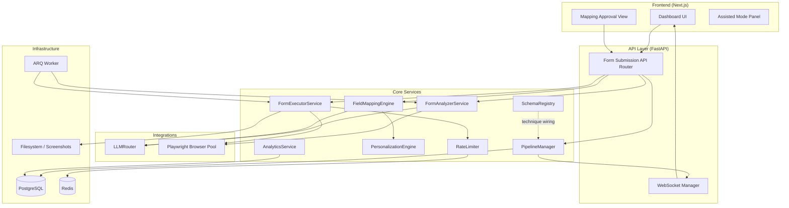
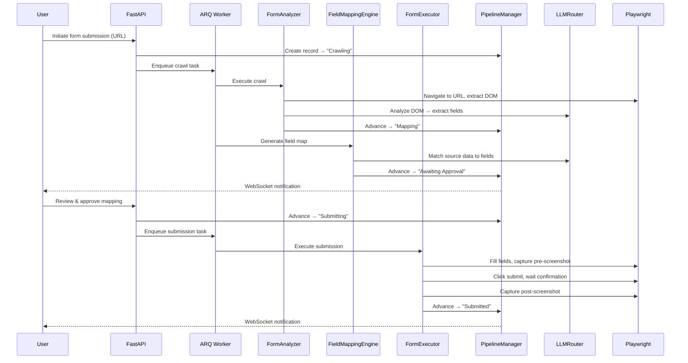

# Design Document: Form Submission Automation

## Overview

Form Submission Automation adds a new outreach technique (`form_submission`) to the GKIM Opportunity Finder v2 platform. It automates the process of filling and submitting web-based application forms (job applications, vendor portals, grant applications, RFP submissions) by combining LLM-powered form analysis with Playwright browser automation, orchestrated through a human-in-the-loop approval step.

The feature introduces three new service components:
1. **FormAnalyzerService** — crawls form pages via headless Playwright, extracts DOM, uses the LLM to identify fields and structure
2. **FieldMappingEngine** — uses LLM to generate a proposed mapping from Source_Data to extracted form fields with confidence scores
3. **FormExecutorService** — fills and submits forms via Playwright, with screenshot capture, rate limiting, and error recovery

These services integrate with the existing architecture through the SchemaRegistry (technique wiring), PipelineManager (state transitions), LLMRouter (LLM calls for analysis and mapping), PersonalizationEngine (source data retrieval), AnalyticsService (performance tracking), and ARQ workers (background execution).

### Key Design Decisions

| Decision | Choice | Rationale |
|----------|--------|-----------|
| Browser automation library | Playwright (async Python) | Native async support, multi-browser, superior to Selenium for modern SPAs. Already in Python ecosystem. |
| Form analysis approach | LLM-based DOM extraction | Forms vary wildly in structure; LLM handles ambiguity (custom components, dynamic fields) better than heuristic parsers |
| Field mapping | LLM with confidence scores | Source data is heterogeneous; LLM can semantically match "First Name" field to `profile.given_name` |
| Screenshot storage | Filesystem (PNG) with DB path references | Keeps DB lean; PNGs can be large; filesystem allows CDN/object-storage migration later |
| Rate limiting | Per-domain Redis-based counters | Prevents abuse detection, respects target sites, configurable per domain |
| Execution model | ARQ background worker | Long-running browser operations (30s+ timeouts) must not block API threads |
| Human approval | Required before submission | Critical for correctness — prevents sending incorrect data to external sites |

## Architecture



### Execution Flow



## Components and Interfaces

### FormAnalyzerService

Responsible for crawling form pages and extracting field structure via LLM analysis.

```python
class FormAnalyzerService:
    """Crawls form pages and extracts field structure using LLM analysis."""

    def __init__(
        self,
        llm_router: LLMRouter,
        browser_pool: BrowserPool,
        config: FormAnalyzerConfig,
    ) -> None: ...

    async def analyze_form(
        self,
        url: str,
        submission_record_id: str,
    ) -> FormExtractionResult:
        """Crawl the form page and extract field structure.

        Handles multi-step forms (up to 10 steps, 15s per step),
        authentication detection, and extraction uncertainty.

        Args:
            url: The form page URL to analyze.
            submission_record_id: Associated submission record ID.

        Returns:
            FormExtractionResult with extracted fields or error status.

        Raises:
            CrawlFailedError: On network/HTTP errors after page load timeout (30s).
        """
        ...

    async def _extract_dom(self, page: Page) -> str:
        """Extract rendered DOM from a Playwright page, simplified for LLM consumption."""
        ...

    async def _detect_multi_step(self, page: Page) -> bool:
        """Detect if the form has multiple steps/pages."""
        ...

    async def _navigate_next_step(self, page: Page) -> bool:
        """Navigate to the next form step. Returns False if navigation fails."""
        ...

    async def _detect_auth_required(self, page: Page, response) -> bool:
        """Detect login redirects or 401/403 responses."""
        ...
```

### FieldMappingEngine

Generates LLM-powered field mappings with confidence scores.

```python
class FieldMappingEngine:
    """Generates field mappings from source data to form fields via LLM."""

    # Source priority order (highest first)
    SOURCE_PRIORITY = [
        "baseline_assets",       # resume, cover letter, company profile
        "generated_materials",   # tailored CV, cover letter, proposal
        "enrichment_data",       # company info, contact details
        "profile_fields",        # name, email, phone, address, LinkedIn
    ]

    def __init__(
        self,
        llm_router: LLMRouter,
        personalization_engine: PersonalizationEngine,
        config: FieldMappingConfig,
    ) -> None: ...

    async def generate_mapping(
        self,
        extracted_fields: list[FormField],
        beneficiary_id: str,
        opportunity_id: str,
    ) -> FieldMapResult:
        """Generate a proposed field mapping.

        Matches extracted form fields to available source data using
        LLM semantic matching. Applies source priority ordering.

        Args:
            extracted_fields: Fields extracted by FormAnalyzer.
            beneficiary_id: The beneficiary whose data to map.
            opportunity_id: The opportunity for context.

        Returns:
            FieldMapResult with mappings, confidence scores, and status.
        """
        ...

    async def _gather_source_data(
        self,
        beneficiary_id: str,
        opportunity_id: str,
    ) -> dict[str, dict]:
        """Collect all available source data organized by priority tier."""
        ...

    def _apply_transformations(
        self,
        value: str,
        field: FormField,
    ) -> tuple[str, str | None]:
        """Apply transformations (date format, truncation, name splitting).
        
        Returns (transformed_value, transformation_instruction or None).
        """
        ...
```

### FormExecutorService

Executes form filling and submission via Playwright with rate limiting.

```python
class FormExecutorService:
    """Executes approved field mappings by filling and submitting web forms."""

    def __init__(
        self,
        browser_pool: BrowserPool,
        rate_limiter: DomainRateLimiter,
        screenshot_store: ScreenshotStore,
        config: FormExecutorConfig,
    ) -> None: ...

    async def execute_submission(
        self,
        submission_record_id: str,
        url: str,
        approved_mapping: list[FieldMapping],
        is_multi_step: bool,
    ) -> ExecutionResult:
        """Fill and submit the form per the approved mapping.

        Implements human-like delays, field-type-specific interactions,
        multi-step navigation, screenshot capture, and error recovery.

        Args:
            submission_record_id: The submission record ID.
            url: Form page URL.
            approved_mapping: Approved field-value mappings.
            is_multi_step: Whether the form has multiple steps.

        Returns:
            ExecutionResult with status, screenshots, and any errors.
        """
        ...

    async def _fill_field(
        self, page: Page, field: FieldMapping
    ) -> FieldFillResult:
        """Fill a single field using appropriate method per field type."""
        ...

    async def _capture_screenshot(
        self, page: Page, record_id: str, stage: str
    ) -> str | None:
        """Capture full-page screenshot. Returns filepath or None on failure."""
        ...

    async def _detect_captcha(self, page: Page) -> bool:
        """Detect CAPTCHA or anti-bot challenges on the page."""
        ...

    async def _detect_submission_confirmation(self, page: Page) -> bool:
        """Detect successful submission via URL change, success message, or confirmation elements."""
        ...
```

### DomainRateLimiter

Redis-backed per-domain rate limiting.

```python
class DomainRateLimiter:
    """Per-domain submission throttling using Redis counters."""

    def __init__(self, redis_client, config: RateLimitConfig) -> None: ...

    async def acquire(self, domain: str) -> RateLimitResult:
        """Check if a submission is allowed for the given domain.

        Enforces:
        - Minimum interval between submissions (default 60s)
        - Daily submission cap per domain (default 10/day, resets midnight UTC)

        Returns:
            RateLimitResult with allowed=True or wait_seconds/queued info.
        """
        ...

    async def record_submission(self, domain: str) -> None:
        """Record a completed submission against the domain counters."""
        ...

    def extract_registrable_domain(self, url: str) -> str:
        """Extract registrable domain from URL (e.g., 'jobs.example.com' → 'example.com')."""
        ...
```

### BrowserPool

Manages Playwright browser instances for concurrent operations.

```python
class BrowserPool:
    """Manages a pool of Playwright browser contexts with anti-detection configuration."""

    VIEWPORT_OPTIONS = [(1920, 1080), (1366, 768)]

    def __init__(self, max_contexts: int = 3) -> None: ...

    async def acquire(self) -> BrowserContext:
        """Acquire a configured browser context from the pool.

        Configures:
        - Current-release Chrome user-agent
        - Random viewport from VIEWPORT_OPTIONS
        - JavaScript enabled
        """
        ...

    async def release(self, context: BrowserContext) -> None:
        """Return a browser context to the pool."""
        ...

    async def shutdown(self) -> None:
        """Close all browser instances and clean up."""
        ...
```

### ScreenshotStore

Filesystem-based screenshot persistence.

```python
class ScreenshotStore:
    """Stores and retrieves submission screenshots on the filesystem."""

    def __init__(self, base_path: Path, retention_days: int = 90) -> None: ...

    async def save(
        self, record_id: str, stage: str, png_data: bytes
    ) -> str:
        """Save a screenshot PNG. Returns the relative file path."""
        ...

    async def get_path(self, record_id: str, stage: str) -> Path | None:
        """Get the filesystem path for a stored screenshot."""
        ...

    async def cleanup_expired(self) -> int:
        """Remove screenshots older than retention_days. Returns count removed."""
        ...
```

### API Router

```python
# app/api/form_submission.py

router = APIRouter(prefix="/api/form-submissions", tags=["form-submission"])

@router.post("/initiate")
async def initiate_submission(request: InitiateSubmissionRequest) -> SubmissionResponse:
    """Start the form submission pipeline for an opportunity."""
    ...

@router.get("/{record_id}")
async def get_submission_detail(record_id: UUID) -> SubmissionDetailResponse:
    """Get full submission record including field map, screenshots, and audit log."""
    ...

@router.put("/{record_id}/mapping/approve")
async def approve_mapping(record_id: UUID, edits: MappingEditsRequest) -> SubmissionResponse:
    """Approve (with optional edits) the proposed field mapping."""
    ...

@router.put("/{record_id}/mapping/reject")
async def reject_mapping(record_id: UUID) -> SubmissionResponse:
    """Reject the mapping, allowing re-generation or assisted mode."""
    ...

@router.post("/{record_id}/re-crawl")
async def re_crawl_form(record_id: UUID) -> SubmissionResponse:
    """Trigger a re-crawl of the form page to refresh field structure."""
    ...

@router.put("/{record_id}/assisted/complete")
async def complete_assisted(record_id: UUID, body: AssistedCompleteRequest) -> SubmissionResponse:
    """Mark an assisted-mode submission as complete."""
    ...

@router.put("/{record_id}/assisted/cancel")
async def cancel_assisted(record_id: UUID) -> SubmissionResponse:
    """Cancel an assisted-mode submission."""
    ...

@router.post("/{record_id}/retry")
async def retry_from_failure(record_id: UUID) -> SubmissionResponse:
    """Retry from the failed pipeline step."""
    ...

@router.get("/analytics/summary")
async def get_submission_analytics(
    time_period: int = Query(30, enum=[7, 30, 90]),
    opportunity_type: str | None = None,
) -> SubmissionAnalyticsResponse:
    """Get form submission analytics summary."""
    ...
```

## Data Models

### SubmissionRecord (SQLAlchemy ORM)

```python
class SubmissionRecord(Base):
    """Tracks the full lifecycle of a form submission attempt."""

    __tablename__ = "submission_records"

    id: Mapped[uuid.UUID] = mapped_column(
        UUID(as_uuid=True), primary_key=True,
        server_default=text("gen_random_uuid()"),
    )
    pipeline_record_id: Mapped[uuid.UUID] = mapped_column(
        UUID(as_uuid=True), ForeignKey("pipeline_records.id"), nullable=False
    )
    beneficiary_id: Mapped[str] = mapped_column(String(50), nullable=False)
    form_url: Mapped[str] = mapped_column(String(2048), nullable=False)
    
    # Status tracking
    status: Mapped[str] = mapped_column(
        String(50), nullable=False, default="crawling"
    )  # crawling, mapping, awaiting_approval, submitting, submitted,
       # crawl_failed, extraction_uncertain, auth_required, mapping_failed,
       # mapping_rejected, submission_failed, submission_unconfirmed,
       # partial_fill, page_changed, captcha_detected, rate_limited,
       # navigation_failed, assisted, cancelled
    
    assisted_mode_reason: Mapped[str | None] = mapped_column(String(50), nullable=True)
    # extraction_uncertain, auth_required, captcha_detected, user_choice, page_changed
    
    # Extracted field structure (JSON)
    extracted_fields: Mapped[dict | None] = mapped_column(JSON, nullable=True)
    extraction_timestamp: Mapped[datetime | None] = mapped_column(
        DateTime(timezone=True), nullable=True
    )
    is_multi_step: Mapped[bool] = mapped_column(Boolean, default=False)
    steps_extracted: Mapped[int | None] = mapped_column(Integer, nullable=True)
    partial_extraction_step: Mapped[int | None] = mapped_column(Integer, nullable=True)
    
    # Field mapping (JSON)
    field_mapping: Mapped[dict | None] = mapped_column(JSON, nullable=True)
    mapping_approved: Mapped[bool] = mapped_column(Boolean, default=False)
    mapping_approved_at: Mapped[datetime | None] = mapped_column(
        DateTime(timezone=True), nullable=True
    )
    
    # Execution results
    fields_filled: Mapped[int | None] = mapped_column(Integer, nullable=True)
    fields_skipped: Mapped[int | None] = mapped_column(Integer, nullable=True)
    validation_errors: Mapped[dict | None] = mapped_column(JSON, nullable=True)
    submission_confirmed: Mapped[bool] = mapped_column(Boolean, default=False)
    
    # Screenshots (JSON array of {stage, filepath, captured_at})
    screenshots: Mapped[list | None] = mapped_column(JSON, nullable=True)
    
    # Audit log (JSON array of {action, timestamp, details})
    audit_log: Mapped[list | None] = mapped_column(JSON, nullable=True)
    
    # Timestamps
    created_at: Mapped[datetime] = mapped_column(
        DateTime(timezone=True), server_default=text("NOW()"), nullable=False
    )
    updated_at: Mapped[datetime] = mapped_column(
        DateTime(timezone=True), server_default=text("NOW()"), nullable=False
    )

    # Relationships
    pipeline_record: Mapped["PipelineRecord"] = relationship(
        "PipelineRecord", back_populates="submission_record"
    )
```

### FormField (Pydantic Schema)

```python
class FormField(BaseModel):
    """A single extracted form field."""

    field_id: str                    # Generated unique ID for this field
    label: str                       # Human-readable field label
    field_type: FormFieldType        # text, textarea, select, radio, checkbox, file, date, number
    is_required: bool
    placeholder: str | None = None
    validation_constraints: dict | None = None  # {max_length, min_length, pattern, etc.}
    options: list[str] | None = None  # For select/radio/checkbox fields
    step_number: int = 1             # Which step this field belongs to
    css_selector: str                # CSS selector for locating the field
    xpath: str | None = None         # Fallback XPath selector


class FormFieldType(str, Enum):
    TEXT = "text"
    TEXTAREA = "textarea"
    SELECT = "select"
    RADIO = "radio"
    CHECKBOX = "checkbox"
    FILE = "file"
    DATE = "date"
    NUMBER = "number"
```

### FieldMapping (Pydantic Schema)

```python
class FieldMapping(BaseModel):
    """A single field-to-value mapping entry."""

    field_id: str                         # References FormField.field_id
    field_label: str                      # Human-readable label for display
    field_type: FormFieldType
    is_required: bool
    proposed_value: str | None            # The value to fill (None if requires_manual_input)
    confidence_score: int | None          # 0-100, None if manually edited
    source_tier: str | None               # Which source provided the value
    transformation: str | None            # Transformation instruction if needed
    status: FieldMappingStatus            # mapped, requires_manual_input, skipped
    file_path: str | None = None          # For file upload fields


class FieldMappingStatus(str, Enum):
    MAPPED = "mapped"
    REQUIRES_MANUAL_INPUT = "requires_manual_input"
    SKIPPED = "skipped"
```

### FormExtractionResult (Pydantic Schema)

```python
class FormExtractionResult(BaseModel):
    """Result of form page crawl and extraction."""

    success: bool
    fields: list[FormField] = []
    is_multi_step: bool = False
    total_steps: int = 1
    partial_extraction_step: int | None = None
    error_status: str | None = None       # crawl_failed, extraction_uncertain, auth_required
    error_reason: str | None = None
    extracted_at: datetime
```

### ExecutionResult (Pydantic Schema)

```python
class ExecutionResult(BaseModel):
    """Result of form execution attempt."""

    success: bool
    status: str                           # submitted, submission_unconfirmed, submission_failed, etc.
    fields_filled: int
    fields_skipped: int
    screenshots: list[ScreenshotRef] = []
    validation_errors: list[ValidationError] = []
    error_reason: str | None = None


class ScreenshotRef(BaseModel):
    stage: str                            # pre_submit, post_submit, step_1, step_2, error, etc.
    filepath: str
    captured_at: datetime


class ValidationError(BaseModel):
    field_id: str
    message: str
```

### RateLimitConfig (Pydantic Schema)

```python
class RateLimitConfig(BaseModel):
    """Rate limiting configuration."""

    min_interval_seconds: int = 60        # Minimum seconds between submissions per domain
    max_daily_submissions: int = 10       # Max submissions per domain per day
    field_delay_min_ms: int = 100         # Min delay between field interactions
    field_delay_max_ms: int = 500         # Max delay between field interactions
    http_429_default_wait: int = 300      # Default wait on 429 (5 minutes)
    http_429_max_wait: int = 1800         # Cap on 429 wait (30 minutes)
```

### Pipeline State Machine

The form submission pipeline states are defined in schema.yaml and enforced by PipelineManager:

```
Personalise → Crawling → Mapping → Awaiting Approval → Submitting → Submitted → [outcome states]
                 │            │              │               │
                 ▼            ▼              ▼               ▼
           crawl_failed  mapping_failed  mapping_rejected  submission_failed
           auth_required                                   captcha_detected
           extraction_uncertain                            page_changed
                                                          partial_fill
                                                          navigation_failed
                                                          rate_limited
                                                          submission_unconfirmed

Any error state → Assisted (on user choice or trigger)
Assisted → Submitted (on user confirmation)
Any error state → Retry from previous step
```

Valid state transitions (enforced):
- `Personalise` → `Crawling` (initiate submission)
- `Crawling` → `Mapping` (extraction complete)
- `Mapping` → `Awaiting Approval` (mapping generated)
- `Awaiting Approval` → `Submitting` (user approves)
- `Submitting` → `Submitted` (confirmation detected)
- Any state → error states (on failure)
- Any state → `Assisted` (on trigger or user choice)
- `Assisted` → `Submitted` (manual completion confirmed)
- Error state → preceding state (retry)


## Correctness Properties

*A property is a characteristic or behavior that should hold true across all valid executions of a system — essentially, a formal statement about what the system should do. Properties serve as the bridge between human-readable specifications and machine-verifiable correctness guarantees.*

### Property 1: Field extraction parsing produces valid FormField objects

*For any* well-formed LLM field extraction response (JSON with field entries), parsing it through our extraction parser SHALL produce a list of FormField objects where every field has a non-empty label, a valid FormFieldType, a boolean is_required flag, and a non-empty css_selector.

**Validates: Requirements 1.2**

### Property 2: Extraction uncertainty threshold

*For any* FormExtractionResult with fewer than 2 extracted fields and no prior error (page loaded successfully), the result status SHALL be "extraction_uncertain".

**Validates: Requirements 1.5**

### Property 3: Partial extraction preserves completed steps

*For any* multi-step form extraction that fails at step K (where K > 1), all fields extracted from steps 1 through K-1 SHALL be retained in the FormExtractionResult, and the partial_extraction_step SHALL equal K.

**Validates: Requirements 1.8**

### Property 4: Confidence score invariants and classification

*For any* generated FieldMapping entry, the confidence_score SHALL be an integer in [0, 100], AND if the confidence_score is below 30 and the field has no suitable source match, the mapping status SHALL be "requires_manual_input".

**Validates: Requirements 2.2, 2.4**

### Property 5: Source data priority ordering

*For any* field mapping scenario where multiple source tiers (baseline_assets, generated_materials, enrichment_data, profile_fields) contain data suitable for the same form field, the FieldMappingEngine SHALL select the value from the highest-priority tier (baseline_assets > generated_materials > enrichment_data > profile_fields).

**Validates: Requirements 2.3**

### Property 6: File upload field mapping

*For any* form field of type "file" with a label semantically matching an available generated document type (resume → tailored_cv, cover letter → tailored_cover_letter, proposal → proposal_document), the mapping SHALL reference the matching document. *For any* file field with no matching document available, the mapping status SHALL be "requires_manual_input".

**Validates: Requirements 2.5, 2.6**

### Property 7: Transformation detection

*For any* source value and target field constraint pair where format conversion is needed (date format mismatch, text exceeds character limit, full name needs splitting into first/last), the FieldMapping entry SHALL include a non-null transformation instruction describing the required conversion.

**Validates: Requirements 2.7**

### Property 8: Mapping completeness

*For any* list of N extracted FormFields passed to the FieldMappingEngine, the resulting FieldMapResult SHALL contain exactly N FieldMapping entries — one for each input field, regardless of whether the field is required or optional.

**Validates: Requirements 2.8**

### Property 9: Mapping response serialization completeness

*For any* FieldMapping object, its serialized API response representation SHALL include the field_label, proposed_value (or null), confidence_score (or null if edited), and is_required flag.

**Validates: Requirements 3.1**

### Property 10: User edit nullifies confidence score

*For any* FieldMapping that has been edited by the user (proposed_value changed from its original), the confidence_score SHALL be None in the resulting mapping state.

**Validates: Requirements 3.2**

### Property 11: Approval validation rules

*For any* mapping approval attempt: (a) if any required field has status "requires_manual_input" and no user-provided value, approval SHALL be rejected; AND (b) if any field's user-edited value exceeds that field's detected character limit, approval SHALL be rejected.

**Validates: Requirements 3.7, 3.8**

### Property 12: Field type interaction dispatch

*For any* FormField, the FormExecutor SHALL select the correct Playwright interaction method: type() for text/textarea/number, select_option() for select, click() for radio/checkbox, set_input_files() for file, and fill() with formatted value for date fields.

**Validates: Requirements 4.2**

### Property 13: Page change abort threshold

*For any* form execution where the fraction of fields not found on the page exceeds 0.30 (more than 30% of expected fields missing), the FormExecutor SHALL abort execution and set status to "page_changed".

**Validates: Requirements 4.8**

### Property 14: Screenshot count per step

*For any* multi-step form with K steps that completes successfully, the submission record SHALL contain at least K pre-submission screenshots (one per step) plus one post-submission screenshot.

**Validates: Requirements 5.2**

### Property 15: Audit log structure and timestamp validity

*For any* completed submission lifecycle, every entry in the audit log SHALL have a timestamp in ISO 8601 format with millisecond precision, and the set of action types in the log SHALL be a superset of the actions actually performed (crawl, mapping, approval, fill_start, submit, confirmation as applicable).

**Validates: Requirements 5.6**

### Property 16: Assisted mode reason validity

*For any* SubmissionRecord in "assisted" status, the assisted_mode_reason SHALL be one of: "extraction_uncertain", "auth_required", "captcha_detected", "user_choice", or "page_changed".

**Validates: Requirements 6.6**

### Property 17: Pipeline state machine correctness

*For any* (current_state, target_state) pair in the form submission pipeline, a transition SHALL succeed if and only if the pair is in the set of valid transitions (Personalise→Crawling, Crawling→Mapping, Mapping→Awaiting Approval, Awaiting Approval→Submitting, Submitting→Submitted, any→error_state, any→Assisted, Assisted→Submitted, error_state→preceding_state). All other transitions SHALL be rejected.

**Validates: Requirements 7.3, 8.8, 8.10**

### Property 18: Analytics ratio computation

*For any* non-empty set of submission records, the computed success_rate SHALL equal (count where status="submitted") / (total count), and the automation_rate SHALL equal (count where status="submitted" AND assisted_mode_reason IS NULL) / (total count). Both rates SHALL be in [0.0, 1.0].

**Validates: Requirements 9.1, 9.2**

### Property 19: Analytics time computation

*For any* set of submission records with both created_at and a completion timestamp, the average_time_hours SHALL equal the mean of (completion_timestamp - created_at) converted to hours and rounded to 1 decimal place.

**Validates: Requirements 9.3**

### Property 20: Assisted mode reason distribution

*For any* non-empty set of assisted-mode submission records, the sum of reason percentages SHALL equal 100% (within floating-point tolerance), and each percentage SHALL equal (reason_count / total_assisted_count) × 100.

**Validates: Requirements 9.4**

### Property 21: Weekly confidence score aggregation

*For any* set of submission records spanning multiple weeks, each weekly data point SHALL represent the arithmetic mean of confidence scores from submissions completed in that ISO week, and data points SHALL be ordered chronologically.

**Validates: Requirements 9.6**

### Property 22: Rate limit interval enforcement

*For any* domain and configured minimum interval I seconds, the DomainRateLimiter SHALL block a submission attempt if the time since the last submission to that domain is less than I seconds, and SHALL allow it otherwise.

**Validates: Requirements 10.1**

### Property 23: Field interaction delay bounds

*For any* generated field interaction delay, the value SHALL be uniformly distributed in the range [100, 500] milliseconds (i.e., always ≥ 100 and ≤ 500).

**Validates: Requirements 10.3**

### Property 24: HTTP 429 wait time capping

*For any* HTTP 429 response with a Retry-After header value V, the computed wait time SHALL be min(V, 1800) seconds. *For any* 429 response without a Retry-After header, the wait time SHALL be 300 seconds.

**Validates: Requirements 10.4**

### Property 25: Daily submission limit enforcement

*For any* domain with a configured daily limit L, the DomainRateLimiter SHALL allow submissions 1 through L and block submission L+1 onwards until the daily counter resets at midnight UTC.

**Validates: Requirements 10.5**

## Error Handling

### Error Categories and Recovery

| Error | Source | Status Set | Recovery Action |
|-------|--------|-----------|----------------|
| Network error / page timeout | FormAnalyzer | crawl_failed | User can retry or switch to Assisted |
| HTTP 4xx/5xx response | FormAnalyzer | crawl_failed | User can retry |
| Auth required (401/403/redirect) | FormAnalyzer | auth_required | User provides credentials or Assisted |
| < 2 fields extracted | FormAnalyzer | extraction_uncertain | Auto-trigger Assisted Mode |
| Multi-step navigation failed | FormAnalyzer | partial_extraction | User can approve partial or re-crawl |
| LLM timeout (>15s) | FieldMappingEngine | mapping_failed | User can retry |
| No source data available | FieldMappingEngine | mapping_failed | User provides data manually |
| CAPTCHA detected | FormExecutor | captcha_detected | User completes CAPTCHA or Assisted |
| > 30% fields not found | FormExecutor | page_changed | User re-crawls form |
| Submit button not found | FormExecutor | submission_failed | User reviews or Assisted |
| No confirmation within 30s | FormExecutor | submission_unconfirmed | User verifies manually |
| Validation errors on page | FormExecutor | submission_failed | User corrects mapping |
| HTTP 429 received | FormExecutor | rate_limited | Auto-retry after wait or queue for next day |
| Step navigation failed | FormExecutor | navigation_failed | User reviews or Assisted |
| Screenshot capture failed | FormExecutor | (no status change) | Log warning, continue workflow |
| Browser crash | FormExecutor | submission_failed | User can retry |

### Error Propagation Strategy

1. **Service-level errors** are caught within each service and translated into structured error results (not thrown as exceptions to callers).
2. **Pipeline state transitions** to error states trigger WebSocket broadcasts to update the Dashboard in real-time (within 10 seconds per Requirement 8.6).
3. **All errors are logged** to the SubmissionRecord audit_log with ISO 8601 timestamps.
4. **Retryable errors** (crawl_failed, mapping_failed, submission_failed) allow retry from the failed step via the API.
5. **Non-retryable errors** (auth_required, captcha_detected) guide the user toward Assisted Mode.

### Graceful Degradation

- If the LLMRouter is unavailable, both FormAnalyzer and FieldMappingEngine will fail after retries (3 attempts, following existing LLMRouter retry logic) and set appropriate error states.
- If Playwright cannot launch (system resource issue), the error is surfaced immediately without retry.
- If Redis is unavailable, rate limiting falls back to in-memory counters with a warning logged (best-effort rate limiting rather than blocking submissions entirely).
- If the filesystem for screenshots is unavailable, submissions continue without screenshot capture (Requirement 5.5).

## Testing Strategy

### Property-Based Tests (Hypothesis)

The project uses **pytest + Hypothesis** for property-based testing. Each property defined above will have a corresponding Hypothesis test with minimum 100 iterations.

**Test file structure:**
```
app/tests/
├── test_form_analyzer_properties.py     # Properties 1-3
├── test_field_mapping_properties.py     # Properties 4-10
├── test_approval_validation_properties.py  # Property 11
├── test_form_executor_properties.py     # Properties 12-14
├── test_audit_log_properties.py         # Property 15
├── test_pipeline_state_properties.py    # Properties 16-17
├── test_analytics_properties.py         # Properties 18-21
├── test_rate_limiter_properties.py      # Properties 22-25
└── test_field_delay_properties.py       # Property 23
```

**Configuration:**
- Minimum 100 examples per property (`@settings(max_examples=100)`)
- Each test tagged with: `# Feature: form-submission-automation, Property N: <title>`
- Custom Hypothesis strategies for:
  - `FormField` generation (valid labels, types, selectors)
  - `FieldMapping` generation (valid mappings with confidence scores)
  - `SubmissionRecord` generation (valid lifecycle sequences)
  - Pipeline state pairs (valid and invalid transitions)

### Unit Tests (pytest)

Unit tests cover specific examples, edge cases, and integration points:

- FormAnalyzer: auth detection patterns (401, 403, login redirects), error classification
- FieldMappingEngine: LLM timeout handling, empty source data, file type matching for specific labels
- FormExecutor: CAPTCHA detection patterns, submit button not found, validation error extraction
- PipelineManager: specific state transitions (approve, reject, retry), assisted mode triggers
- API Router: request validation, response shapes, error responses

### Integration Tests

Integration tests use mock HTTP servers and a test PostgreSQL database:

- Full pipeline flow: initiate → crawl → map → approve → submit → confirm
- Multi-step form handling with mock form server
- Rate limiter with Redis (test container)
- Screenshot storage and retrieval
- WebSocket notifications on state changes
- ARQ worker task execution
- Schema Registry validation with form_submission technique

### Test Coverage Targets

- Core services (FormAnalyzer, FieldMappingEngine, FormExecutor): >90% line coverage
- State machine transitions: 100% path coverage
- Rate limiter logic: 100% branch coverage
- Analytics computations: 100% branch coverage
- API endpoints: >85% line coverage
