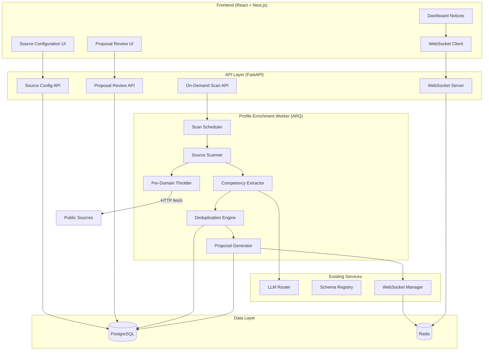
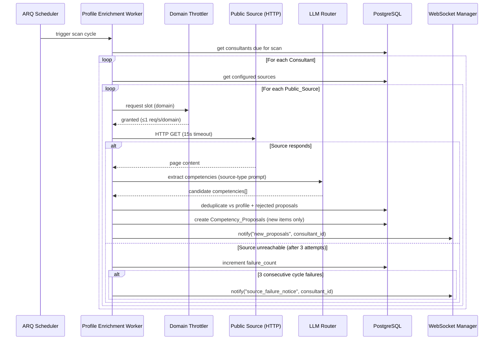
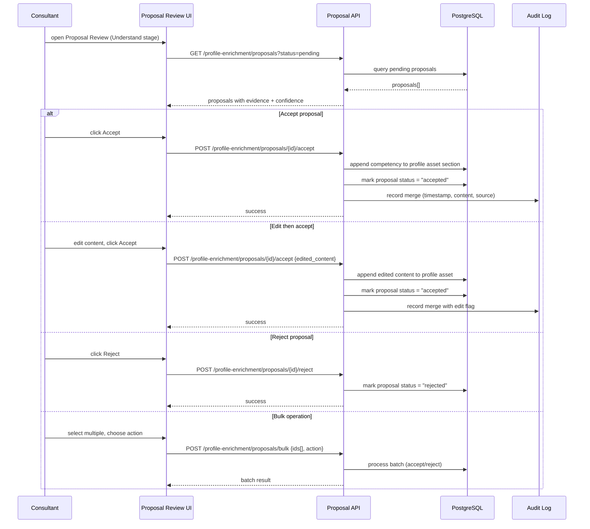

# Technical Design Document: Internal Profile Enrichment

## Overview

Internal Profile Enrichment mirrors the system's existing outward enrichment philosophy back toward the Consultant's own profile. While the EnrichmentWorker refreshes external prospect data via Apollo.io, Consultant profiles silently decay as new skills, publications, and projects accumulate. This feature introduces a **Profile_Enrichment_Worker** that periodically scans each Consultant's configured public sources (GitHub, portfolio sites, Google Scholar, etc.), extracts undiscovered competencies via the LLM_Router, and proposes additive-only updates with source attribution — never modifying existing content, never merging without human approval.

### Design Goals

1. **Automated discovery** — Surface new skills, projects, publications, and certifications from public sources without manual data entry
2. **Human-in-the-loop** — Every proposed change requires explicit Consultant approval before merging
3. **Additive-only safety** — The system may only append to profile assets; it never modifies or deletes existing content
4. **Privacy-first** — Only explicitly configured sources are scanned; only the configuring Consultant's data is processed
5. **Graceful degradation** — Source failures are tracked and surfaced without blocking other sources or cycles

### Key Architectural Decisions

| Decision | Rationale |
|----------|-----------|
| Reuse ARQ worker pattern | Consistent with existing EnrichmentWorker/DiscoveryWorker; proven scheduling and retry infrastructure |
| LLM_Router for extraction | Reuse existing provider routing, caching, and retry logic rather than building bespoke NLP |
| Per-domain throttling (1 req/s) | Respect rate limits of public sources; avoid IP blocking |
| Deduplication against rejected proposals | Prevents re-proposing items the Consultant explicitly declined |
| Confidence levels (strong/inferred) | Gives Consultants signal about evidence quality without hiding uncertain discoveries |
| Proposal_Review in Understand stage | Natural fit alongside existing profile management; maintains Dashboard-first UX |


## Architecture

### High-Level Component Diagram




### Scan Lifecycle Sequence




### Proposal Review and Merge Flow




## Components and Interfaces

### 1. Profile Enrichment Worker (`app/workers/profile_enrichment_worker.py`)

The new ARQ worker that orchestrates periodic scanning. Follows the same pattern as the existing `enrichment_worker.py`.

```python
"""Profile Enrichment Worker — scans public sources for competency evidence.

Scheduled via ARQ cron. Runs once per 30 days per Consultant (configurable).
Respects per-domain throttling (1 req/s) and 15-second fetch timeout.
Tracks consecutive failures and surfaces Dashboard notices at threshold.
"""

import asyncio
import logging
from datetime import datetime, timedelta, timezone
from dataclasses import dataclass
from enum import Enum

import httpx

logger = logging.getLogger(__name__)


class SourceType(str, Enum):
    """Supported public source types for profile enrichment."""
    GITHUB = "github"
    PORTFOLIO = "portfolio"
    GOOGLE_SCHOLAR = "google_scholar"
    LINKEDIN_PUBLICATIONS = "linkedin_publications"
    CERTIFICATION_BADGE = "certification_badge"
    PERSONAL_BLOG = "personal_blog"
    NPM_PYPI = "npm_pypi"
    STACK_OVERFLOW = "stack_overflow"
    SPEAKER_PROFILE = "speaker_profile"
    OTHER = "other"


class ProposalConfidence(str, Enum):
    """Confidence level for a competency proposal."""
    STRONG = "strong"       # Directly evidenced (repo owner, named author)
    INFERRED = "inferred"   # Indirectly evidenced (contributor, tech used)


class ProposalStatus(str, Enum):
    """Lifecycle status of a competency proposal."""
    PENDING = "pending"
    ACCEPTED = "accepted"
    REJECTED = "rejected"


@dataclass
class ScanConfig:
    """Per-consultant scan configuration."""
    consultant_id: str
    scan_interval_days: int = 30  # default 30, configurable per consultant
    max_sources: int = 10


FETCH_TIMEOUT = 15.0           # seconds per page fetch
MAX_FETCH_RETRIES = 3          # attempts per source per cycle
THROTTLE_DELAY = 1.0           # seconds between requests to same domain
CONSECUTIVE_FAILURE_THRESHOLD = 3  # cycles before Dashboard notice
```


### 2. Domain Throttler (`app/core/domain_throttler.py`)

Rate-limits HTTP requests on a per-domain basis using a token-bucket approach backed by Redis timestamps.

```python
"""Per-domain request throttler.

Ensures no more than 1 request per second per source domain.
Uses Redis sorted sets to track request timestamps per domain.
"""

import asyncio
import time
from urllib.parse import urlparse

from app.core.redis import get_redis_client


class DomainThrottler:
    """Enforces per-domain rate limiting (1 req/s max)."""

    RATE_LIMIT_INTERVAL = 1.0  # seconds between requests to same domain
    REDIS_KEY_PREFIX = "throttle:domain:"
    TTL_SECONDS = 120  # cleanup stale entries

    def __init__(self, redis_client):
        self._redis = redis_client

    async def acquire(self, url: str) -> None:
        """Wait until a request to this URL's domain is permitted.

        Blocks (async sleep) until at least RATE_LIMIT_INTERVAL seconds
        have elapsed since the last request to the same domain.

        Args:
            url: The target URL whose domain to throttle.
        """
        domain = self._extract_domain(url)
        key = f"{self.REDIS_KEY_PREFIX}{domain}"

        while True:
            now = time.time()
            last_request = await self._redis.get(key)

            if last_request is None:
                await self._redis.set(key, str(now), ex=self.TTL_SECONDS)
                return

            elapsed = now - float(last_request)
            if elapsed >= self.RATE_LIMIT_INTERVAL:
                await self._redis.set(key, str(now), ex=self.TTL_SECONDS)
                return

            # Wait for remaining interval
            await asyncio.sleep(self.RATE_LIMIT_INTERVAL - elapsed)

    @staticmethod
    def _extract_domain(url: str) -> str:
        """Extract domain from URL for throttle grouping."""
        parsed = urlparse(url)
        return parsed.netloc or parsed.path.split("/")[0]
```


### 3. Competency Extractor (`app/core/competency_extractor.py`)

Uses the LLM_Router to extract structured competency candidates from source content. Prompt templates vary by source type.

```python
"""Competency extraction via LLM Router.

Provides source-type-specific prompts that guide the LLM to extract
structured competency candidates from raw page content.
"""

from dataclasses import dataclass
from enum import Enum

from app.integrations.llm_router import EvaluationType, LLMRouter


@dataclass
class CompetencyCandidate:
    """A single extracted competency candidate before deduplication."""
    category: str          # "technology", "publication", "certification",
                           # "course", "project", "community_role"
    name: str              # e.g. "Kubernetes", "RFC 9114 co-author"
    evidence_summary: str  # e.g. "Owner of 'k8s-operator' repo (142 stars)"
    confidence: str        # "strong" or "inferred"
    source_url: str        # The Public_Source URL it came from
    raw_evidence: str      # Verbatim snippet from source content


class CompetencyExtractor:
    """Extracts competency candidates from public source content via LLM."""

    MAX_CONTENT_LENGTH = 15_000  # chars sent to LLM (truncate if larger)
    MAX_CANDIDATES_PER_SOURCE = 20

    # Source-type-specific prompt templates
    PROMPTS = {
        "github": (
            "Analyze this GitHub profile/repository content. Extract:\n"
            "- Technologies the user demonstrably uses (languages, frameworks, tools)\n"
            "- Projects they own or significantly contribute to\n"
            "- Any certifications or badges visible\n"
            "For each, indicate confidence: 'strong' if they are the owner/primary "
            "contributor, 'inferred' if they are a minor contributor or the tech "
            "is only used peripherally.\n"
            "Return JSON array of objects with: category, name, evidence_summary, confidence"
        ),
        "google_scholar": (
            "Analyze this Google Scholar profile. Extract:\n"
            "- Publications (title, venue, year)\n"
            "- Research areas/expertise evidenced by publication topics\n"
            "- H-index or citation metrics if visible\n"
            "Confidence is 'strong' for authored publications, 'inferred' for "
            "research areas derived from publication topics.\n"
            "Return JSON array of objects with: category, name, evidence_summary, confidence"
        ),
        "certification_badge": (
            "Analyze this certification/badge page. Extract:\n"
            "- Certifications with issuing body and date if visible\n"
            "- Technologies or skills the certifications validate\n"
            "All certifications with visible badge or verification link are 'strong'.\n"
            "Return JSON array of objects with: category, name, evidence_summary, confidence"
        ),
        "portfolio": (
            "Analyze this portfolio/personal website. Extract:\n"
            "- Projects showcased with technologies used\n"
            "- Skills or competencies explicitly listed\n"
            "- Publications, talks, or community contributions mentioned\n"
            "Items explicitly listed by the author are 'strong'. "
            "Items inferred from project descriptions are 'inferred'.\n"
            "Return JSON array of objects with: category, name, evidence_summary, confidence"
        ),
        "default": (
            "Analyze this professional web page. Extract skills, projects, "
            "publications, certifications, and competencies. For each, indicate "
            "confidence: 'strong' if directly stated/evidenced, 'inferred' if "
            "indirectly implied.\n"
            "Return JSON array of objects with: category, name, evidence_summary, confidence"
        ),
    }

    def __init__(self, llm_router: LLMRouter):
        self._llm = llm_router

    async def extract(
        self, content: str, source_type: str, source_url: str
    ) -> list[CompetencyCandidate]:
        """Extract competency candidates from source content.

        Args:
            content: Raw text content fetched from the public source.
            source_type: One of the SourceType enum values.
            source_url: The URL the content was fetched from.

        Returns:
            List of CompetencyCandidate objects (max MAX_CANDIDATES_PER_SOURCE).
        """
        truncated = content[:self.MAX_CONTENT_LENGTH]
        prompt_template = self.PROMPTS.get(source_type, self.PROMPTS["default"])

        full_prompt = (
            f"{prompt_template}\n\n"
            f"--- SOURCE CONTENT ({source_type}) ---\n"
            f"{truncated}"
        )

        response = await self._llm.generate_content(
            prompt=full_prompt,
            context={"source_type": source_type, "source_url": source_url},
            material_type="competency_extraction",
        )

        candidates = self._parse_candidates(response, source_url)
        return candidates[:self.MAX_CANDIDATES_PER_SOURCE]

    def _parse_candidates(
        self, response: str, source_url: str
    ) -> list[CompetencyCandidate]:
        """Parse LLM JSON response into CompetencyCandidate objects."""
        import json

        try:
            cleaned = response.strip()
            if cleaned.startswith("```"):
                lines = cleaned.split("\n")
                cleaned = "\n".join(lines[1:-1])
            items = json.loads(cleaned)
            if not isinstance(items, list):
                items = [items]
        except (json.JSONDecodeError, TypeError):
            return []

        candidates = []
        for item in items:
            if not isinstance(item, dict):
                continue
            candidates.append(CompetencyCandidate(
                category=item.get("category", "unknown"),
                name=item.get("name", ""),
                evidence_summary=item.get("evidence_summary", ""),
                confidence=item.get("confidence", "inferred"),
                source_url=source_url,
                raw_evidence=item.get("evidence_summary", ""),
            ))
        return candidates
```


### 4. Deduplication Engine (`app/core/proposal_deduplicator.py`)

Prevents re-proposing items already in the profile or previously rejected.

```python
"""Deduplication logic for competency proposals.

Deduplicates candidates against:
1. Existing profile assets (exact and fuzzy match on name)
2. Previously rejected proposals (exact match on name + category)
3. Currently pending proposals (prevent duplicates within same cycle)
"""

from dataclasses import dataclass


@dataclass
class DeduplicationResult:
    """Result of deduplication check for a single candidate."""
    is_duplicate: bool
    reason: str | None  # "existing_profile", "previously_rejected", "pending_proposal"
    matched_against: str | None  # the item it matched


class ProposalDeduplicator:
    """Deduplicates competency candidates against profile and history."""

    FUZZY_THRESHOLD = 0.85  # Normalized similarity score for fuzzy matching

    def __init__(self, db_repo):
        self._db = db_repo

    async def deduplicate(
        self,
        candidates: list,  # list[CompetencyCandidate]
        consultant_id: str,
    ) -> list:  # list[CompetencyCandidate] — only genuinely new items
        """Filter out candidates that are duplicates.

        Checks in order:
        1. Exact name match against existing profile assets
        2. Fuzzy name match against existing profile assets (≥85% similarity)
        3. Exact name+category match against rejected proposals
        4. Exact name+category match against pending proposals

        Args:
            candidates: Raw competency candidates from extraction.
            consultant_id: The Consultant whose profile to check against.

        Returns:
            Filtered list containing only genuinely new candidates.
        """
        existing_assets = await self._db.get_profile_assets(consultant_id)
        rejected_proposals = await self._db.get_rejected_proposals(consultant_id)
        pending_proposals = await self._db.get_pending_proposals(consultant_id)

        existing_names = {self._normalize(a.name) for a in existing_assets}
        rejected_keys = {
            (self._normalize(p.name), p.category) for p in rejected_proposals
        }
        pending_keys = {
            (self._normalize(p.name), p.category) for p in pending_proposals
        }

        new_candidates = []
        for candidate in candidates:
            norm_name = self._normalize(candidate.name)

            # Check exact match against existing profile
            if norm_name in existing_names:
                continue

            # Check fuzzy match against existing profile
            if self._fuzzy_match_any(norm_name, existing_names):
                continue

            # Check against rejected proposals
            if (norm_name, candidate.category) in rejected_keys:
                continue

            # Check against pending proposals
            if (norm_name, candidate.category) in pending_keys:
                continue

            new_candidates.append(candidate)

        return new_candidates

    @staticmethod
    def _normalize(name: str) -> str:
        """Normalize a competency name for comparison.

        Lowercases, strips whitespace, removes version numbers.
        """
        import re
        normalized = name.lower().strip()
        # Remove version suffixes like "v3", "3.x", "14.0"
        normalized = re.sub(r"\s*v?\d+(\.\d+)*\s*$", "", normalized)
        return normalized

    def _fuzzy_match_any(self, name: str, existing: set[str]) -> bool:
        """Check if name fuzzy-matches any item in existing set."""
        from difflib import SequenceMatcher

        for existing_name in existing:
            ratio = SequenceMatcher(None, name, existing_name).ratio()
            if ratio >= self.FUZZY_THRESHOLD:
                return True
        return False
```


### 5. Proposal Review Service (`app/core/proposal_review_service.py`)

Handles the accept/edit/reject lifecycle and the additive-only merge.

```python
"""Proposal Review Service — accept, reject, bulk operations, merge.

Enforces the additive-only constraint: accepted proposals APPEND to
profile asset sections. No existing content is ever modified or deleted.
All merges are recorded in the audit log.
"""

from dataclasses import dataclass
from datetime import datetime, timezone
from enum import Enum


class MergeAction(str, Enum):
    ACCEPT = "accept"
    ACCEPT_WITH_EDIT = "accept_with_edit"
    REJECT = "reject"


@dataclass
class MergeResult:
    """Result of merging an accepted proposal into the profile."""
    proposal_id: str
    action: MergeAction
    merged_content: str | None  # The content appended (None for reject)
    profile_section: str        # Which profile asset section was modified
    audit_log_id: str           # Reference to the audit log entry


@dataclass
class AuditLogEntry:
    """Audit trail for profile changes from enrichment proposals."""
    id: str
    consultant_id: str
    proposal_id: str
    action: MergeAction
    timestamp: datetime
    added_content: str
    evidence_source_url: str
    profile_section: str
    edited: bool  # True if Consultant modified before accepting


class ProposalReviewService:
    """Manages the Consultant review workflow for competency proposals."""

    MAX_BULK_SIZE = 50  # max proposals per bulk operation

    def __init__(self, db_repo, websocket_manager):
        self._db = db_repo
        self._ws = websocket_manager

    async def accept_proposal(
        self,
        proposal_id: str,
        consultant_id: str,
        edited_content: str | None = None,
    ) -> MergeResult:
        """Accept a proposal and merge into the profile (additive-only).

        Args:
            proposal_id: The proposal to accept.
            consultant_id: The owning Consultant (authorization check).
            edited_content: If provided, use this instead of the proposal content.

        Returns:
            MergeResult with details of what was appended.

        Raises:
            PermissionError: If consultant_id doesn't own the proposal.
            ValueError: If proposal is not in 'pending' status.
        """
        ...

    async def reject_proposal(
        self, proposal_id: str, consultant_id: str
    ) -> None:
        """Reject a proposal. Records rejection to prevent re-proposal."""
        ...

    async def bulk_action(
        self,
        proposal_ids: list[str],
        action: MergeAction,
        consultant_id: str,
    ) -> list[MergeResult]:
        """Process up to MAX_BULK_SIZE proposals in a single operation."""
        ...

    async def _append_to_profile(
        self, consultant_id: str, content: str, section: str
    ) -> None:
        """Append content to the specified profile asset section.

        CRITICAL: This method only ever appends. It never modifies or
        deletes existing content. The implementation uses an INSERT into
        the profile_assets junction table, preserving all existing rows.
        """
        ...

    async def _create_audit_entry(
        self, consultant_id: str, proposal_id: str,
        action: MergeAction, content: str, source_url: str,
        section: str, edited: bool
    ) -> str:
        """Create an immutable audit log entry for the profile change."""
        ...
```


### 6. API Routes (`app/api/profile_enrichment.py`)

FastAPI router for source configuration, proposal management, and on-demand scans.

```python
"""Profile Enrichment API routes.

Endpoints:
- GET/POST/DELETE /profile-enrichment/sources — Manage public sources
- POST /profile-enrichment/scan — Trigger on-demand scan
- GET /profile-enrichment/proposals — List pending proposals
- POST /profile-enrichment/proposals/{id}/accept — Accept proposal
- POST /profile-enrichment/proposals/{id}/reject — Reject proposal
- POST /profile-enrichment/proposals/bulk — Bulk accept/reject
"""

from fastapi import APIRouter, Depends, HTTPException, status
from pydantic import BaseModel, HttpUrl, Field
from typing import Literal

router = APIRouter(prefix="/profile-enrichment", tags=["profile-enrichment"])


# --- Request/Response Schemas ---

class PublicSourceCreate(BaseModel):
    source_type: str  # SourceType enum value
    url: HttpUrl
    label: str = Field(max_length=100)

class PublicSourceResponse(BaseModel):
    id: str
    source_type: str
    url: str
    label: str
    last_scanned_at: str | None
    consecutive_failures: int
    created_at: str

class ProposalResponse(BaseModel):
    id: str
    category: str
    name: str
    evidence_summary: str
    confidence: Literal["strong", "inferred"]
    source_url: str
    source_label: str
    status: Literal["pending", "accepted", "rejected"]
    created_at: str

class AcceptRequest(BaseModel):
    edited_content: str | None = None

class BulkActionRequest(BaseModel):
    proposal_ids: list[str] = Field(max_length=50)
    action: Literal["accept", "reject"]


# --- Endpoints ---

@router.get("/sources")
async def list_sources(consultant_id: str = Depends(get_current_consultant)):
    """List all configured public sources for the current Consultant."""
    ...

@router.post("/sources", status_code=status.HTTP_201_CREATED)
async def add_source(
    body: PublicSourceCreate,
    consultant_id: str = Depends(get_current_consultant),
):
    """Add a new public source (max 10 per Consultant)."""
    ...

@router.delete("/sources/{source_id}")
async def remove_source(
    source_id: str,
    consultant_id: str = Depends(get_current_consultant),
):
    """Remove a configured public source."""
    ...

@router.post("/scan")
async def trigger_scan(consultant_id: str = Depends(get_current_consultant)):
    """Trigger an on-demand scan of all configured sources."""
    ...

@router.get("/proposals")
async def list_proposals(
    status_filter: str | None = "pending",
    consultant_id: str = Depends(get_current_consultant),
):
    """List competency proposals with optional status filter."""
    ...

@router.post("/proposals/{proposal_id}/accept")
async def accept_proposal(
    proposal_id: str,
    body: AcceptRequest | None = None,
    consultant_id: str = Depends(get_current_consultant),
):
    """Accept a proposal (optionally with edits). Merges into profile."""
    ...

@router.post("/proposals/{proposal_id}/reject")
async def reject_proposal(
    proposal_id: str,
    consultant_id: str = Depends(get_current_consultant),
):
    """Reject a proposal. Prevents re-proposal in future cycles."""
    ...

@router.post("/proposals/bulk")
async def bulk_action(
    body: BulkActionRequest,
    consultant_id: str = Depends(get_current_consultant),
):
    """Bulk accept or reject up to 50 proposals."""
    ...
```


## Data Models

### Database Schema (PostgreSQL)

```sql
-- Public sources configured by each Consultant
CREATE TABLE public_sources (
    id              UUID PRIMARY KEY DEFAULT gen_random_uuid(),
    consultant_id   UUID NOT NULL REFERENCES beneficiaries(id),
    source_type     VARCHAR(50) NOT NULL,  -- SourceType enum
    url             TEXT NOT NULL,
    label           VARCHAR(100) NOT NULL,
    scan_interval_days INTEGER NOT NULL DEFAULT 30,
    last_scanned_at TIMESTAMPTZ,
    consecutive_failures INTEGER NOT NULL DEFAULT 0,
    is_active       BOOLEAN NOT NULL DEFAULT true,
    created_at      TIMESTAMPTZ NOT NULL DEFAULT NOW(),
    updated_at      TIMESTAMPTZ NOT NULL DEFAULT NOW(),
    UNIQUE(consultant_id, url),
    CHECK (scan_interval_days >= 1 AND scan_interval_days <= 365)
);

-- Competency proposals generated by the enrichment worker
CREATE TABLE competency_proposals (
    id              UUID PRIMARY KEY DEFAULT gen_random_uuid(),
    consultant_id   UUID NOT NULL REFERENCES beneficiaries(id),
    source_id       UUID NOT NULL REFERENCES public_sources(id),
    category        VARCHAR(50) NOT NULL,  -- technology, publication, etc.
    name            VARCHAR(500) NOT NULL,
    evidence_summary TEXT NOT NULL,
    raw_evidence    TEXT,
    confidence      VARCHAR(20) NOT NULL CHECK (confidence IN ('strong', 'inferred')),
    source_url      TEXT NOT NULL,
    status          VARCHAR(20) NOT NULL DEFAULT 'pending'
                    CHECK (status IN ('pending', 'accepted', 'rejected')),
    merged_content  TEXT,  -- actual content appended on acceptance (may be edited)
    reviewed_at     TIMESTAMPTZ,
    created_at      TIMESTAMPTZ NOT NULL DEFAULT NOW(),
    updated_at      TIMESTAMPTZ NOT NULL DEFAULT NOW()
);

-- Index for efficient proposal queries
CREATE INDEX idx_proposals_consultant_status
    ON competency_proposals(consultant_id, status);
CREATE INDEX idx_proposals_consultant_name_category
    ON competency_proposals(consultant_id, lower(name), category);

-- Audit log for profile changes from enrichment
CREATE TABLE profile_enrichment_audit_log (
    id              UUID PRIMARY KEY DEFAULT gen_random_uuid(),
    consultant_id   UUID NOT NULL REFERENCES beneficiaries(id),
    proposal_id     UUID NOT NULL REFERENCES competency_proposals(id),
    action          VARCHAR(20) NOT NULL,  -- accept, accept_with_edit, reject
    added_content   TEXT NOT NULL,
    evidence_source_url TEXT NOT NULL,
    profile_section VARCHAR(100) NOT NULL,
    was_edited      BOOLEAN NOT NULL DEFAULT false,
    created_at      TIMESTAMPTZ NOT NULL DEFAULT NOW()
);

-- Scan history for tracking cycle success/failure
CREATE TABLE enrichment_scan_history (
    id              UUID PRIMARY KEY DEFAULT gen_random_uuid(),
    consultant_id   UUID NOT NULL REFERENCES beneficiaries(id),
    source_id       UUID REFERENCES public_sources(id),
    started_at      TIMESTAMPTZ NOT NULL,
    completed_at    TIMESTAMPTZ,
    status          VARCHAR(20) NOT NULL DEFAULT 'running'
                    CHECK (status IN ('running', 'completed', 'failed')),
    proposals_generated INTEGER NOT NULL DEFAULT 0,
    error_message   TEXT,
    created_at      TIMESTAMPTZ NOT NULL DEFAULT NOW()
);
```


### SQLAlchemy ORM Models

```python
# app/models/public_source.py
class PublicSource(Base):
    """A Consultant-configured public source for enrichment scanning."""
    __tablename__ = "public_sources"
    __table_args__ = (
        UniqueConstraint("consultant_id", "url"),
    )

    id: Mapped[uuid.UUID] = mapped_column(UUID(as_uuid=True), primary_key=True,
                                           server_default=text("gen_random_uuid()"))
    consultant_id: Mapped[uuid.UUID] = mapped_column(UUID(as_uuid=True),
                                                      ForeignKey("beneficiaries.id"))
    source_type: Mapped[str] = mapped_column(String(50), nullable=False)
    url: Mapped[str] = mapped_column(Text, nullable=False)
    label: Mapped[str] = mapped_column(String(100), nullable=False)
    scan_interval_days: Mapped[int] = mapped_column(Integer, server_default="30")
    last_scanned_at: Mapped[datetime | None] = mapped_column(DateTime(timezone=True))
    consecutive_failures: Mapped[int] = mapped_column(Integer, server_default="0")
    is_active: Mapped[bool] = mapped_column(Boolean, server_default="true")
    created_at: Mapped[datetime] = mapped_column(DateTime(timezone=True),
                                                  server_default=text("NOW()"))
    updated_at: Mapped[datetime] = mapped_column(DateTime(timezone=True),
                                                  server_default=text("NOW()"))


# app/models/competency_proposal.py
class CompetencyProposal(Base):
    """A proposed competency addition awaiting Consultant review."""
    __tablename__ = "competency_proposals"

    id: Mapped[uuid.UUID] = mapped_column(UUID(as_uuid=True), primary_key=True,
                                           server_default=text("gen_random_uuid()"))
    consultant_id: Mapped[uuid.UUID] = mapped_column(UUID(as_uuid=True),
                                                      ForeignKey("beneficiaries.id"))
    source_id: Mapped[uuid.UUID] = mapped_column(UUID(as_uuid=True),
                                                   ForeignKey("public_sources.id"))
    category: Mapped[str] = mapped_column(String(50), nullable=False)
    name: Mapped[str] = mapped_column(String(500), nullable=False)
    evidence_summary: Mapped[str] = mapped_column(Text, nullable=False)
    raw_evidence: Mapped[str | None] = mapped_column(Text)
    confidence: Mapped[str] = mapped_column(String(20), nullable=False)
    source_url: Mapped[str] = mapped_column(Text, nullable=False)
    status: Mapped[str] = mapped_column(String(20), server_default="'pending'")
    merged_content: Mapped[str | None] = mapped_column(Text)
    reviewed_at: Mapped[datetime | None] = mapped_column(DateTime(timezone=True))
    created_at: Mapped[datetime] = mapped_column(DateTime(timezone=True),
                                                  server_default=text("NOW()"))
    updated_at: Mapped[datetime] = mapped_column(DateTime(timezone=True),
                                                  server_default=text("NOW()"))


# app/models/profile_enrichment_audit.py
class ProfileEnrichmentAudit(Base):
    """Immutable audit log for profile changes from enrichment proposals."""
    __tablename__ = "profile_enrichment_audit_log"

    id: Mapped[uuid.UUID] = mapped_column(UUID(as_uuid=True), primary_key=True,
                                           server_default=text("gen_random_uuid()"))
    consultant_id: Mapped[uuid.UUID] = mapped_column(UUID(as_uuid=True),
                                                      ForeignKey("beneficiaries.id"))
    proposal_id: Mapped[uuid.UUID] = mapped_column(UUID(as_uuid=True),
                                                    ForeignKey("competency_proposals.id"))
    action: Mapped[str] = mapped_column(String(20), nullable=False)
    added_content: Mapped[str] = mapped_column(Text, nullable=False)
    evidence_source_url: Mapped[str] = mapped_column(Text, nullable=False)
    profile_section: Mapped[str] = mapped_column(String(100), nullable=False)
    was_edited: Mapped[bool] = mapped_column(Boolean, server_default="false")
    created_at: Mapped[datetime] = mapped_column(DateTime(timezone=True),
                                                  server_default=text("NOW()"))
```


## Correctness Properties

*A property is a characteristic or behavior that should hold true across all valid executions of a system — essentially, a formal statement about what the system should do. Properties serve as the bridge between human-readable specifications and machine-verifiable correctness guarantees.*

### Property 1: Source Limit Enforcement

*For any* Consultant and any sequence of Public_Source additions, the system SHALL accept at most 10 sources; any attempt to add an 11th or subsequent source SHALL be rejected while the existing 10 remain unchanged.

**Validates: Requirements 1.1**

### Property 2: Scan Scheduling Correctness

*For any* Public_Source with a configured `scan_interval_days` and a `last_scanned_at` timestamp, the source is due for scanning if and only if `current_time - last_scanned_at >= scan_interval_days` (or `last_scanned_at` is null, indicating never scanned).

**Validates: Requirements 1.2**

### Property 3: Domain Extraction Determinism

*For any* valid URL, the domain extraction function SHALL produce a consistent domain string such that two URLs sharing the same host produce the same throttle group key, and two URLs with different hosts produce different keys.

**Validates: Requirements 1.3**

### Property 4: Failure Counter Monotonicity and Reset

*For any* sequence of scan outcomes (success or failure) for a Public_Source, the consecutive_failures counter SHALL increment by exactly 1 on each failure, reset to 0 on each success, and a Dashboard notice SHALL be emitted if and only if the counter reaches exactly 3.

**Validates: Requirements 1.4**

### Property 5: Competency Candidate Parsing Completeness

*For any* valid JSON array produced by the LLM representing competency candidates, the parser SHALL produce CompetencyCandidate objects where each has: a non-empty `category`, a non-empty `name`, a non-empty `evidence_summary`, a `confidence` value in {"strong", "inferred"}, and the originating `source_url`.

**Validates: Requirements 2.1, 2.3**

### Property 6: Deduplication Soundness

*For any* set of existing profile assets, any set of previously rejected proposals, and any list of new competency candidates: the deduplication function SHALL output only candidates whose normalized name does not match (exactly or within 85% fuzzy similarity) any existing asset, and whose (normalized name, category) pair does not match any rejected proposal. No genuinely new candidates SHALL be incorrectly filtered.

**Validates: Requirements 2.2, 3.3**

### Property 7: Additive-Only Merge Invariant

*For any* profile state and any accepted Competency_Proposal, after the merge operation the profile asset section SHALL contain all previous content byte-for-byte unchanged, plus the new content appended. No existing content SHALL be modified, reordered, or deleted.

**Validates: Requirements 3.2**

### Property 8: Audit Log Completeness

*For any* accepted and merged Competency_Proposal, the system SHALL create exactly one audit log entry containing: a non-null timestamp, the `added_content` matching the merged content, the `evidence_source_url` from the proposal, and the target `profile_section`.

**Validates: Requirements 3.4**


## Error Handling

### Source Fetching Errors

| Error Condition | Handling Strategy |
|----------------|-------------------|
| HTTP timeout (>15s) | Abort fetch, count as attempt failure. Retry up to 3 times within same cycle. |
| HTTP 4xx (client error) | Log warning, count as failure. Do not retry within same cycle (likely permanent). |
| HTTP 5xx (server error) | Retry up to 3 times with 5s backoff between attempts. |
| DNS resolution failure | Count as fetch failure. Source may have been removed. |
| SSL/TLS error | Count as failure. Log security warning for review. |
| Content too large (>1MB) | Truncate to 1MB, proceed with extraction. Log warning. |

### Consecutive Failure Escalation

```
Cycle 1 failure → consecutive_failures = 1 → skip source, continue others
Cycle 2 failure → consecutive_failures = 2 → skip source, continue others
Cycle 3 failure → consecutive_failures = 3 → emit Dashboard notice to Consultant
Cycle 4+ failure → no additional notices (avoid spam), source remains inactive
Manual re-scan → resets consecutive_failures on success
```

### LLM Extraction Errors

| Error Condition | Handling Strategy |
|----------------|-------------------|
| LLM timeout | Use LLM_Router's built-in retry (3 attempts, 5-min delay). Skip source if all fail. |
| Invalid JSON response | Return empty candidate list. Log parse failure for monitoring. |
| LLM returns empty results | Normal case (source may not contain new competencies). No error raised. |
| LLM rate limit | Handled by LLM_Router's existing retry/backoff logic. |

### Proposal Merge Errors

| Error Condition | Handling Strategy |
|----------------|-------------------|
| Proposal not in "pending" status | Return 409 Conflict. Proposal may have been processed by another tab/session. |
| Consultant doesn't own proposal | Return 403 Forbidden. Authorization violation. |
| Database write failure during merge | Rollback transaction. Return 500 with retry guidance. |
| Profile section not found | Return 422 Unprocessable. Log for investigation (schema mismatch). |

### Worker-Level Error Handling

- **Unhandled exception in scan cycle**: Catch at top level, log with full traceback, continue to next Consultant. Never crash the entire worker.
- **Database connectivity loss**: ARQ will retry the job on next scheduled interval. Log critical-level alert.
- **Redis unavailable (throttler)**: Degrade gracefully — skip throttling, add 2s fixed delay between all requests as fallback.


## Testing Strategy

### Property-Based Testing

Property-based tests validate the correctness properties defined above using **Hypothesis** (already in use in this project). Each property test runs a minimum of 100 iterations with randomized inputs.

**Library**: Hypothesis (Python)
**Configuration**: `@settings(max_examples=100)`

| Property | Test Target | Generator Strategy |
|----------|-------------|-------------------|
| Property 1: Source Limit | `add_source()` service logic | Random (consultant, source_count 1-20) |
| Property 2: Scan Scheduling | `is_due_for_scan()` pure function | Random (interval_days, last_scanned_at, now) |
| Property 3: Domain Extraction | `DomainThrottler._extract_domain()` | Random valid URLs with various schemes/paths |
| Property 4: Failure Counter | `update_failure_count()` logic | Random sequences of (success, failure) booleans |
| Property 5: Candidate Parsing | `CompetencyExtractor._parse_candidates()` | Random valid JSON arrays of candidate objects |
| Property 6: Deduplication | `ProposalDeduplicator.deduplicate()` | Random (existing_assets, rejected_proposals, new_candidates) |
| Property 7: Additive-Only Merge | `ProposalReviewService._append_to_profile()` | Random (profile_content, proposal_content) |
| Property 8: Audit Log | `ProposalReviewService.accept_proposal()` | Random proposals with varying fields |

**Tag format**: Each test is annotated with:
```python
# Feature: internal-profile-enrichment, Property {N}: {property_text}
```

### Unit Tests (Example-Based)

| Test Area | Key Scenarios |
|-----------|---------------|
| Source Configuration API | Add source (happy path), add 11th source (rejected), remove source, invalid URL |
| Proposal Review API | Accept, reject, bulk accept, edit-then-accept, accept non-pending (409) |
| Worker scheduling | On-demand trigger, scan interval reached, not yet due |
| LLM prompt selection | GitHub source gets github prompt, Scholar gets scholar prompt, unknown gets default |
| Authorization | Consultant A cannot access Consultant B's proposals or sources |

### Integration Tests

| Test Area | Key Scenarios |
|-----------|---------------|
| Full scan cycle | Configure source → trigger scan → verify proposals created |
| Accept-to-profile flow | Accept proposal → verify profile asset updated → verify audit log entry |
| Failure escalation | Simulate 3 consecutive cycle failures → verify Dashboard notice emitted |
| Privacy isolation | Configure sources for two Consultants → verify no cross-contamination |

### Test Execution

- Property tests: `pytest tests/property/ -v --hypothesis-show-statistics`
- Unit tests: `pytest tests/unit/test_profile_enrichment/ -v`
- Integration tests: `pytest tests/integration/test_profile_enrichment/ -v` (requires PostgreSQL + Redis)
