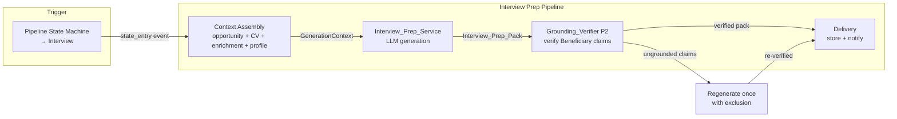
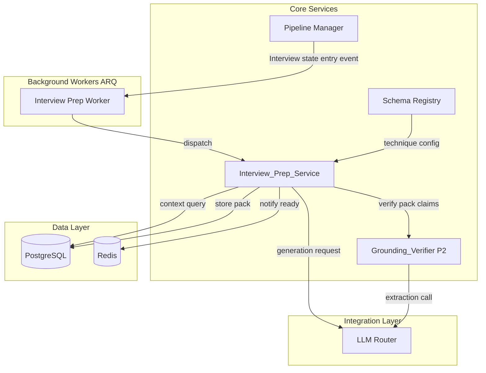
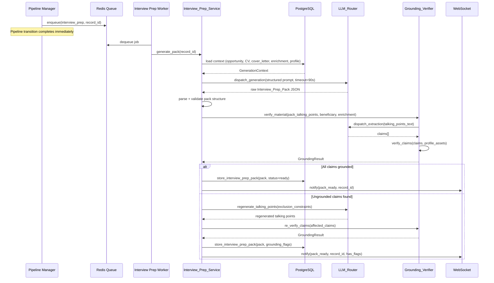
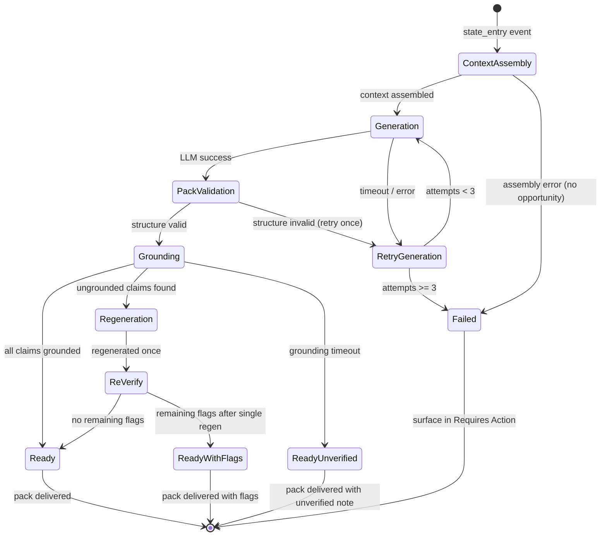

# Technical Design Document: Interview Prep Technique

## Overview

The Interview Prep Technique (P8) adds a schema-declared prepare technique that fires on Interview state entry. When a pipeline record transitions into the Interview state, the `Interview_Prep_Service` assembles generation context from the opportunity, submitted materials, Enrichment_Record, and Consultant profile assets, then produces a structured `Interview_Prep_Pack` containing likely questions, STAR-format talking points, a company briefing, and questions to ask. All Beneficiary-side claims pass through the existing Grounding_Verifier before delivery.

### Design Goals

1. **State-entry trigger** — Generation begins on Interview state entry, not at material-preparation time
2. **Grounded content** — Every STAR talking point is traceable to profile assets; gaps are acknowledged honestly
3. **Schema-driven wiring** — Declared as a prepare technique attachable to any opportunity type with Interview state
4. **120-second deadline** — Full pack generation completes within timeout; failures surface without blocking pipeline
5. **On-demand regeneration** — Consultant can trigger regeneration after profile updates or rescheduled interviews

### Key Architectural Decisions

| Decision | Rationale |
|----------|-----------|
| Separate `interview_preparation` technique type | Triggered on state entry, not material-prep time — distinct lifecycle from cv_and_cover_letter |
| Reuse Grounding_Verifier (P2) | Same claim extraction + verification pattern; talking points are Beneficiary-side claims |
| Single LLM call for pack generation | 120s budget allows one structured generation call rather than multiple sequential calls |
| ARQ worker dispatch | Keeps API response instant; worker handles generation + grounding asynchronously |
| Gap-handling in prompt, not post-processing | LLM produces honest framing at generation time, reducing rework from grounding failures |


## Architecture

### Interview Prep Pipeline Flow



### System Context




### Generation Sequence




## Components and Interfaces

### 1. Interview_Prep_Service (`app/core/interview_prep_service.py`)

The primary service orchestrating context assembly, LLM generation, grounding verification, and pack storage.

```python
from dataclasses import dataclass, field
from enum import Enum
from datetime import datetime


class PackStatus(str, Enum):
    """Status of an Interview_Prep_Pack lifecycle."""
    GENERATING = "generating"
    GROUNDING = "grounding"
    READY = "ready"
    READY_WITH_FLAGS = "ready_with_flags"
    FAILED = "failed"


class GapHandlingStrategy(str, Enum):
    """How to handle a competency gap in a STAR talking point."""
    ADJACENT_EXPERIENCE = "adjacent_experience"
    TRANSFERABLE_SKILL = "transferable_skill"
    LEARNING_TRAJECTORY = "learning_trajectory"


@dataclass
class STAR_Talking_Point:
    """A Situation-Task-Action-Result narrative for a competency question."""
    competency: str  # the competency being addressed
    question: str  # the anticipated interview question
    situation: str
    task: str
    action: str
    result: str
    source_asset_refs: list[str]  # asset IDs this point is drawn from
    is_gap_handled: bool = False
    gap_note: str | None = None  # framing note when competency not evidenced
```


```python
@dataclass
class Interview_Prep_Pack:
    """The complete interview preparation pack delivered to the Consultant."""
    id: str  # UUID
    pipeline_record_id: str
    beneficiary_id: str
    opportunity_type_id: str
    likely_questions: list[str]  # 8-15 questions
    star_talking_points: list[STAR_Talking_Point]  # exactly 5
    company_briefing: str  # max 400 words
    questions_to_ask: list[str]  # 3-6 questions
    status: PackStatus
    omission_notes: list[str]  # notes about missing context inputs
    grounding_flags: list[str]  # remaining flags after single regen attempt
    generation_duration_ms: int
    created_at: datetime
    updated_at: datetime


@dataclass
class GenerationContext:
    """Assembled inputs for pack generation."""
    opportunity_description: str
    tailored_cv: str | None  # the submitted CV for this record
    tailored_cover_letter: str | None  # the submitted cover letter
    enrichment_record: "EnrichmentRecord"
    intent_signals: list["IntentSignal"]
    profile_assets: dict[str, str]  # asset_id -> content
    star_examples: list[dict] | None  # existing STAR material from profile
    opportunity_type_id: str
    beneficiary_id: str
```


```python
class InterviewPrepService:
    """Orchestrates interview preparation pack generation and grounding.

    Triggered by Interview state entry via ARQ worker dispatch.
    Follows the same pattern as PersonalizationEngine but with:
    - State-entry trigger (not material-prep stage)
    - Single structured LLM call for entire pack
    - Grounding limited to STAR talking points (Beneficiary claims)
    - Single regeneration attempt on grounding failure
    """

    GENERATION_TIMEOUT = 90.0  # seconds (leaves 30s buffer within 120s deadline)
    TOTAL_DEADLINE = 120.0  # seconds overall
    MAX_RETRIES = 2
    MAX_QUESTIONS = 15
    MIN_QUESTIONS = 8
    STAR_COUNT = 5
    MAX_BRIEFING_WORDS = 400
    MAX_QUESTIONS_TO_ASK = 6
    MIN_QUESTIONS_TO_ASK = 3

    def __init__(
        self,
        llm_router: "LLMRouter",
        grounding_verifier: "GroundingVerifier",
        schema_registry: "SchemaRegistry",
        db_repo: "InterviewPrepRepository",
        event_publisher: "EventPublisher",
    ):
        self._llm = llm_router
        self._grounding = grounding_verifier
        self._schema = schema_registry
        self._db = db_repo
        self._publisher = event_publisher
```


    async def generate_pack(
        self,
        pipeline_record_id: str,
    ) -> Interview_Prep_Pack:
        """Generate a complete Interview_Prep_Pack for a pipeline record.

        Preconditions:
        - pipeline_record exists and is in Interview state
        - opportunity type has interview_preparation technique attached
        - beneficiary has at least profile_assets loaded

        Postconditions:
        - Returns Interview_Prep_Pack with status in {ready, ready_with_flags, failed}
        - Pack is stored in database
        - WebSocket notification sent on completion
        - Total execution within 120 seconds
        - Grounding_Verifier called on all STAR talking points
        - If ungrounded: single regeneration with exclusion constraint attempted
        """
        ...

    async def assemble_context(
        self,
        pipeline_record_id: str,
    ) -> GenerationContext:
        """Assemble all available inputs for pack generation.

        Loads:
        - Opportunity description from pipeline_record → prospect
        - tailored_cv and tailored_cover_letter from submitted_materials
        - Enrichment_Record for the prospect (company data, intent, tech stack)
        - Consultant's profile assets (resume, cover_letter, consultant_profiles)
        - Existing STAR example material from profile

        If submitted materials are unavailable, proceeds with profile-only
        and records the omission.

        Postconditions:
        - GenerationContext.opportunity_description is always non-empty
        - GenerationContext.enrichment_record is always present
        - GenerationContext.profile_assets has at least one entry
        - omission_notes populated for any missing submitted materials
        """
        ...
```


```python
    async def _generate_via_llm(
        self,
        context: GenerationContext,
    ) -> Interview_Prep_Pack:
        """Dispatch structured generation to LLM_Router.

        Uses GENERATION evaluation type with interview_prep prompt template.
        Timeout: 90 seconds.
        Returns parsed Interview_Prep_Pack or raises GenerationError.
        """
        ...

    def _validate_pack_structure(
        self,
        pack: Interview_Prep_Pack,
    ) -> list[str]:
        """Validate pack meets structural constraints.

        Checks:
        - likely_questions count in [8, 15]
        - star_talking_points count == 5
        - company_briefing word count <= 400
        - questions_to_ask count in [3, 6]
        - All STAR points reference at least one source_asset_ref

        Returns list of validation errors (empty = valid).
        """
        errors = []
        if not (self.MIN_QUESTIONS <= len(pack.likely_questions) <= self.MAX_QUESTIONS):
            errors.append(
                f"likely_questions count {len(pack.likely_questions)} "
                f"not in [{self.MIN_QUESTIONS}, {self.MAX_QUESTIONS}]"
            )
        if len(pack.star_talking_points) != self.STAR_COUNT:
            errors.append(
                f"star_talking_points count {len(pack.star_talking_points)} != {self.STAR_COUNT}"
            )
        briefing_words = len(pack.company_briefing.split())
        if briefing_words > self.MAX_BRIEFING_WORDS:
            errors.append(
                f"company_briefing has {briefing_words} words, max {self.MAX_BRIEFING_WORDS}"
            )
        if not (self.MIN_QUESTIONS_TO_ASK <= len(pack.questions_to_ask) <= self.MAX_QUESTIONS_TO_ASK):
            errors.append(
                f"questions_to_ask count {len(pack.questions_to_ask)} "
                f"not in [{self.MIN_QUESTIONS_TO_ASK}, {self.MAX_QUESTIONS_TO_ASK}]"
            )
        for tp in pack.star_talking_points:
            if not tp.source_asset_refs:
                errors.append(
                    f"STAR point for '{tp.competency}' has no source_asset_refs"
                )
        return errors
```


```python
    async def _ground_talking_points(
        self,
        pack: Interview_Prep_Pack,
        beneficiary: "Beneficiary",
        enrichment: "EnrichmentRecord",
    ) -> tuple[Interview_Prep_Pack, list[str]]:
        """Run Grounding_Verifier on STAR talking points.

        Only Beneficiary-side claims are verified (STAR narratives).
        Company briefing and questions-to-ask are prospect-side — not grounded.

        If ungrounded claims found:
        1. Regenerate affected talking points ONCE with exclusion constraint
        2. Re-verify regenerated points
        3. Return pack with any remaining flags

        Returns:
            (updated_pack, remaining_grounding_flags)
        """
        ...

    async def regenerate_pack(
        self,
        pipeline_record_id: str,
    ) -> Interview_Prep_Pack:
        """Regenerate pack on demand (profile update, rescheduled interview).

        Reassembles context (may have new profile data) and regenerates
        the full pack. Replaces the existing pack in storage.

        Postconditions:
        - New pack stored with fresh created_at
        - Previous pack version retained in history
        - Same grounding flow applied
        """
        ...
```

### 2. Interview Prep Worker (`app/workers/interview_prep_worker.py`)

```python
from arq import func


async def process_interview_prep(ctx: dict, pipeline_record_id: str) -> dict:
    """ARQ task: generate Interview_Prep_Pack for a record entering Interview state.

    Dispatched by PipelineManager on Interview state entry.
    Enforces the 120-second overall deadline.
    On failure after MAX_RETRIES: marks pack as failed, surfaces in Requires Action.

    Returns:
        {"status": "ready" | "ready_with_flags" | "failed", "pack_id": str | None}
    """
    ...


async def regenerate_interview_prep(ctx: dict, pipeline_record_id: str) -> dict:
    """ARQ task: regenerate pack on user demand.

    Same logic as initial generation but replaces existing pack.
    """
    ...
```


### 3. Pipeline Manager Extension (`app/core/pipeline_manager.py`)

The PipelineManager gains a hook for Interview state entry that enqueues the prep generation job.

```python
class PipelineManager:
    # ... existing code ...

    async def _transition(
        self, record: PipelineRecordData, new_status: str
    ) -> PipelineTransition:
        """Extended: dispatch state-entry techniques after transition."""
        transition = await self._execute_transition(record, new_status)

        # Fire state-entry techniques
        if transition.result == PipelineTransitionResult.ADVANCED:
            await self._dispatch_state_entry_techniques(record, new_status)

        return transition

    async def _dispatch_state_entry_techniques(
        self,
        record: PipelineRecordData,
        new_status: str,
    ) -> None:
        """Dispatch techniques configured for state entry.

        Queries Schema_Registry for any prepare techniques triggered
        on entry to `new_status` for this opportunity type.
        Enqueues ARQ jobs for each matching technique.
        """
        techniques = self._schema.get_state_entry_techniques(
            opportunity_type_id=record.opportunity_type_id,
            state=new_status,
        )
        for technique in techniques:
            await self._enqueue_technique(technique, record)
```

### 4. Schema_Registry Extension

```python
@dataclass
class PrepareTechnique:
    """Extended to support state-entry triggering."""
    id: str
    service_class: str
    description: str
    inputs: list[str] = field(default_factory=list)
    outputs: list[str] = field(default_factory=list)
    review_technique: str | None = None
    grounding_technique: str | None = None
    trigger: str = "material_preparation"  # "material_preparation" | "state_entry"
    trigger_state: str | None = None  # required when trigger == "state_entry"
```


```python
class SchemaRegistry:
    # ... existing code ...

    def get_state_entry_techniques(
        self,
        opportunity_type_id: str,
        state: str,
    ) -> list[PrepareTechnique]:
        """Return prepare techniques triggered on entry to a given state.

        Filters techniques where:
        - trigger == "state_entry"
        - trigger_state == state
        - technique is attached to the opportunity type
        """
        ot = next(
            (o for o in self.opportunity_types if o.id == opportunity_type_id),
            None,
        )
        if not ot:
            return []

        techniques = []
        for tech_id in ot.state_entry_techniques:
            tech = self.get_prepare_technique(tech_id)
            if tech and tech.trigger == "state_entry" and tech.trigger_state == state:
                techniques.append(tech)
        return techniques

    def _validate_state_entry_techniques(self) -> None:
        """Validate state-entry technique references.

        Rules:
        - trigger_state must exist in the opportunity type's pipeline_states
        - technique must be declared in prepare_techniques
        """
        for ot in self._raw.get("opportunity_types", []):
            for tech_ref in ot.get("state_entry_techniques", []):
                tech = next(
                    (t for t in self._raw.get("prepare_techniques", [])
                     if t["id"] == tech_ref),
                    None,
                )
                if tech is None:
                    raise SchemaValidationError(
                        f"OpportunityType '{ot['id']}' references unknown "
                        f"state_entry_technique '{tech_ref}'"
                    )
                trigger_state = tech.get("trigger_state")
                if trigger_state and trigger_state not in ot.get("pipeline_states", []):
                    raise SchemaValidationError(
                        f"Technique '{tech_ref}' trigger_state '{trigger_state}' "
                        f"not in pipeline_states of '{ot['id']}'"
                    )
```


### 5. Generation Prompt (`app/core/interview_prep_prompts.py`)

```python
INTERVIEW_PREP_GENERATION_PROMPT = """
You are an expert interview coach. Generate a structured interview preparation pack
for a consultant preparing for an interview.

OPPORTUNITY:
{opportunity_description}

CONSULTANT PROFILE ASSETS:
{profile_assets_text}

{submitted_materials_section}

COMPANY CONTEXT (from Enrichment_Record):
- Industry: {industry}
- Employee count: {employee_count}
- Technology stack: {tech_stack}
- Intent signals: {intent_signals}
- Headquarters: {headquarters}

INSTRUCTIONS:
1. Generate 8-15 likely interview questions based on the opportunity's stated
   requirements and responsibilities. Questions should range from technical to
   behavioral to situational.

2. For the 5 most probable competency-based questions, construct a STAR talking point:
   - Situation: drawn EXCLUSIVELY from the consultant's profile assets
   - Task: what was required in that situation
   - Action: what the consultant did (from profile evidence)
   - Result: measurable outcome (from profile evidence)
   - If the opportunity demands a competency NOT evidenced in the profile,
     include an honest gap-handling note suggesting how to frame adjacent
     experience. Do NOT fabricate.

3. Write a company briefing (max 400 words) synthesized from the enrichment data.
   Focus on what would be useful for interview conversation — recent initiatives,
   technology choices, growth signals.

4. Generate 3-6 informed questions for the consultant to ask, grounded in the
   enrichment record (intent signals, tech stack, company trajectory).

GROUNDING CONSTRAINT:
All STAR talking points MUST be traceable to the profile assets provided above.
Never invent achievements, metrics, certifications, or client names.
If a competency gap exists, acknowledge it honestly with adjacent experience framing.

Return a JSON object with this structure:
{{
  "likely_questions": ["..."],
  "star_talking_points": [
    {{
      "competency": "...",
      "question": "...",
      "situation": "...",
      "task": "...",
      "action": "...",
      "result": "...",
      "source_asset_refs": ["..."],
      "is_gap_handled": false,
      "gap_note": null
    }}
  ],
  "company_briefing": "...",
  "questions_to_ask": ["..."]
}}
"""
```


### 6. LLM_Router Extension

The `EvaluationType` enum is already used for GENERATION calls. The Interview Prep Service uses the existing GENERATION evaluation type with a longer timeout (90s vs default 30s), configured via the schema technique declaration.

```python
class EvaluationType(str, Enum):
    MATCHING = "matching"
    GENERATION = "generation"  # used for interview prep generation
    RESEARCH = "research"
    CRITIQUE = "critique"       # P1
    REVISION = "revision"       # P1
    EXTRACTION = "extraction"   # P2 — also used for grounding interview prep
```

### 7. API Routes (`app/api/interview_prep.py`)

```python
from fastapi import APIRouter, HTTPException

router = APIRouter(prefix="/interview-prep", tags=["interview-prep"])


@router.get("/{pipeline_record_id}")
async def get_interview_prep_pack(pipeline_record_id: str):
    """Retrieve the Interview_Prep_Pack for a pipeline record.

    Returns 404 if no pack exists (generation not triggered or still pending).
    Returns pack with status indicating readiness.
    """
    ...


@router.post("/{pipeline_record_id}/regenerate")
async def regenerate_interview_prep(pipeline_record_id: str):
    """Trigger on-demand regeneration of the Interview_Prep_Pack.

    Enqueues a regeneration job. Returns 202 Accepted with job reference.
    Used after profile updates or rescheduled interviews.
    """
    ...


@router.get("/{pipeline_record_id}/status")
async def get_pack_generation_status(pipeline_record_id: str):
    """Check current generation status (generating, grounding, ready, failed)."""
    ...
```


### 8. Schema YAML Declaration (`config/schema.yaml`)

```yaml
# ─── PREPARE TECHNIQUES (extended) ───────────────────────────────────────────

prepare_techniques:
  # ... existing techniques ...

  - id: interview_preparation
    service_class: InterviewPrepService
    description: "Generates interview prep pack on Interview state entry"
    trigger: state_entry
    trigger_state: Interview
    grounding_technique: standard_grounding
    inputs:
      - opportunity_description
      - tailored_cv
      - tailored_cover_letter
      - enrichment_record
      - consultant_profiles
      - star_examples
    outputs:
      - interview_prep_pack


# ─── OPPORTUNITY TYPES (extended with state_entry_techniques) ─────────────────

opportunity_types:
  - id: job_site
    # ... existing fields ...
    state_entry_techniques:
      - interview_preparation

  - id: company
    # ... existing fields ...
    state_entry_techniques:
      - interview_preparation
```


## Data Models

### PostgreSQL Schema

```sql
-- Interview preparation packs
CREATE TABLE interview_prep_packs (
    id UUID PRIMARY KEY DEFAULT gen_random_uuid(),
    pipeline_record_id UUID NOT NULL REFERENCES pipeline_records(id),
    beneficiary_id VARCHAR(50) NOT NULL,
    opportunity_type_id VARCHAR(50) NOT NULL,
    status VARCHAR(20) NOT NULL DEFAULT 'generating',
    -- CHECK (status IN ('generating','grounding','ready','ready_with_flags','failed'))
    likely_questions JSONB NOT NULL DEFAULT '[]',
    star_talking_points JSONB NOT NULL DEFAULT '[]',
    company_briefing TEXT NOT NULL DEFAULT '',
    questions_to_ask JSONB NOT NULL DEFAULT '[]',
    omission_notes JSONB NOT NULL DEFAULT '[]',
    grounding_flags JSONB NOT NULL DEFAULT '[]',
    generation_duration_ms INT,
    retry_count INT NOT NULL DEFAULT 0,
    created_at TIMESTAMPTZ NOT NULL DEFAULT NOW(),
    updated_at TIMESTAMPTZ NOT NULL DEFAULT NOW(),
    superseded_by UUID REFERENCES interview_prep_packs(id)
);

CREATE INDEX idx_interview_prep_record ON interview_prep_packs(pipeline_record_id);
CREATE INDEX idx_interview_prep_status ON interview_prep_packs(status);
CREATE INDEX idx_interview_prep_beneficiary ON interview_prep_packs(beneficiary_id);
```


```sql
-- Pack generation history (for regeneration tracking)
CREATE TABLE interview_prep_history (
    id UUID PRIMARY KEY DEFAULT gen_random_uuid(),
    pack_id UUID NOT NULL REFERENCES interview_prep_packs(id),
    trigger_reason VARCHAR(30) NOT NULL,
    -- CHECK (trigger_reason IN ('state_entry','manual_regenerate','profile_update'))
    generation_context_hash VARCHAR(64) NOT NULL,  -- SHA-256 of assembled context
    created_at TIMESTAMPTZ NOT NULL DEFAULT NOW()
);

CREATE INDEX idx_interview_prep_history_pack ON interview_prep_history(pack_id);
```

### STAR_Talking_Point JSONB Structure

```json
{
  "competency": "Technical Leadership",
  "question": "Tell me about a time you led a team through a complex technical challenge.",
  "situation": "At GKIM, I inherited a legacy monolith serving 50k daily users with 4-second response times.",
  "task": "Migrate to microservices architecture while maintaining zero downtime.",
  "action": "Led a team of 4 engineers through a strangler-fig pattern migration over 3 months.",
  "result": "Reduced p95 response time to 200ms; zero downtime during migration.",
  "source_asset_refs": ["resume", "consultant_profiles"],
  "is_gap_handled": false,
  "gap_note": null
}
```

### Gap-Handled STAR_Talking_Point Example

```json
{
  "competency": "Machine Learning Deployment",
  "question": "Describe your experience deploying ML models to production.",
  "situation": "While I haven't deployed ML models directly, at GKIM I architected the data pipeline infrastructure that ML teams consumed.",
  "task": "Build scalable data pipelines supporting real-time feature stores.",
  "action": "Designed and deployed Apache Kafka streaming pipelines with schema validation.",
  "result": "Enabled ML team to reduce feature freshness from 24h to 5 minutes.",
  "source_asset_refs": ["consultant_profiles"],
  "is_gap_handled": true,
  "gap_note": "Profile does not evidence direct ML deployment. Adjacent experience: data pipeline architecture that supported ML workflows."
}
```


## Correctness Properties

*A property is a characteristic or behavior that should hold true across all valid executions of a system — essentially, a formal statement about what the system should do. Properties serve as the bridge between human-readable specifications and machine-verifiable correctness guarantees.*

### Property 1: Pack structural invariants

*For any* successfully generated Interview_Prep_Pack (status in {ready, ready_with_flags}), the pack SHALL contain between 8 and 15 likely questions, exactly 5 STAR talking points, a company briefing of at most 400 words, and between 3 and 6 questions to ask.

**Validates: Requirements 2.1**

### Property 2: Context assembly completeness and graceful degradation

*For any* pipeline record in Interview state, the assembled GenerationContext SHALL include all available data sources (opportunity description, submitted CV, submitted cover letter, Enrichment_Record, profile assets). *For any* pipeline record where submitted materials are unavailable, the service SHALL still produce a pack and the pack's omission_notes SHALL contain an entry for each missing material.

**Validates: Requirements 1.2, 1.3**

### Property 3: STAR talking points grounded exclusively in profile assets

*For any* STAR_Talking_Point in a generated pack, every narrative element (situation, task, action, result) SHALL be traceable to at least one profile asset referenced in source_asset_refs. *For any* STAR_Talking_Point where is_gap_handled is true, the gap_note SHALL be non-empty and no fabricated claims SHALL appear in the narrative.

**Validates: Requirements 2.2**

### Property 4: Grounding verification with single regeneration

*For any* Interview_Prep_Pack, the Grounding_Verifier SHALL be invoked on all STAR talking point text. *For any* pack where ungrounded claims are detected, the service SHALL regenerate the affected talking points exactly once with an exclusion constraint. After this single regeneration, any remaining flags SHALL be surfaced in grounding_flags rather than triggering further regeneration.

**Validates: Requirements 2.3**

### Property 5: Schema validation — technique attachable only to types with Interview state

*For any* Schema_Registry configuration where `interview_preparation` technique is attached to an opportunity type, that opportunity type's pipeline_states SHALL include "Interview". *For any* configuration where the opportunity type lacks an "Interview" state, the Schema_Registry SHALL reject the configuration at validation time.

**Validates: Requirements 3.1**

### Property 6: Generation deadline and failure non-blocking

*For any* pack generation attempt, the total execution SHALL complete within 120 seconds. *For any* generation that fails after 2 retries, the system SHALL mark the pack as failed, surface the failure in the Dashboard "Requires Action" section, and SHALL NOT block any pipeline state transition.

**Validates: Requirements 1.1, 3.3**


## Error Handling

### Error Types

```python
class InterviewPrepError(BaseServiceError):
    """Base error for interview prep generation failures."""
    def __init__(self, message: str, pipeline_record_id: str, retryable: bool = True):
        super().__init__(message, integration="interview_prep", retryable=retryable)
        self.pipeline_record_id = pipeline_record_id


class GenerationTimeoutError(InterviewPrepError):
    """Generation exceeded 90-second LLM timeout."""
    pass


class DeadlineExceededError(InterviewPrepError):
    """Total generation pipeline exceeded 120-second deadline."""
    def __init__(self, message: str, pipeline_record_id: str):
        super().__init__(message, pipeline_record_id, retryable=False)


class PackValidationError(InterviewPrepError):
    """Generated pack does not meet structural constraints."""
    def __init__(self, message: str, pipeline_record_id: str, validation_errors: list[str]):
        super().__init__(message, pipeline_record_id, retryable=True)
        self.validation_errors = validation_errors


class ContextAssemblyError(InterviewPrepError):
    """Failed to assemble minimum required context for generation."""
    pass
```

### Error Scenarios and Recovery

| Scenario | Strategy | Max Retries | Timeout | Degradation |
|----------|----------|-------------|---------|-------------|
| LLM generation timeout | Retry with same prompt | 2 | 90s per attempt | Mark "failed", surface in Requires Action |
| LLM generation error (5xx) | Retry with exponential backoff | 2 | 90s | Mark "failed", surface in Requires Action |
| Pack structure invalid (wrong counts) | Retry with stricter prompt | 1 | 90s | Mark "failed" if second attempt also invalid |
| Grounding verification timeout | Skip grounding, deliver unverified | 0 | 30s | Pack delivered with "unverified" note |
| Context assembly failure (no opportunity) | No retry — cannot proceed | 0 | N/A | Mark "failed" immediately |
| Missing submitted materials | Proceed without them | N/A | N/A | Generate from profile; note omission |
| Overall 120s deadline exceeded | Abort immediately | 0 | 120s | Mark "failed", surface in Requires Action |
| Regeneration after grounding failure | Single attempt only | 0 | 30s | Deliver with remaining flags |


### Retry State Machine



### Non-Blocking Guarantee

Pack generation failure NEVER blocks pipeline transitions. The Interview state is a valid resting state regardless of pack status. The pack is supplementary material — its absence does not gate any downstream state change (unlike the Grounding_Verifier P2 which blocks transitions to GATED_STATES for outreach materials).


## Testing Strategy

### Property-Based Testing

**Library:** [Hypothesis](https://hypothesis.readthedocs.io/) (Python)

**Configuration:**
- Minimum 100 examples per property test (via `@settings(max_examples=100)`)
- Each test tagged: `# Feature: interview-prep-technique, Property {N}: {title}`

**Properties to test with PBT:**

| Property | Module Under Test | Generator Strategy |
|----------|-------------------|-------------------|
| P1: Pack structural invariants | `interview_prep_service.py` | Random opportunity descriptions, profile asset combinations → verify output counts and word limits |
| P2: Context assembly completeness | `interview_prep_service.py` | Random pipeline records with varying presence/absence of submitted materials → verify context includes all available, omissions noted |
| P3: STAR grounding in profile assets | `interview_prep_service.py` | Random profiles with known competencies + opportunity requirements with/without matches → verify source_asset_refs populated, gap handling correct |
| P4: Grounding single regeneration | `interview_prep_service.py` | Random packs with mocked Grounding_Verifier returning varying claim statuses → verify exactly one regeneration attempt |
| P5: Schema validation for state-entry technique | `schema_registry.py` | Random opportunity type configs with/without Interview state → verify validation accepts/rejects correctly |
| P6: Generation deadline and failure surfacing | `interview_prep_service.py` | Random generation scenarios with mocked timeouts → verify 120s cap respected and failures surface correctly |

### Unit Testing

- **Context assembly**: verify all sources loaded when present; omission notes when CV/cover letter absent
- **Pack validation**: boundary cases (exactly 8 questions, exactly 15, exactly 400 words in briefing)
- **STAR construction**: gap-handled point has non-empty gap_note; non-gap point has source_asset_refs
- **Grounding integration**: mock verifier returns ungrounded → regeneration triggered; mock returns grounded → no regeneration
- **Schema wiring**: interview_preparation attached to job_site (has Interview) → accepted; attached to cold_outreach_consultant (no Interview) → rejected
- **Regeneration on demand**: new pack replaces old; old pack retained in history
- **Failure handling**: 2 retries exhausted → status=failed, Requires Action item created, pipeline not blocked

### Integration Testing

- **End-to-end**: pipeline transition to Interview → ARQ job dispatched → pack generated → stored → WebSocket notification
- **LLM mock**: verify generation prompt includes all context elements (opportunity, profile, enrichment)
- **Grounding flow**: pack with fabricated claim → Grounding_Verifier flags → regeneration → claim removed
- **Regeneration API**: POST regenerate → new pack created with fresh context → old pack superseded
- **Dashboard**: pack appears on pipeline record detail view; failed pack appears in Requires Action
- **Schema integration**: schema.yaml with interview_preparation technique passes validation on app startup
