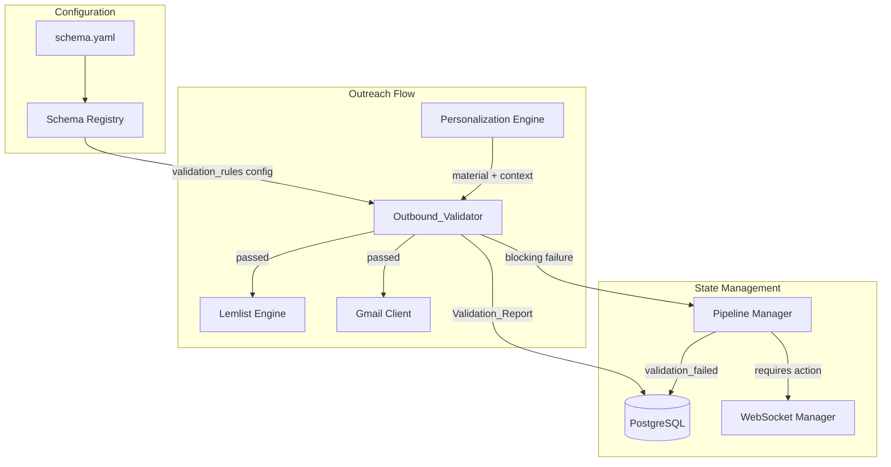
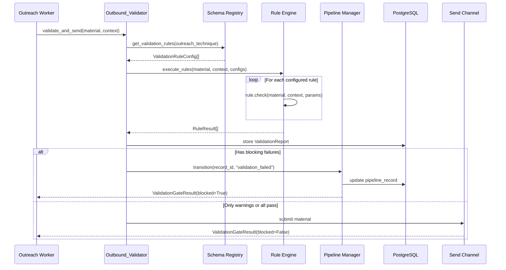

# Technical Design Document: Outbound Validation Gate

## Overview

The Outbound Validation Gate introduces a deterministic, rule-based `Outbound_Validator` service that intercepts every material immediately before submission to external Send_Channels (Lemlist_Engine sequence enrollment and Gmail API send). It catches delivery-layer defects — unreplaced template tokens, missing signatures, wrong recipient names, broken links — without LLM calls.

### Design Goals

1. **Zero-defect delivery** — No material with a blocking rule failure ever reaches a prospect
2. **Fast and cheap** — All rules complete in < 5 seconds (excluding optional link liveness); no LLM calls
3. **Schema-driven** — Rule sets declared per outreach technique in existing Schema_Registry YAML
4. **Non-intrusive** — Integrates as a pre-send interception point without modifying existing Send_Channel implementations
5. **Observable** — Every send attempt produces a Validation_Report for debugging and audit

### Key Architectural Decisions

| Decision | Rationale |
|----------|-----------|
| Synchronous interception before send | Blocking validation must complete before any external call |
| Rule interface with severity levels | Allows flexible blocking vs. warning semantics per technique |
| Schema_Registry extension | Consistent with existing config-driven architecture |
| No LLM calls | Deterministic, fast, predictable cost |
| PostgreSQL for Validation_Reports | Auditable, queryable, linked to pipeline records |
| `validation_failed` pipeline state | Leverages existing `RequiresActionType` pattern |


## Architecture

### High-Level System Diagram




### Validation Flow Sequence




### Interception Point

The `Outbound_Validator` sits between the Personalization Engine output and the Send_Channel submission. It is called by outreach workers (ARQ background tasks) that currently call `LemlistEngine.enroll_prospects()` or the Gmail send path directly. The validator wraps these calls:

```
[ARQ Worker] → OutboundValidator.validate_and_send() → [Send Channel]
                     ↓ (on blocking failure)
              PipelineManager.transition("validation_failed")
```

This means existing `LemlistEngine` and `GmailClient` remain unmodified — validation is an upstream concern.

## Components and Interfaces

### 1. Validation Rule Interface (`app/core/outbound_validator.py`)

```python
from abc import ABC, abstractmethod
from dataclasses import dataclass, field
from datetime import datetime, timezone
from enum import Enum
from typing import Any


class RuleSeverity(str, Enum):
    """Severity level for a validation rule."""
    BLOCKING = "blocking"
    WARNING = "warning"


@dataclass(frozen=True)
class TextSpan:
    """Identifies an offending span within the material text."""
    start: int       # character offset from start of field
    end: int         # character offset (exclusive)
    field_name: str  # which field (e.g., "body", "subject")
    text: str        # the offending text content


@dataclass
class RuleResult:
    """Result of a single validation rule execution."""
    rule_id: str
    passed: bool
    severity: RuleSeverity
    message: str = ""
    offending_spans: list[TextSpan] = field(default_factory=list)
    execution_ms: float = 0.0


@dataclass
class ValidationContext:
    """Context passed to each rule for validation."""
    pipeline_record_id: str
    contact_first_name: str
    contact_last_name: str
    outreach_technique: str
    material_type: str  # "email", "linkedin_message", "proposal"
    required_fields: list[str] = field(default_factory=list)


@dataclass
class Material:
    """The outbound material to validate."""
    subject: str | None = None   # None for non-email channels
    body: str = ""
    signature: str | None = None
    personalization_fields: dict[str, str] = field(default_factory=dict)


class ValidationRule(ABC):
    """Abstract base class for all validation rules."""

    @property
    @abstractmethod
    def rule_id(self) -> str:
        """Unique identifier for this rule."""
        ...

    @property
    @abstractmethod
    def default_severity(self) -> RuleSeverity:
        """Default severity if not overridden in schema."""
        ...

    @abstractmethod
    def check(
        self,
        material: Material,
        context: ValidationContext,
        params: dict[str, Any],
    ) -> RuleResult:
        """Execute the rule against the material.

        Must be synchronous and deterministic. No LLM or network calls
        (except LinkLivenessRule which is explicitly async).
        """
        ...
```


### 2. Built-in Rule Implementations

```python
import re
from urllib.parse import urlparse

# --- Blocking Rules (default) ---

class UnreplacedTokenRule(ValidationRule):
    """Detects unreplaced template tokens in material body and subject.

    Patterns: {{...}}, {single_word}, [PLACEHOLDER], <INSERT...>
    """
    rule_id = "unreplaced_tokens"
    default_severity = RuleSeverity.BLOCKING

    PATTERNS = [
        re.compile(r"\{\{[^}]+\}\}"),          # {{first_name}}
        re.compile(r"\{[a-z_]+\}"),            # {company_name}
        re.compile(r"\[PLACEHOLDER\]", re.I),  # [PLACEHOLDER]
        re.compile(r"<INSERT[^>]*>", re.I),    # <INSERT_NAME>
    ]

    def check(self, material, context, params) -> RuleResult:
        spans = []
        for field_name, text in [("subject", material.subject or ""),
                                  ("body", material.body)]:
            for pattern in self.PATTERNS:
                for match in pattern.finditer(text):
                    spans.append(TextSpan(
                        start=match.start(), end=match.end(),
                        field_name=field_name, text=match.group(),
                    ))
        return RuleResult(
            rule_id=self.rule_id,
            passed=len(spans) == 0,
            severity=params.get("severity", self.default_severity),
            message=f"Found {len(spans)} unreplaced token(s)" if spans else "",
            offending_spans=spans,
        )


class EmptySubjectRule(ValidationRule):
    """Fails if subject line is empty/missing for email materials."""
    rule_id = "empty_subject"
    default_severity = RuleSeverity.BLOCKING

    def check(self, material, context, params) -> RuleResult:
        if context.material_type != "email":
            return RuleResult(rule_id=self.rule_id, passed=True,
                              severity=self.default_severity)
        has_subject = bool(material.subject and material.subject.strip())
        return RuleResult(
            rule_id=self.rule_id, passed=has_subject,
            severity=params.get("severity", self.default_severity),
            message="" if has_subject else "Email has empty or missing subject",
        )


class MissingSignatureRule(ValidationRule):
    """Fails if signature block is missing when technique requires one."""
    rule_id = "missing_signature"
    default_severity = RuleSeverity.BLOCKING

    def check(self, material, context, params) -> RuleResult:
        requires_sig = params.get("required", True)
        if not requires_sig:
            return RuleResult(rule_id=self.rule_id, passed=True,
                              severity=self.default_severity)
        has_sig = bool(material.signature and material.signature.strip())
        return RuleResult(
            rule_id=self.rule_id, passed=has_sig,
            severity=params.get("severity", self.default_severity),
            message="" if has_sig else "Missing required signature block",
        )


class RecipientNameMismatchRule(ValidationRule):
    """Fails if recipient name in body doesn't match pipeline contact."""
    rule_id = "recipient_name_mismatch"
    default_severity = RuleSeverity.BLOCKING

    # Common greeting patterns that contain a name
    GREETING_PATTERNS = [
        re.compile(r"(?:Hi|Hello|Dear|Hey)\s+([A-Z][a-z]+)", re.MULTILINE),
    ]

    def check(self, material, context, params) -> RuleResult:
        expected_first = context.contact_first_name.strip().lower()
        expected_last = context.contact_last_name.strip().lower()
        if not expected_first:
            # No contact name to validate against
            return RuleResult(rule_id=self.rule_id, passed=True,
                              severity=self.default_severity)

        spans = []
        for pattern in self.GREETING_PATTERNS:
            for match in pattern.finditer(material.body):
                found_name = match.group(1).lower()
                if found_name != expected_first and found_name != expected_last:
                    spans.append(TextSpan(
                        start=match.start(1), end=match.end(1),
                        field_name="body", text=match.group(1),
                    ))
        return RuleResult(
            rule_id=self.rule_id,
            passed=len(spans) == 0,
            severity=params.get("severity", self.default_severity),
            message=f"Name mismatch: expected '{context.contact_first_name}'"
                    if spans else "",
            offending_spans=spans,
        )


class EmptyPersonalizationFieldRule(ValidationRule):
    """Fails if a required personalization field is empty."""
    rule_id = "empty_personalization_field"
    default_severity = RuleSeverity.BLOCKING

    def check(self, material, context, params) -> RuleResult:
        required = params.get("required_fields", context.required_fields)
        missing = [
            f for f in required
            if not material.personalization_fields.get(f, "").strip()
        ]
        return RuleResult(
            rule_id=self.rule_id,
            passed=len(missing) == 0,
            severity=params.get("severity", self.default_severity),
            message=f"Empty required fields: {missing}" if missing else "",
        )


# --- Warning Rules (default) ---

class LengthBoundsRule(ValidationRule):
    """Warns if material body length is outside configured bounds."""
    rule_id = "length_bounds"
    default_severity = RuleSeverity.WARNING

    def check(self, material, context, params) -> RuleResult:
        min_len = params.get("min_length", 50)
        max_len = params.get("max_length", 5000)
        body_len = len(material.body)
        passed = min_len <= body_len <= max_len
        msg = ""
        if body_len < min_len:
            msg = f"Body too short ({body_len} < {min_len} chars)"
        elif body_len > max_len:
            msg = f"Body too long ({body_len} > {max_len} chars)"
        return RuleResult(
            rule_id=self.rule_id, passed=passed,
            severity=params.get("severity", self.default_severity),
            message=msg,
        )


class MalformedUrlRule(ValidationRule):
    """Warns if material contains syntactically malformed URLs."""
    rule_id = "malformed_url"
    default_severity = RuleSeverity.WARNING

    URL_PATTERN = re.compile(
        r"https?://[^\s<>\"']+|www\.[^\s<>\"']+", re.IGNORECASE
    )

    def check(self, material, context, params) -> RuleResult:
        spans = []
        for field_name, text in [("subject", material.subject or ""),
                                  ("body", material.body)]:
            for match in self.URL_PATTERN.finditer(text):
                url = match.group()
                parsed = urlparse(url if "://" in url else f"http://{url}")
                if not parsed.netloc or "." not in parsed.netloc:
                    spans.append(TextSpan(
                        start=match.start(), end=match.end(),
                        field_name=field_name, text=url,
                    ))
        return RuleResult(
            rule_id=self.rule_id,
            passed=len(spans) == 0,
            severity=params.get("severity", self.default_severity),
            message=f"Found {len(spans)} malformed URL(s)" if spans else "",
            offending_spans=spans,
        )


class DuplicateContentRule(ValidationRule):
    """Warns on consecutive duplicate words or repeated sentences."""
    rule_id = "duplicate_content"
    default_severity = RuleSeverity.WARNING

    DUPLICATE_WORD = re.compile(r"\b(\w+)\s+\1\b", re.IGNORECASE)

    def check(self, material, context, params) -> RuleResult:
        spans = []
        # Check consecutive duplicate words
        for match in self.DUPLICATE_WORD.finditer(material.body):
            spans.append(TextSpan(
                start=match.start(), end=match.end(),
                field_name="body", text=match.group(),
            ))
        # Check repeated sentences
        sentences = [s.strip() for s in material.body.split(".")
                     if s.strip()]
        seen: dict[str, int] = {}
        for i, sentence in enumerate(sentences):
            normalized = sentence.lower()
            if normalized in seen:
                offset = material.body.find(sentence, seen[normalized])
                if offset >= 0:
                    spans.append(TextSpan(
                        start=offset, end=offset + len(sentence),
                        field_name="body", text=sentence,
                    ))
            seen[normalized] = material.body.find(sentence)
        return RuleResult(
            rule_id=self.rule_id,
            passed=len(spans) == 0,
            severity=params.get("severity", self.default_severity),
            message=f"Found {len(spans)} duplicate content issue(s)"
                    if spans else "",
            offending_spans=spans,
        )
```


### 3. Link Liveness Rule (Async)

```python
import asyncio
import httpx

class LinkLivenessRule:
    """Async rule that verifies URLs respond with HTTP < 400.

    Not a subclass of ValidationRule because it requires async I/O.
    Has its own 5-second per-link timeout. Timeouts are warning-severity.
    """
    rule_id = "link_liveness"
    default_severity = RuleSeverity.WARNING
    PER_LINK_TIMEOUT = 5.0  # seconds

    URL_PATTERN = re.compile(
        r"https?://[^\s<>\"']+", re.IGNORECASE
    )

    async def check(
        self, material: Material, context: ValidationContext,
        params: dict[str, Any],
    ) -> RuleResult:
        if not params.get("enabled", False):
            return RuleResult(rule_id=self.rule_id, passed=True,
                              severity=self.default_severity)

        urls = self.URL_PATTERN.findall(material.body)
        if material.subject:
            urls.extend(self.URL_PATTERN.findall(material.subject))

        if not urls:
            return RuleResult(rule_id=self.rule_id, passed=True,
                              severity=self.default_severity)

        spans = []
        async with httpx.AsyncClient(
            timeout=self.PER_LINK_TIMEOUT, follow_redirects=True
        ) as client:
            tasks = [self._check_url(client, url) for url in set(urls)]
            results = await asyncio.gather(*tasks)

        for url, status_ok, error_msg in results:
            if not status_ok:
                # Find offset of URL in body
                offset = material.body.find(url)
                field_name = "body"
                if offset < 0 and material.subject:
                    offset = material.subject.find(url)
                    field_name = "subject"
                spans.append(TextSpan(
                    start=max(offset, 0), end=max(offset, 0) + len(url),
                    field_name=field_name, text=f"{url} ({error_msg})",
                ))

        return RuleResult(
            rule_id=self.rule_id,
            passed=len(spans) == 0,
            severity=RuleSeverity.WARNING,  # Always warning per req
            message=f"{len(spans)} URL(s) failed liveness check" if spans else "",
            offending_spans=spans,
        )

    async def _check_url(
        self, client: httpx.AsyncClient, url: str
    ) -> tuple[str, bool, str]:
        try:
            resp = await client.head(url)
            if resp.status_code >= 400:
                return (url, False, f"HTTP {resp.status_code}")
            return (url, True, "")
        except httpx.TimeoutException:
            return (url, False, "timeout")
        except httpx.HTTPError as e:
            return (url, False, str(e)[:100])
```


### 4. Outbound Validator Service (`app/core/outbound_validator.py`)

```python
import time
import logging
from dataclasses import dataclass, field
from datetime import datetime, timezone
from typing import Any

logger = logging.getLogger(__name__)

# Rule registry — all built-in rules instantiated at module level
BUILT_IN_RULES: dict[str, ValidationRule] = {
    "unreplaced_tokens": UnreplacedTokenRule(),
    "empty_subject": EmptySubjectRule(),
    "missing_signature": MissingSignatureRule(),
    "recipient_name_mismatch": RecipientNameMismatchRule(),
    "empty_personalization_field": EmptyPersonalizationFieldRule(),
    "length_bounds": LengthBoundsRule(),
    "malformed_url": MalformedUrlRule(),
    "duplicate_content": DuplicateContentRule(),
}

ASYNC_RULES: dict[str, Any] = {
    "link_liveness": LinkLivenessRule(),
}

# Default blocking rules applied when no schema config exists
DEFAULT_BLOCKING_RULE_IDS = [
    "unreplaced_tokens",
    "empty_subject",
    "missing_signature",
    "recipient_name_mismatch",
    "empty_personalization_field",
]


@dataclass
class ValidationRuleConfig:
    """Schema-declared configuration for a single rule."""
    rule_id: str
    severity: RuleSeverity | None = None  # None = use rule default
    params: dict[str, Any] = field(default_factory=dict)


@dataclass
class ValidationReport:
    """Complete validation report for a send attempt."""
    id: str
    pipeline_record_id: str
    outreach_technique: str
    results: list[RuleResult]
    passed: bool  # True if no blocking failures
    has_warnings: bool
    total_execution_ms: float
    created_at: datetime = field(
        default_factory=lambda: datetime.now(timezone.utc)
    )

    @property
    def blocking_failures(self) -> list[RuleResult]:
        return [r for r in self.results
                if not r.passed and r.severity == RuleSeverity.BLOCKING]

    @property
    def warnings(self) -> list[RuleResult]:
        return [r for r in self.results
                if not r.passed and r.severity == RuleSeverity.WARNING]


@dataclass
class ValidationGateResult:
    """Result returned to the caller after validation gate."""
    blocked: bool
    report: ValidationReport
    send_result: Any | None = None  # Result from Send_Channel if not blocked


class OutboundValidator:
    """Pre-send validation gate service.

    Intercepts materials before Send_Channel submission, executes configured
    rules, and blocks on any blocking-severity failure.

    Performance target: all sync rules < 5 seconds total.
    """

    MAX_SYNC_DURATION = 5.0  # seconds, excluding link liveness

    def __init__(
        self,
        schema_registry: "SchemaRegistry",
        pipeline_manager: "PipelineManager",
        db_repo: "ValidationRepository",
    ):
        self._schema = schema_registry
        self._pipeline = pipeline_manager
        self._db = db_repo

    def get_rules_for_technique(
        self, outreach_technique: str
    ) -> list[ValidationRuleConfig]:
        """Load rule configs from schema, or return defaults."""
        technique_config = self._schema.get_validation_rules(
            outreach_technique
        )
        if technique_config is None:
            # No declaration: apply default blocking rules
            return [
                ValidationRuleConfig(rule_id=rid)
                for rid in DEFAULT_BLOCKING_RULE_IDS
            ]
        return technique_config

    async def validate(
        self,
        material: Material,
        context: ValidationContext,
    ) -> ValidationReport:
        """Execute all configured rules and produce a report."""
        configs = self.get_rules_for_technique(context.outreach_technique)
        results: list[RuleResult] = []
        start = time.monotonic()

        # Execute synchronous rules
        for config in configs:
            if config.rule_id in BUILT_IN_RULES:
                rule = BUILT_IN_RULES[config.rule_id]
                severity = config.severity or rule.default_severity
                params = {**config.params, "severity": severity}
                rule_start = time.monotonic()
                result = rule.check(material, context, params)
                result.execution_ms = (time.monotonic() - rule_start) * 1000
                results.append(result)

        # Execute async rules (link liveness)
        for config in configs:
            if config.rule_id in ASYNC_RULES:
                rule = ASYNC_RULES[config.rule_id]
                severity = config.severity or rule.default_severity
                params = {**config.params, "severity": severity}
                rule_start = time.monotonic()
                result = await rule.check(material, context, params)
                result.execution_ms = (time.monotonic() - rule_start) * 1000
                results.append(result)

        total_ms = (time.monotonic() - start) * 1000
        has_blocking = any(
            not r.passed and r.severity == RuleSeverity.BLOCKING
            for r in results
        )
        has_warnings = any(
            not r.passed and r.severity == RuleSeverity.WARNING
            for r in results
        )

        report = ValidationReport(
            id=self._generate_id(),
            pipeline_record_id=context.pipeline_record_id,
            outreach_technique=context.outreach_technique,
            results=results,
            passed=not has_blocking,
            has_warnings=has_warnings,
            total_execution_ms=total_ms,
        )

        # Persist report
        await self._db.save_validation_report(report)
        return report


    async def validate_and_send(
        self,
        material: Material,
        context: ValidationContext,
        send_fn,  # async callable: the actual send operation
    ) -> ValidationGateResult:
        """Full gate: validate, then send or block.

        Args:
            material: The outbound material to validate.
            context: Validation context with contact and technique info.
            send_fn: Async callable that performs the actual send.

        Returns:
            ValidationGateResult with blocking status and report.
        """
        report = await self.validate(material, context)

        if not report.passed:
            # Transition pipeline to validation_failed
            await self._pipeline.transition_to_validation_failed(
                record_id=context.pipeline_record_id,
                blocking_failures=report.blocking_failures,
            )
            return ValidationGateResult(blocked=True, report=report)

        # All blocking rules passed — proceed with send
        send_result = await send_fn()
        return ValidationGateResult(
            blocked=False, report=report, send_result=send_result
        )

    @staticmethod
    def _generate_id() -> str:
        import uuid
        return str(uuid.uuid4())
```


### 5. Schema Registry Extension

The existing `SchemaRegistry` is extended to parse a new optional `validation_rules` key per outreach technique:

```yaml
# schema.yaml — outreach_techniques section (extension)
outreach_techniques:
  - id: cold_email_consultant
    service_class: LemlistEngine
    description: "Email outreach for consultant opportunities"
    validation_rules:
      - rule_id: unreplaced_tokens
      - rule_id: empty_subject
      - rule_id: missing_signature
        params:
          required: true
      - rule_id: recipient_name_mismatch
      - rule_id: empty_personalization_field
        params:
          required_fields: ["first_name", "company_name", "hook"]
      - rule_id: length_bounds
        severity: warning
        params:
          min_length: 100
          max_length: 3000
      - rule_id: malformed_url
      - rule_id: link_liveness
        params:
          enabled: true
      - rule_id: duplicate_content
```

**Schema Registry additions** (`app/core/schema_registry.py`):

```python
@dataclass(frozen=True)
class ValidationRuleDeclaration:
    """A validation rule declaration within an outreach technique."""
    rule_id: str
    severity: str | None = None  # "blocking" or "warning", None = use default
    params: dict[str, Any] = field(default_factory=dict)


@dataclass(frozen=True)
class Technique:
    # ... existing fields ...
    validation_rules: list[ValidationRuleDeclaration] = field(
        default_factory=list
    )
```


**Startup validation additions:**

```python
# In SchemaRegistry._validate_cross_references():
def _validate_validation_rules(self) -> None:
    """Validate that declared rule ids reference known built-in rules."""
    known_rules = set(BUILT_IN_RULES.keys()) | set(ASYNC_RULES.keys())
    for technique_entry in self._raw.get("outreach_techniques", []):
        technique_id = technique_entry["id"]
        for rule_decl in technique_entry.get("validation_rules", []):
            rule_id = rule_decl.get("rule_id", "")
            if rule_id not in known_rules:
                raise SchemaValidationError(
                    f"Outreach technique '{technique_id}' declares "
                    f"unknown validation rule '{rule_id}'",
                    entity_id=technique_id,
                )
            severity = rule_decl.get("severity")
            if severity and severity not in ("blocking", "warning"):
                raise SchemaValidationError(
                    f"Outreach technique '{technique_id}', rule "
                    f"'{rule_id}': invalid severity '{severity}' "
                    f"(must be 'blocking' or 'warning')",
                    entity_id=technique_id,
                )
```

**Public API addition to SchemaRegistry:**

```python
def get_validation_rules(
    self, outreach_technique_id: str
) -> list[ValidationRuleConfig] | None:
    """Get validation rule configs for an outreach technique.

    Returns None if no validation_rules section exists (trigger defaults).
    """
    technique = next(
        (t for t in self.outreach_techniques
         if t.id == outreach_technique_id), None
    )
    if technique is None:
        return None
    if not technique.validation_rules:
        return None
    return [
        ValidationRuleConfig(
            rule_id=decl.rule_id,
            severity=RuleSeverity(decl.severity) if decl.severity else None,
            params=dict(decl.params),
        )
        for decl in technique.validation_rules
    ]
```


### 6. Pipeline Manager Extension

Add `validation_failed` as a requires-action state and a new transition method:

```python
# Addition to pipeline_manager.py

class RequiresActionType(str, Enum):
    STALE_FOLLOWUP = "stale_followup"
    FAILED_SEQUENCE = "failed_sequence"
    ENRICHMENT_ERROR = "enrichment_error"
    VALIDATION_FAILED = "validation_failed"  # NEW


async def transition_to_validation_failed(
    self,
    record_id: str,
    blocking_failures: list[RuleResult],
) -> PipelineTransition:
    """Transition a pipeline record to validation_failed state.

    Broadcasts the failure to the Dashboard "Requires Action" section
    with the offending text spans from each blocking rule.
    """
    record = await self._get_record(record_id)
    if record is None:
        return PipelineTransition(
            result=PipelineTransitionResult.INVALID_STATE,
            record_id=record_id,
            reason="Pipeline record not found",
        )

    transition = await self._transition(record, "validation_failed")

    # Broadcast detailed failure info for Dashboard
    await self._broadcast_validation_failure(
        record_id=record_id,
        blocking_failures=blocking_failures,
        beneficiary_id=record.beneficiary_id,
    )

    return transition
```

## Data Models

### Validation Report Table

```sql
CREATE TABLE validation_reports (
    id UUID PRIMARY KEY DEFAULT gen_random_uuid(),
    pipeline_record_id UUID NOT NULL REFERENCES pipeline_records(id),
    outreach_technique VARCHAR(50) NOT NULL,
    passed BOOLEAN NOT NULL,
    has_warnings BOOLEAN NOT NULL DEFAULT FALSE,
    total_execution_ms FLOAT NOT NULL,
    results JSONB NOT NULL,  -- Serialized list[RuleResult]
    created_at TIMESTAMPTZ NOT NULL DEFAULT NOW()
);

CREATE INDEX idx_validation_reports_pipeline
    ON validation_reports(pipeline_record_id);
CREATE INDEX idx_validation_reports_created
    ON validation_reports(created_at DESC);
CREATE INDEX idx_validation_reports_failed
    ON validation_reports(passed) WHERE passed = FALSE;
```


### SQLAlchemy ORM Model

```python
# app/models/validation_report.py
import uuid
from datetime import datetime

from sqlalchemy import Boolean, DateTime, Float, ForeignKey, String, text
from sqlalchemy.dialects.postgresql import JSONB, UUID
from sqlalchemy.orm import Mapped, mapped_column, relationship

from app.models.base import Base


class ValidationReportModel(Base):
    """ORM model for validation reports."""

    __tablename__ = "validation_reports"

    id: Mapped[uuid.UUID] = mapped_column(
        UUID(as_uuid=True), primary_key=True,
        server_default=text("gen_random_uuid()"),
    )
    pipeline_record_id: Mapped[uuid.UUID] = mapped_column(
        UUID(as_uuid=True), ForeignKey("pipeline_records.id"), nullable=False
    )
    outreach_technique: Mapped[str] = mapped_column(
        String(50), nullable=False
    )
    passed: Mapped[bool] = mapped_column(Boolean, nullable=False)
    has_warnings: Mapped[bool] = mapped_column(
        Boolean, server_default="false", nullable=False
    )
    total_execution_ms: Mapped[float] = mapped_column(Float, nullable=False)
    results: Mapped[dict] = mapped_column(JSONB, nullable=False)
    created_at: Mapped[datetime] = mapped_column(
        DateTime(timezone=True), server_default=text("NOW()"), nullable=False
    )

    # Relationship
    pipeline_record = relationship("PipelineRecord", backref="validation_reports")
```


### RuleResult JSON Schema (stored in `results` JSONB column)

```json
[
  {
    "rule_id": "unreplaced_tokens",
    "passed": false,
    "severity": "blocking",
    "message": "Found 2 unreplaced token(s)",
    "execution_ms": 1.2,
    "offending_spans": [
      {
        "start": 45,
        "end": 61,
        "field_name": "body",
        "text": "{{first_name}}"
      },
      {
        "start": 120,
        "end": 136,
        "field_name": "body",
        "text": "{{company_name}}"
      }
    ]
  },
  {
    "rule_id": "length_bounds",
    "passed": true,
    "severity": "warning",
    "message": "",
    "execution_ms": 0.1,
    "offending_spans": []
  }
]
```

### Schema Registry YAML Extension Data Model

```yaml
# New optional key within each outreach_techniques entry:
validation_rules:
  - rule_id: string          # Must match a BUILT_IN_RULES or ASYNC_RULES key
    severity: string | null  # "blocking" | "warning" | omit for rule default
    params: object           # Rule-specific parameters (optional)
```


## Correctness Properties

*A property is a characteristic or behavior that should hold true across all valid executions of a system — essentially, a formal statement about what the system should do. Properties serve as the bridge between human-readable specifications and machine-verifiable correctness guarantees.*

### Property 1: Gate blocks iff blocking rule fails

*For any* material and validation context, the `ValidationGateResult.blocked` field SHALL be `True` if and only if at least one `RuleResult` in the report has `passed=False` and `severity=BLOCKING`. Conversely, if all blocking rules pass (regardless of warning failures), `blocked` SHALL be `False`.

**Validates: Requirements 1.2, 1.3**

### Property 2: Report completeness

*For any* set of configured `ValidationRuleConfig` entries and any material, the resulting `ValidationReport.results` list SHALL contain exactly one `RuleResult` per configured rule, and each result's `rule_id` SHALL match a configured rule id.

**Validates: Requirements 1.1, 1.4**

### Property 3: Unreplaced token detection

*For any* material body or subject containing a string matching the patterns `{{...}}`, `{word}`, `[PLACEHOLDER]`, or `<INSERT...>`, the `UnreplacedTokenRule` SHALL return `passed=False` with at least one `TextSpan` identifying the token. *For any* material body and subject containing none of these patterns, the rule SHALL return `passed=True` with zero offending spans.

**Validates: Requirements 2.1**

### Property 4: Recipient name mismatch detection

*For any* material body containing a greeting with a name (e.g., "Hi X") where X does not match the contact's first name or last name in the validation context, the `RecipientNameMismatchRule` SHALL return `passed=False`. *For any* material where all greeting names match the contact, the rule SHALL return `passed=True`.

**Validates: Requirements 2.1**

### Property 5: Schema config resolution with defaults

*For any* outreach technique with a `validation_rules` declaration in the schema, `get_validation_rules()` SHALL return configs matching the declared rule ids, severities, and params. *For any* outreach technique without a `validation_rules` declaration, `get_validation_rules()` SHALL return `None`, causing the validator to apply `DEFAULT_BLOCKING_RULE_IDS` with default parameters.

**Validates: Requirements 3.1, 3.3**

### Property 6: Unknown rule id rejection at startup

*For any* rule id string that is not a key in `BUILT_IN_RULES` or `ASYNC_RULES`, declaring it in a schema's `validation_rules` section SHALL cause `SchemaValidationError` to be raised during schema loading, with an error message identifying the unknown rule id.

**Validates: Requirements 3.2**


## Error Handling

### Validation Rule Errors

| Scenario | Handling |
|----------|----------|
| Rule raises unexpected exception | Catch, log error, treat as `passed=True` (fail-open for that rule) with a warning in the report. Do not block send due to rule implementation bugs. |
| Link liveness timeout (per-link) | Return `passed=False` with `severity=WARNING` and message "timeout". Never blocking. |
| Link liveness network error | Same as timeout — warning severity, never blocking. |
| All sync rules exceed 5s budget | Log performance warning, complete execution anyway. Never time-out and block a send. |

### Schema Validation Errors

| Scenario | Handling |
|----------|----------|
| Unknown rule_id in schema | `SchemaValidationError` at startup — application refuses to start |
| Invalid severity value | `SchemaValidationError` at startup |
| Malformed params (wrong type) | `SchemaValidationError` at startup |

### Pipeline Transition Errors

| Scenario | Handling |
|----------|----------|
| Pipeline record not found | Log error, still block the send (fail-safe). Return `ValidationGateResult(blocked=True)` |
| Database write failure (report) | Log error, retry once. If still fails, proceed with send (fail-open for persistence, fail-safe for blocking logic). The blocking decision is independent of report storage. |
| WebSocket broadcast failure | Log error, do not affect send decision. Dashboard may show stale data until next poll. |

### Design Principle: Fail-Safe for Blocking, Fail-Open for Side Effects

The gate's primary contract is: **if a blocking rule fails, the material never sends**. This logic runs in-process and does not depend on database or network. Side effects (report storage, pipeline transition, WebSocket broadcast) are best-effort — their failure never causes a material to be incorrectly sent or incorrectly blocked.


## Testing Strategy

### Property-Based Tests (Hypothesis)

The project already uses Hypothesis (`.hypothesis/` directory present). Each correctness property maps to one property-based test with minimum 100 iterations.

| Property | Test File | Strategy |
|----------|-----------|----------|
| 1: Gate blocks iff blocking rule fails | `test_outbound_validator_properties.py` | Generate materials + rule configs with varying severity combinations. Assert `blocked == any(not r.passed and r.severity == BLOCKING for r in results)`. |
| 2: Report completeness | `test_outbound_validator_properties.py` | Generate random subsets of BUILT_IN_RULES keys as config. Assert `len(report.results) == len(configs)` and all rule_ids match. |
| 3: Unreplaced token detection | `test_validation_rules_properties.py` | Generate strings with/without token patterns using `st.from_regex`. Assert `passed == (no tokens in text)`. |
| 4: Recipient name mismatch | `test_validation_rules_properties.py` | Generate (greeting_name, contact_name) pairs. When they differ, assert `passed=False`. When they match, assert `passed=True`. |
| 5: Schema config resolution | `test_schema_validation_properties.py` | Generate technique entries with/without validation_rules. Assert correct return type (list vs None). |
| 6: Unknown rule rejection | `test_schema_validation_properties.py` | Generate strings not in known rule set via `st.text().filter(lambda s: s not in KNOWN_RULES)`. Assert SchemaValidationError raised. |

**Configuration:**
- Library: `hypothesis` (already installed)
- Min iterations: `@settings(max_examples=100)`
- Tag format: `# Feature: outbound-validation-gate, Property N: <title>`

### Unit Tests (pytest)

| Test Area | Examples |
|-----------|----------|
| Each blocking rule (specific inputs) | Token: `"Hi {{name}}"` → fail; `"Hi John"` → pass |
| Each warning rule (boundary cases) | Length: 49 chars → fail, 50 chars → pass |
| Link liveness with mocked httpx | Mock 200 → pass, Mock 404 → fail, Mock timeout → warning |
| Validation report serialization | Round-trip JSON encode/decode of RuleResult |
| Pipeline transition on blocking failure | Mock PipelineManager, verify `transition_to_validation_failed` called |
| Default rules fallback | Technique without config → 5 default blocking rules |

### Integration Tests

| Test Area | Approach |
|-----------|----------|
| End-to-end validation flow | Send a material through `validate_and_send()` with a mock send_fn, verify full report and send/block behavior |
| Schema loading with validation_rules | Load real schema.yaml with validation_rules section, verify startup succeeds |
| Database persistence | Write and read back a ValidationReport from PostgreSQL |
| Performance benchmark | Run full rule set on a large material (5000 chars, 20 URLs), assert < 5s for sync rules |
