# Technical Design Document: Outreach Routing Engine

## Overview

The Outreach Routing Engine is a decision service that evaluates each prospect against configurable routing rules and assigns them to either the Lemlist automated sequence path or a new Creative Playbook path for high-touch, multi-channel outreach. It integrates into the existing GKIM Opportunity Finder v2 service layer, coordinating with the Scoring_Engine, Personalization_Engine, Lemlist_Engine, and Analytics_Service.

### Design Goals

1. **Intelligent routing** — Weighted rule evaluation drives path assignment based on Account_Score, deal size, seniority, intent, and engagement
2. **Creative Playbook orchestration** — Multi-step, multi-channel playbook execution with conditional branching and scheduling
3. **Seamless integration** — Fits into existing FastAPI routes, ARQ workers, SQLAlchemy models, and WebSocket notifications
4. **External API access** — Third-party applications can trigger routing and manage playbooks via authenticated REST endpoints
5. **Performance analytics** — Side-by-side comparison of automated vs. creative paths with actionable recommendations

### Key Architectural Decisions

| Decision | Rationale |
|----------|-----------|
| New `app/core/routing_engine.py` service | Pure computation (like ScoringEngine) — no I/O in the decision logic, testable in isolation |
| Weighted score with proportional redistribution | Mirrors ScoringEngine pattern for missing attributes; consistent UX |
| ARQ worker for playbook scheduling | Reuses existing background task infrastructure for step scheduling and escalation checks |
| SQLAlchemy models for routing/playbook state | Follows existing ORM patterns; enables complex queries for analytics |
| Redis sliding window for API rate limiting | Leverages existing Redis infrastructure; O(1) per request |
| Webhook delivery via ARQ tasks | Async delivery with retry/backoff without blocking API responses |

## Architecture

### High-Level System Diagram

```mermaid
graph TB
    subgraph "API Layer"
        RoutingAPI["/api/routing/* Routes"]
        PlaybookAPI["/api/playbooks/* Routes"]
        IntegrationAPI["/api/integration/* Routes"]
        WebhookAPI["/api/webhooks/* Routes"]
    end

    subgraph "Core Services"
        RoutingEngine["Routing Engine<br/>(app/core/routing_engine.py)"]
        PlaybookOrchestrator["Playbook Orchestrator<br/>(app/core/playbook_orchestrator.py)"]
        PersonalizationEngine["Personalization Engine<br/>(existing)"]
        ScoringEngine["Scoring Engine<br/>(existing)"]
        AnalyticsService["Analytics Service<br/>(existing — extended)"]
        WebSocketManager["WebSocket Manager<br/>(existing)"]
    end

    subgraph "Background Workers (ARQ)"
        RoutingWorker["Routing Worker<br/>(app/workers/routing_worker.py)"]
        PlaybookWorker["Playbook Worker<br/>(app/workers/playbook_worker.py)"]
        WebhookWorker["Webhook Worker<br/>(app/workers/webhook_worker.py)"]
        AnalyticsWorker["Analytics Worker<br/>(existing — extended)"]
    end

    subgraph "Integration Layer"
        LemlistEngine["Lemlist Engine<br/>(existing)"]
    end

    subgraph "Data Layer"
        PG[(PostgreSQL)]
        Redis[(Redis)]
    end

    RoutingAPI --> RoutingEngine
    PlaybookAPI --> PlaybookOrchestrator
    IntegrationAPI --> RoutingEngine
    IntegrationAPI --> PlaybookOrchestrator
    WebhookAPI --> PG

    RoutingEngine --> ScoringEngine
    RoutingEngine --> PG
    PlaybookOrchestrator --> PersonalizationEngine
    PlaybookOrchestrator --> LemlistEngine
    PlaybookOrchestrator --> WebSocketManager
    PlaybookOrchestrator --> PG

    RoutingWorker --> RoutingEngine
    RoutingWorker --> PlaybookOrchestrator
    RoutingWorker --> LemlistEngine
    PlaybookWorker --> PlaybookOrchestrator
    PlaybookWorker --> PersonalizationEngine
    WebhookWorker --> Redis
    WebhookWorker --> PG

    AnalyticsWorker --> AnalyticsService
    AnalyticsService --> PG
```

