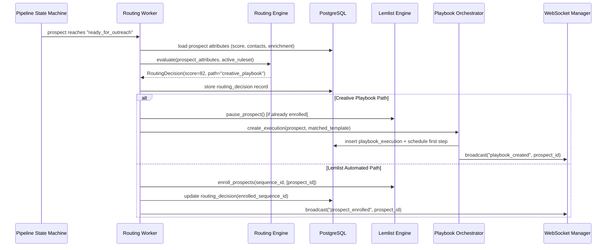
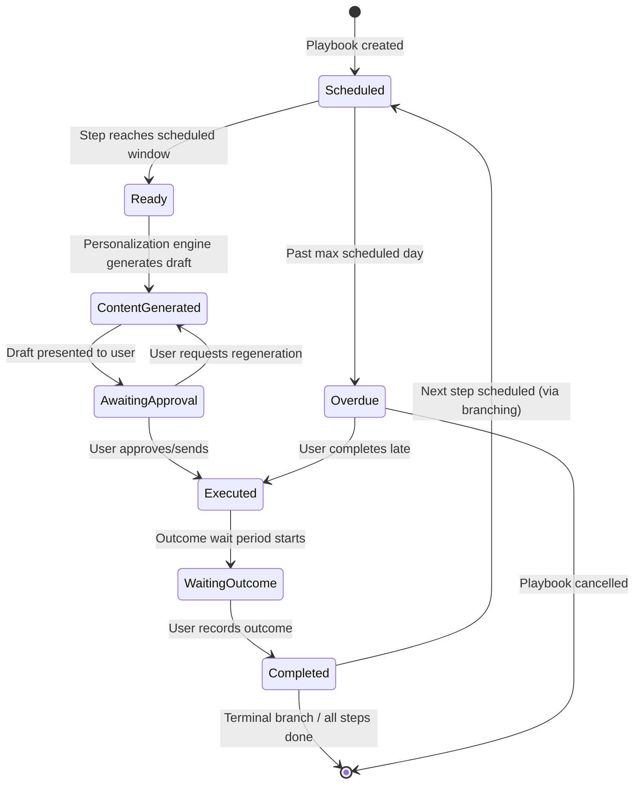

# Technical Design Document: Outreach Routing Engine

## Overview

The Outreach Routing Engine is a decision service that evaluates each prospect against configurable routing rules and assigns them to either the Lemlist automated sequence path or a new Creative Playbook path for high-touch, multi-channel outreach. It integrates into the existing GKIM Opportunity Finder v2 service layer, coordinating with the Scoring_Engine, Personalization_Engine, Lemlist_Engine, and Analytics_Service.

### Design Goals

1. **Intelligent routing** — Weighted rule evaluation drives path assignment based on Account_Score, deal size, seniority, intent, and engagement
2. **Creative Playbook orchestration** — Multi-step, multi-channel playbook execution with conditional branching and scheduling
3. **Seamless integration** — Fits into existing FastAPI routes, ARQ workers, SQLAlchemy models, and WebSocket notifications
4. **External API access** — Third-party applications can trigger routing and manage playbooks via authenticated REST endpoints
5. **Performance analytics** — Side-by-side comparison of automated vs. creative paths with actionable recommendations

### Key Architectural Decisions

| Decision | Rationale |
|----------|-----------|
| New `app/core/routing_engine.py` service | Pure computation (like ScoringEngine) — no I/O in the decision logic, testable in isolation |
| Weighted score with proportional redistribution | Mirrors ScoringEngine pattern for missing attributes; consistent UX |
| ARQ worker for playbook scheduling | Reuses existing background task infrastructure for step scheduling and escalation checks |
| SQLAlchemy models for routing/playbook state | Follows existing ORM patterns; enables complex queries for analytics |
| Redis sliding window for API rate limiting | Leverages existing Redis infrastructure; O(1) per request |
| Webhook delivery via ARQ tasks | Async delivery with retry/backoff without blocking API responses |


## Architecture

### High-Level System Diagram

```mermaid
graph TB
    subgraph "API Layer"
        RoutingAPI["/api/routing/* Routes"]
        PlaybookAPI["/api/playbooks/* Routes"]
        IntegrationAPI["/api/integration/* Routes"]
        WebhookAPI["/api/webhooks/* Routes"]
    end

    subgraph "Core Services"
        RoutingEngine["Routing Engine<br/>(app/core/routing_engine.py)"]
        PlaybookOrchestrator["Playbook Orchestrator<br/>(app/core/playbook_orchestrator.py)"]
        PersonalizationEngine["Personalization Engine<br/>(existing)"]
        ScoringEngine["Scoring Engine<br/>(existing)"]
        AnalyticsService["Analytics Service<br/>(existing — extended)"]
        WebSocketManager["WebSocket Manager<br/>(existing)"]
    end

    subgraph "Background Workers (ARQ)"
        RoutingWorker["Routing Worker<br/>(app/workers/routing_worker.py)"]
        PlaybookWorker["Playbook Worker<br/>(app/workers/playbook_worker.py)"]
        WebhookWorker["Webhook Worker<br/>(app/workers/webhook_worker.py)"]
        AnalyticsWorker["Analytics Worker<br/>(existing — extended)"]
    end

    subgraph "Integration Layer"
        LemlistEngine["Lemlist Engine<br/>(existing)"]
    end

    subgraph "Data Layer"
        PG[(PostgreSQL)]
        Redis[(Redis)]
    end

    RoutingAPI --> RoutingEngine
    PlaybookAPI --> PlaybookOrchestrator
    IntegrationAPI --> RoutingEngine
    IntegrationAPI --> PlaybookOrchestrator
    WebhookAPI --> PG

    RoutingEngine --> ScoringEngine
    RoutingEngine --> PG
    PlaybookOrchestrator --> PersonalizationEngine
    PlaybookOrchestrator --> LemlistEngine
    PlaybookOrchestrator --> WebSocketManager
    PlaybookOrchestrator --> PG

    RoutingWorker --> RoutingEngine
    RoutingWorker --> PlaybookOrchestrator
    RoutingWorker --> LemlistEngine
    PlaybookWorker --> PlaybookOrchestrator
    PlaybookWorker --> PersonalizationEngine
    WebhookWorker --> Redis
    WebhookWorker --> PG

    AnalyticsWorker --> AnalyticsService
    AnalyticsService --> PG
```




### Routing Decision Flow



### Playbook Execution Lifecycle




## Components and Interfaces

### 1. Routing Engine (`app/core/routing_engine.py`)

Pure computation service — no database access, no async, no I/O. Mirrors the ScoringEngine pattern. Receives pre-loaded prospect attributes and the active ruleset, returns a routing decision.

```python
from dataclasses import dataclass, field
from enum import Enum
from typing import Any


class OutreachPath(str, Enum):
    """Assigned outreach strategy for a prospect."""
    LEMLIST_AUTOMATED = "lemlist_automated"
    CREATIVE_PLAYBOOK = "creative_playbook"


class RuleOperator(str, Enum):
    """Operators for routing rule evaluation."""
    GREATER_THAN = "greater_than"
    LESS_THAN = "less_than"
    EQUALS = "equals"
    IN_SET = "in_set"
    BETWEEN = "between"


class EvaluationFlag(str, Enum):
    """Flags indicating evaluation completeness."""
    FULL = "full"
    PARTIAL_EVALUATION = "partial_evaluation"
    NO_EVALUATION = "no_evaluation"


@dataclass(frozen=True)
class RoutingRule:
    """A single routing rule definition.
    
    Attributes:
        id: Unique rule identifier.
        attribute: Prospect attribute to evaluate.
        operator: Comparison operator.
        threshold: Threshold value or value set.
        weight: Rule weight (0-100), all active weights must sum to 100.
        enabled: Whether this rule is active.
    """
    id: str
    attribute: str
    operator: RuleOperator
    threshold: Any  # numeric, string, list, or tuple (for between)
    weight: int
    enabled: bool = True


@dataclass(frozen=True)
class RoutingRuleset:
    """Complete collection of routing rules with threshold configuration.
    
    Attributes:
        id: Ruleset version identifier.
        rules: All routing rules (active and disabled).
        creative_playbook_threshold: Score threshold for creative path (0-100, default 70).
        version: Configuration version number.
        updated_by: User who last modified the ruleset.
    """
    id: str
    rules: list[RoutingRule]
    creative_playbook_threshold: int = 70
    version: int = 1
    updated_by: str | None = None

    @property
    def active_rules(self) -> list[RoutingRule]:
        """Return only enabled rules."""
        return [r for r in self.rules if r.enabled]

    @property
    def active_weight_sum(self) -> int:
        """Sum of weights for active rules."""
        return sum(r.weight for r in self.active_rules)


@dataclass(frozen=True)
class RuleContribution:
    """Result of evaluating a single routing rule."""
    rule_id: str
    attribute: str
    raw_match: bool  # whether the rule matched
    normalized_score: int  # 0-100 normalized score
    weighted_contribution: float  # normalized_score * effective_weight


@dataclass(frozen=True)
class RoutingDecision:
    """Complete routing decision result.
    
    Attributes:
        routing_score: Computed score (0-100).
        outreach_path: Assigned path.
        rule_contributions: Individual rule evaluations.
        evaluation_flag: Completeness of evaluation.
        missing_attributes: Attributes unavailable for evaluation.
        threshold_used: The creative_playbook_threshold at time of decision.
    """
    routing_score: int
    outreach_path: OutreachPath
    rule_contributions: list[RuleContribution]
    evaluation_flag: EvaluationFlag
    missing_attributes: list[str]
    threshold_used: int


class RoutingEngine:
    """Pure computation engine for routing decisions.
    
    Evaluates prospect attributes against a ruleset to produce a RoutingDecision.
    No I/O, no async, no database access — fully testable in isolation.
    
    Key behaviors:
    - Evaluates each active rule against prospect attributes
    - Normalizes rule results to 0-100
    - Applies configured weights with proportional redistribution for missing attributes
    - Compares final score against creative_playbook_threshold
    - Flags partial evaluations when attributes are missing
    """

    # Valid prospect attributes for routing rules
    VALID_ATTRIBUTES = {
        "account_score",           # 0-100 numeric
        "deal_size_estimate",      # 0.01-999,999,999.99 numeric
        "contact_seniority_level", # C-suite, VP, director, manager, individual_contributor
        "intent_signal_strength",  # strong, moderate, weak, none
        "industry_vertical",       # string
        "engagement_history",      # numeric (interaction count in trailing 90 days)
        "lead_source_quality_score", # 0-100 numeric
    }

    # Attribute type mapping for operator validation
    NUMERIC_ATTRIBUTES = {
        "account_score", "deal_size_estimate", 
        "engagement_history", "lead_source_quality_score"
    }
    CATEGORICAL_ATTRIBUTES = {
        "contact_seniority_level", "intent_signal_strength", "industry_vertical"
    }

    def evaluate(
        self,
        prospect_attributes: dict[str, Any],
        ruleset: RoutingRuleset,
    ) -> RoutingDecision:
        """Evaluate a prospect against the active routing ruleset.
        
        Args:
            prospect_attributes: Map of attribute name to value.
            ruleset: The active routing ruleset configuration.
            
        Returns:
            RoutingDecision with score, path, and rule contributions.
        """
        ...

    def _evaluate_rule(
        self,
        rule: RoutingRule,
        attribute_value: Any,
    ) -> int:
        """Evaluate a single rule and return a normalized score (0-100).
        
        For numeric comparisons: score is proportional to how far above/below threshold.
        For categorical matches: 100 if matched, 0 if not.
        """
        ...

    def _redistribute_weights(
        self,
        active_rules: list[RoutingRule],
        available_attributes: set[str],
    ) -> dict[str, float]:
        """Redistribute weights of rules with missing attributes proportionally.
        
        Returns map of rule_id -> effective_weight (0.0-1.0).
        """
        ...

    @staticmethod
    def validate_ruleset(ruleset: RoutingRuleset) -> list[str]:
        """Validate a ruleset configuration, returning list of error messages.
        
        Checks:
        - All rules reference valid attributes
        - Operators are compatible with attribute data types
        - Thresholds are non-empty and type-compatible
        - Active rule weights sum to 100
        - At least one active rule exists
        """
        ...
```


### 2. Playbook Orchestrator (`app/core/playbook_orchestrator.py`)

Manages Creative Playbook lifecycle — template matching, execution creation, step scheduling, content generation coordination, and state transitions.

```python
from dataclasses import dataclass, field
from datetime import datetime
from enum import Enum
from typing import Protocol


class ChannelType(str, Enum):
    """Supported Creative Playbook outreach channels."""
    PERSONALIZED_EMAIL = "personalized_email"
    LINKEDIN_CONNECT = "linkedin_connect"
    LINKEDIN_MESSAGE = "linkedin_message"
    VIDEO_MESSAGE = "video_message"
    GIFT_SEND = "gift_send"
    REFERRAL_INTRODUCTION = "referral_introduction"
    CUSTOM_CONTENT = "custom_content"
    CALENDAR_INVITE = "calendar_invite"


class StepOutcome(str, Enum):
    """Possible outcomes of a completed playbook step."""
    RESPONDED = "responded"
    ACCEPTED_CONNECTION = "accepted_connection"
    NO_RESPONSE = "no_response"
    DECLINED = "declined"


class ExecutionStatus(str, Enum):
    """Status of a playbook execution."""
    ACTIVE = "active"
    PAUSED = "paused"
    COMPLETED = "completed"
    CANCELLED = "cancelled"


class FinalOutcome(str, Enum):
    """Final outcome of a completed playbook execution."""
    RESPONDED = "responded"
    MEETING_BOOKED = "meeting_booked"
    CONVERTED = "converted"
    NO_RESPONSE = "no_response"


# Channel-to-valid-outcome mapping for conditional branching validation
CHANNEL_VALID_OUTCOMES: dict[ChannelType, set[StepOutcome]] = {
    ChannelType.PERSONALIZED_EMAIL: {
        StepOutcome.RESPONDED, StepOutcome.NO_RESPONSE, StepOutcome.DECLINED
    },
    ChannelType.LINKEDIN_CONNECT: {
        StepOutcome.ACCEPTED_CONNECTION, StepOutcome.NO_RESPONSE, StepOutcome.DECLINED
    },
    ChannelType.LINKEDIN_MESSAGE: {
        StepOutcome.RESPONDED, StepOutcome.NO_RESPONSE, StepOutcome.DECLINED
    },
    ChannelType.VIDEO_MESSAGE: {
        StepOutcome.RESPONDED, StepOutcome.NO_RESPONSE
    },
    ChannelType.GIFT_SEND: {
        StepOutcome.RESPONDED, StepOutcome.NO_RESPONSE
    },
    ChannelType.REFERRAL_INTRODUCTION: {
        StepOutcome.RESPONDED, StepOutcome.ACCEPTED_CONNECTION, StepOutcome.NO_RESPONSE
    },
    ChannelType.CUSTOM_CONTENT: {
        StepOutcome.RESPONDED, StepOutcome.NO_RESPONSE
    },
    ChannelType.CALENDAR_INVITE: {
        StepOutcome.RESPONDED, StepOutcome.ACCEPTED_CONNECTION, 
        StepOutcome.NO_RESPONSE, StepOutcome.DECLINED
    },
}


@dataclass
class PlaybookStep:
    """A single step within a Creative Playbook template."""
    order: int
    channel_type: ChannelType
    content_instructions: str  # max 10000 chars
    min_days: int  # 0-89 from start or previous step
    max_days: int  # 1-90 from start or previous step
    completion_criteria: str  # max 500 chars
    conditional_branches: dict[StepOutcome, int | None] = field(default_factory=dict)
    # Maps outcome -> next step order (None = terminal)


@dataclass
class PlaybookTemplate:
    """A Creative Playbook template definition."""
    id: str
    name: str
    steps: list[PlaybookStep]
    target_industries: list[str] = field(default_factory=list)
    target_seniority_levels: list[str] = field(default_factory=list)
    target_deal_size_min: float | None = None
    target_deal_size_max: float | None = None
    priority: int = 0  # Lower number = higher priority for matching
    created_at: datetime | None = None


@dataclass
class StepExecution:
    """Tracks execution of a single playbook step for a prospect."""
    step_order: int
    status: str  # scheduled, ready, content_generated, awaiting_approval, executed, skipped
    scheduled_date: datetime | None = None
    due_date: datetime | None = None
    content_draft: str | None = None
    outcome: StepOutcome | None = None
    completed_at: datetime | None = None


@dataclass
class PlaybookExecution:
    """Tracks a prospect's progress through a Creative Playbook."""
    id: str
    prospect_id: str
    template_id: str
    status: ExecutionStatus = ExecutionStatus.ACTIVE
    current_step_order: int = 1
    step_executions: list[StepExecution] = field(default_factory=list)
    final_outcome: FinalOutcome | None = None
    created_at: datetime | None = None
    completed_at: datetime | None = None
