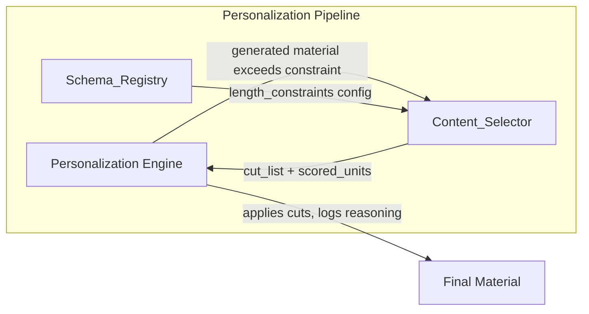
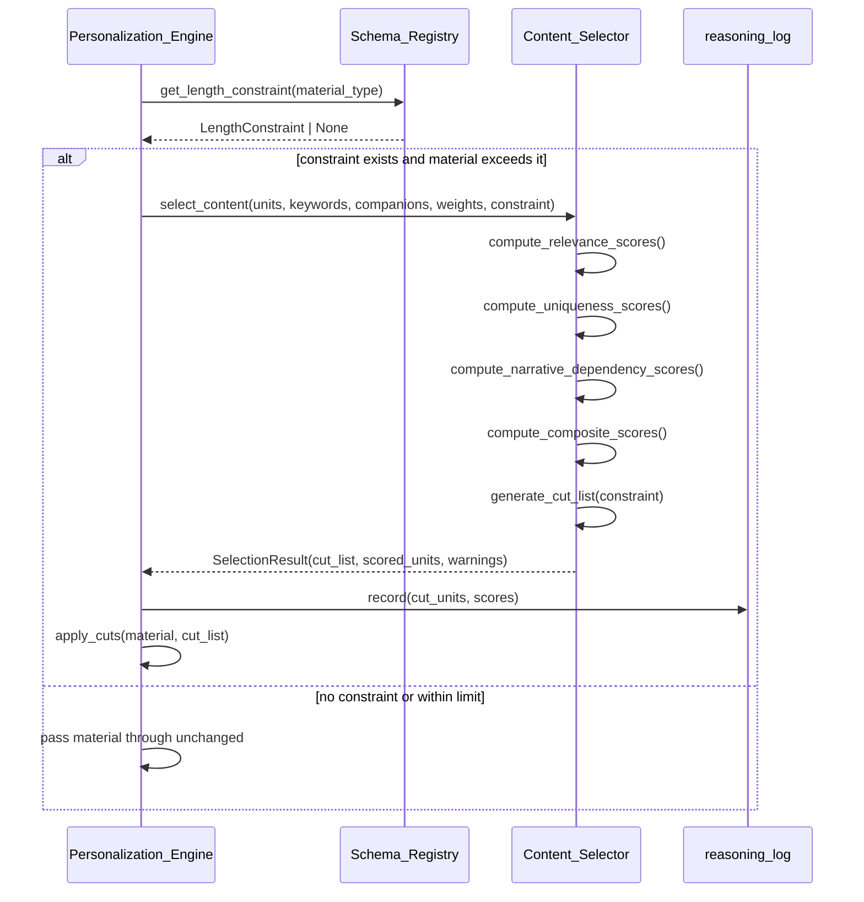
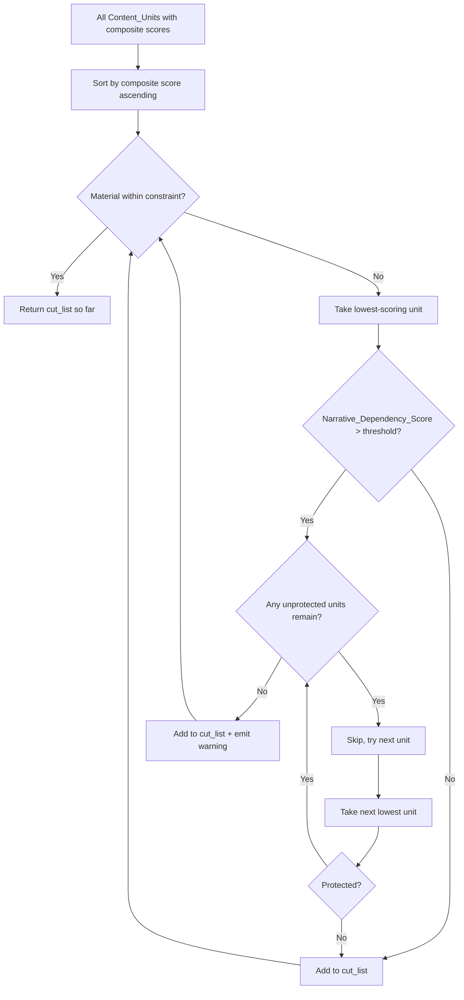

# Technical Design Document: Relevance-Weighted Content Selection

## Overview

The Content_Selector is a pure-computation module that scores content units for inclusion or cutting when generated materials exceed their length constraints. It follows the same pure-function pattern as the existing `ScoringEngine`: frozen dataclass inputs/outputs, no I/O, no async, no database access — deterministic and property-testable.

### Design Goals

1. **Determinism** — Given the same inputs, always produce the same cut list
2. **Relevance-driven cuts** — Older but keyword-matching content survives; recent but irrelevant content is cut first
3. **Narrative safety** — High-dependency units (referenced by companion materials) are protected from cuts
4. **Configuration-driven constraints** — Length limits live in Schema_Registry YAML, not code
5. **Composability** — Integrates into the Personalization_Engine pipeline as a post-generation filter

### Key Architectural Decisions

| Decision | Rationale |
|----------|-----------|
| Pure function, no I/O | Same testability pattern as ScoringEngine; enables property-based testing |
| Frozen dataclasses for all inputs/outputs | Immutability guarantees determinism, prevents side-effects |
| Three weighted sub-scores (Relevance, Uniqueness, Narrative_Dependency) | Captures the three orthogonal selection axes: match quality, deduplication, cross-material safety |
| Configurable weights summing to 100 | Same validated-weights pattern as ScoringEngine; allows per-material-type tuning |
| Protection threshold for narrative dependencies | Prevents breaking companion materials (e.g. cover letter references a CV bullet) |
| Schema_Registry extension with `length_constraints` | Keeps limits as configuration; same YAML-first pattern as the rest of the system |

## Architecture

### Module Position in System



### Content Selection Flow



### Cutting Algorithm Detail



## Components and Interfaces

### 1. Content_Selector Module (`app/core/content_selector.py`)

The main module exposing the pure selection function.

```python
"""Content_Selector — scores and ranks content units for inclusion/cutting.

Pure computation module with no database access, no async, and no I/O.
Follows the ScoringEngine pattern: frozen dataclass inputs/outputs,
configurable weights summing to 100, deterministic output.

Requirements 1.1, 1.2, 1.3, 1.4: Pure scoring with weighted sub-scores.
Requirements 2.1, 2.2, 2.3: Cutting behavior with protection threshold.
"""

from dataclasses import dataclass, field
from enum import Enum


# ─── Enums ────────────────────────────────────────────────────────────────────


class ContentUnitType(str, Enum):
    """Type of atomic content unit."""
    BULLET = "bullet"           # Experience bullet point
    SKILL_ENTRY = "skill"       # Single skill or technology entry
    SENTENCE = "sentence"       # Sentence within a paragraph
    STATEMENT = "statement"     # Profile statement line


class ConstraintType(str, Enum):
    """Type of length constraint from Schema_Registry."""
    MAX_WORDS = "max_words"
    MAX_CHARACTERS = "max_characters"
    MAX_UNITS = "max_units"


# ─── Input Dataclasses ────────────────────────────────────────────────────────


@dataclass(frozen=True)
class ContentUnit:
    """An atomic piece of material content that can be independently scored.

    Attributes:
        id: Unique identifier within the material.
        unit_type: Classification of the content unit.
        text: The actual text content.
        section: Which section this unit belongs to (e.g. "experience", "skills").
        document_order: Position in the original document (0-indexed).
        parent_paragraph_id: If sentence, the paragraph it belongs to. None otherwise.
    """
    id: str
    unit_type: ContentUnitType
    text: str
    section: str
    document_order: int
    parent_paragraph_id: str | None = None


@dataclass(frozen=True)
class CompanionReference:
    """A reference from a companion material to a content unit.

    Attributes:
        source_material: Which companion material makes the reference (e.g. "cover_letter").
        source_passage: The text passage in the companion that references this unit.
        target_unit_id: The content unit ID being referenced.
        strength: How strongly the companion depends on this unit (0-100).
    """
    source_material: str
    source_passage: str
    target_unit_id: str
    strength: int  # 0-100


@dataclass(frozen=True)
class SelectionWeights:
    """Configurable weight distribution across the three scoring factors.

    Each weight is an integer percentage (0-100). All three must sum to exactly 100.
    Default: Relevance 50%, Uniqueness 25%, Narrative_Dependency 25%.
    """
    relevance: int = 50
    uniqueness: int = 25
    narrative_dependency: int = 25

    def validate(self) -> tuple[bool, str]:
        """Validate weights are in [0, 100] and sum to 100.

        Returns:
            (True, "") if valid, (False, error_message) otherwise.
        """
        weights = [self.relevance, self.uniqueness, self.narrative_dependency]
        if not all(0 <= w <= 100 for w in weights):
            return False, "Each weight must be between 0 and 100 inclusive"
        if sum(weights) != 100:
            return False, f"Weights must sum to 100, got {sum(weights)}"
        return True, ""


@dataclass(frozen=True)
class LengthConstraint:
    """A per-material-type length constraint from Schema_Registry.

    Attributes:
        constraint_type: The type of limit (words, characters, or units).
        max_value: The numeric limit.
        section: Optional section-specific constraint. None means whole-material.
    """
    constraint_type: ConstraintType
    max_value: int
    section: str | None = None


@dataclass(frozen=True)
class SelectionConfig:
    """Full configuration for a content selection run.

    Attributes:
        weights: Sub-score weight distribution.
        protection_threshold: Narrative_Dependency_Score above which units are protected (0-100).
        length_constraint: The constraint to satisfy.
    """
    weights: SelectionWeights = field(default_factory=SelectionWeights)
    protection_threshold: int = 80
    length_constraint: LengthConstraint = field(
        default_factory=lambda: LengthConstraint(ConstraintType.MAX_WORDS, 500)
    )


# ─── Output Dataclasses ───────────────────────────────────────────────────────


@dataclass(frozen=True)
class ScoredUnit:
    """A content unit with its computed scores.

    Attributes:
        unit: The original content unit.
        relevance_score: Keyword/capability match score (0-100).
        uniqueness_score: Information overlap penalty inverted to uniqueness (0-100).
        narrative_dependency_score: Cross-material dependency score (0-100).
        composite_score: Weighted combination of sub-scores (0-100).
    """
    unit: ContentUnit
    relevance_score: int
    uniqueness_score: int
    narrative_dependency_score: int
    composite_score: int


@dataclass(frozen=True)
class CutEntry:
    """A single entry in the cut list.

    Attributes:
        unit: The content unit to be cut.
        composite_score: The score at time of cutting.
        forced: True if this unit was protected but had to be cut anyway.
    """
    unit: ContentUnit
    composite_score: int
    forced: bool = False


@dataclass(frozen=True)
class ProtectionWarning:
    """Warning emitted when a protected unit must be cut.

    Attributes:
        unit_id: The protected content unit that was force-cut.
        narrative_dependency_score: Its dependency score.
        dependent_passage: The companion passage that depends on this unit.
        source_material: Which companion material is affected.
    """
    unit_id: str
    narrative_dependency_score: int
    dependent_passage: str
    source_material: str


@dataclass(frozen=True)
class SelectionResult:
    """Complete output of the content selection algorithm.

    Attributes:
        scored_units: All units with their computed scores, ordered by composite descending.
        cut_list: Units to cut, ordered lowest-score-first.
        retained_units: Units that survive, ordered by document_order.
        warnings: Protection warnings for force-cut units.
        original_length: Length of input material (in constraint units).
        final_length: Length after cuts (in constraint units).
    """
    scored_units: list[ScoredUnit]
    cut_list: list[CutEntry]
    retained_units: list[ContentUnit]
    warnings: list[ProtectionWarning]
    original_length: int
    final_length: int
```

### 2. Content_Selector Core Function

```python
class ContentSelector:
    """Pure-function content selection engine.

    Stateless: all configuration is passed per invocation. No instance state
    is mutated between calls. Could be a module-level function, but class
    grouping aids discoverability and future extension.
    """

    def select_content(
        self,
        *,
        units: list[ContentUnit],
        opportunity_keywords: list[str],
        companion_references: list[CompanionReference],
        config: SelectionConfig,
    ) -> SelectionResult:
        """Score all units and produce a cut list to satisfy the length constraint.

        Args:
            units: All content units in the material, in document order.
            opportunity_keywords: Keywords/capabilities extracted from the opportunity.
            companion_references: References from companion materials to these units.
            config: Weights, protection threshold, and length constraint.

        Returns:
            SelectionResult with scored units, cut list, and warnings.

        Raises:
            ValueError: If config.weights fails validation.
        """
        # 1. Validate configuration
        valid, error = config.weights.validate()
        if not valid:
            raise ValueError(f"Invalid weight configuration: {error}")

        # 2. Compute sub-scores for each unit
        scored = self._score_all_units(units, opportunity_keywords, companion_references, config)

        # 3. Generate cut list to satisfy constraint
        cut_list, warnings = self._generate_cut_list(scored, config)

        # 4. Compute retained units (original order preserved)
        cut_ids = {entry.unit.id for entry in cut_list}
        retained = [su.unit for su in scored if su.unit.id not in cut_ids]
        retained.sort(key=lambda u: u.document_order)

        # 5. Compute lengths
        original_length = self._measure_length(units, config.length_constraint)
        final_length = self._measure_length(retained, config.length_constraint)

        return SelectionResult(
            scored_units=sorted(scored, key=lambda s: s.composite_score, reverse=True),
            cut_list=cut_list,
            retained_units=retained,
            warnings=warnings,
            original_length=original_length,
            final_length=final_length,
        )
```

### 3. Schema_Registry Extension

The existing `prepare_techniques` section in `config/schema.yaml` is extended with an optional `length_constraints` field on each output:

```yaml
prepare_techniques:
  - id: cv_and_cover_letter
    service_class: CVGeneratorService
    description: "Generates tailored CV and cover letter via LLM using enrichment data"
    inputs:
      - resume
      - cover_letter
      - instructions
      - consultant_profiles
    outputs:
      - tailored_cv
      - tailored_cover_letter
      - reasoning_log
    length_constraints:
      tailored_cv:
        max_words: 800
      tailored_cover_letter:
        max_words: 400

  - id: cold_email_composition
    service_class: ColdEmailComposerService
    description: "Drafts personalized cold emails using Apollo enrichment and hooks"
    inputs:
      - cold_email_instructions
      - consultant_profiles
      - enrichment_record
    outputs:
      - draft_email
    length_constraints:
      draft_email:
        max_words: 250

  - id: proposal_composition
    service_class: ProposalCompositionService
    description: "Generates project proposals from company profile, case studies, and enrichment"
    inputs:
      - company_profile
      - company_documents
      - enrichment_record
    outputs:
      - proposal_document
      - executive_summary
    length_constraints:
      executive_summary:
        max_words: 150
      # proposal_document has no constraint — skipped by Content_Selector
```

Schema_Registry dataclass addition:

```python
@dataclass(frozen=True)
class LengthConstraintConfig:
    """Length constraint as declared in schema YAML.

    Exactly one of max_words, max_characters, max_units must be set.
    """
    max_words: int | None = None
    max_characters: int | None = None
    max_units: int | None = None

    def to_length_constraint(self) -> "LengthConstraint":
        """Convert to the Content_Selector's LengthConstraint type."""
        if self.max_words is not None:
            return LengthConstraint(ConstraintType.MAX_WORDS, self.max_words)
        if self.max_characters is not None:
            return LengthConstraint(ConstraintType.MAX_CHARACTERS, self.max_characters)
        if self.max_units is not None:
            return LengthConstraint(ConstraintType.MAX_UNITS, self.max_units)
        raise ValueError("At least one constraint type must be specified")
```

## Data Models

### Content Unit Atomization Strategy

Materials are atomized into `ContentUnit` instances based on their structure:

| Material Type | Atomization Rule | ContentUnitType |
|---------------|-----------------|-----------------|
| Experience section | Each bullet point → one unit | BULLET |
| Skills section | Each skill/technology → one unit | SKILL_ENTRY |
| Profile statement | Each line → one unit | STATEMENT |
| Cover letter body paragraphs | Each sentence → one unit | SENTENCE |
| Proposal sections | Each sentence → one unit | SENTENCE |

### Sub-Score Computation Algorithms

#### Relevance_Score (0–100)

Measures keyword/capability match between a content unit and the opportunity.

```python
def _compute_relevance_score(
    self,
    unit: ContentUnit,
    opportunity_keywords: list[str],
) -> int:
    """Compute relevance score as percentage of keywords matched.

    Algorithm:
    1. Normalize unit text to lowercase tokens (split on whitespace + punctuation).
    2. Normalize each keyword to lowercase.
    3. For each keyword, check if it appears as a substring in the unit text.
    4. Score = (matched_keywords / total_keywords) * 100, rounded to int.

    Edge cases:
    - Empty keywords list → score 100 (everything is relevant by default).
    - Empty unit text → score 0.
    """
    if not opportunity_keywords:
        return 100
    if not unit.text.strip():
        return 0

    text_lower = unit.text.lower()
    matched = sum(1 for kw in opportunity_keywords if kw.lower() in text_lower)
    return int(round((matched / len(opportunity_keywords)) * 100))
```

#### Uniqueness_Score (0–100)

Penalizes content units whose information duplicates other units in the same material.

```python
def _compute_uniqueness_scores(
    self,
    units: list[ContentUnit],
) -> dict[str, int]:
    """Compute uniqueness scores for all units via pairwise token overlap.

    Algorithm:
    1. For each unit, extract a token set (lowercase, stopwords removed).
    2. For each unit pair, compute Jaccard similarity.
    3. Each unit's overlap = max Jaccard similarity with any other unit.
    4. Uniqueness_Score = 100 - (max_overlap * 100), clamped to [0, 100].

    A unit with no token overlap with anything else gets 100 (fully unique).
    A unit that is a subset of another gets close to 0 (redundant).
    """
    ...
```

#### Narrative_Dependency_Score (0–100)

Measures whether companion materials reference this content unit.

```python
def _compute_narrative_dependency_score(
    self,
    unit: ContentUnit,
    companion_references: list[CompanionReference],
) -> int:
    """Compute narrative dependency from companion references.

    Algorithm:
    1. Collect all CompanionReferences whose target_unit_id matches this unit.
    2. If no references → score 0 (no dependency, safe to cut).
    3. If references exist → score = max(reference.strength for matching refs).

    A unit referenced by a cover letter passage with strength 90 gets
    Narrative_Dependency_Score = 90, making it highly protected.
    """
    matching = [ref for ref in companion_references if ref.target_unit_id == unit.id]
    if not matching:
        return 0
    return max(ref.strength for ref in matching)
```

#### Composite Score

```python
def _compute_composite_score(
    self,
    relevance: int,
    uniqueness: int,
    narrative_dependency: int,
    weights: SelectionWeights,
) -> int:
    """Weighted composite: (R * w_r + U * w_u + N * w_n) / 100.

    Since weights sum to 100, dividing by 100 normalizes back to 0-100 range.
    Result is rounded to nearest integer.
    """
    raw = (
        relevance * weights.relevance
        + uniqueness * weights.uniqueness
        + narrative_dependency * weights.narrative_dependency
    )
    return int(round(raw / 100))
```

### Tie-Breaking Rules

When two `ScoredUnit` instances have equal `composite_score`:
1. Higher `relevance_score` wins (keeps the more relevant unit)
2. If still tied, lower `document_order` wins (earlier in document is preserved)

Sort key for cutting (ascending = cut first):

```python
sort_key = lambda su: (su.composite_score, su.relevance_score, -su.unit.document_order)
```

### Length Measurement

```python
def _measure_length(
    self,
    units: list[ContentUnit],
    constraint: LengthConstraint,
) -> int:
    """Measure total length of units in the constraint's unit type."""
    if constraint.constraint_type == ConstraintType.MAX_WORDS:
        return sum(len(u.text.split()) for u in units)
    elif constraint.constraint_type == ConstraintType.MAX_CHARACTERS:
        return sum(len(u.text) for u in units)
    elif constraint.constraint_type == ConstraintType.MAX_UNITS:
        return len(units)
    return 0
```

### Paragraph-Internal Sentence Cutting

When cutting sentences within a paragraph, the algorithm prefers cutting low-uniqueness sentences first (Requirement 2.3). This is handled naturally by the composite scoring: sentences with low `Uniqueness_Score` get lower composite scores, so they appear earlier in the cut list. No special-case logic is needed — the scoring model already encodes this preference through the Uniqueness weight.


## Correctness Properties

*A property is a characteristic or behavior that should hold true across all valid executions of a system — essentially, a formal statement about what the system should do. Properties serve as the bridge between human-readable specifications and machine-verifiable correctness guarantees.*

### Property 1: Composite Score Formula

*For any* content unit with sub-scores `relevance ∈ [0,100]`, `uniqueness ∈ [0,100]`, `narrative_dependency ∈ [0,100]` and *for any* valid weight configuration where `w_r + w_u + w_n = 100` and each weight ∈ [0,100], the computed composite score SHALL equal `round((relevance * w_r + uniqueness * w_u + narrative_dependency * w_n) / 100)`.

**Validates: Requirements 1.2**

### Property 2: Weight Validation Acceptance and Rejection

*For any* triple of integers `(a, b, c)`:
- If `a + b + c = 100` and all are in `[0, 100]`, the selector SHALL accept the configuration without error.
- If `a + b + c ≠ 100` OR any value is outside `[0, 100]`, the selector SHALL raise a `ValueError` with a descriptive message.

**Validates: Requirements 1.3**

### Property 3: Cut List Satisfies Constraint with Correct Ordering

*For any* set of content units whose total length exceeds a given `LengthConstraint`, the `SelectionResult` SHALL satisfy:
1. The `cut_list` is ordered by ascending `composite_score`.
2. The `final_length` (retained units measured in the constraint's unit type) is ≤ `constraint.max_value`.
3. The cut list is minimal: removing any single entry from `cut_list` would cause `final_length` to exceed the constraint.

**Validates: Requirements 2.1, 2.3**

### Property 4: Tie-Breaking Determinism

*For any* two scored units with equal `composite_score`, the unit with higher `relevance_score` SHALL rank higher (retained over the other). If `relevance_score` is also equal, the unit with lower `document_order` SHALL rank higher.

**Validates: Requirements 1.4**

### Property 5: Protection Threshold Invariant

*For any* selection run where the `LengthConstraint` can be satisfied by cutting only units with `narrative_dependency_score ≤ protection_threshold`:
- No unit with `narrative_dependency_score > protection_threshold` SHALL appear in the `cut_list`.

*For any* selection run where the constraint CANNOT be satisfied without cutting protected units:
- The `warnings` list SHALL contain a `ProtectionWarning` for each force-cut protected unit, identifying the dependent companion passage.

**Validates: Requirements 2.2**

### Property 6: Schema Length Constraints Parsing Round-Trip

*For any* valid `length_constraints` YAML block (specifying one of `max_words`, `max_characters`, or `max_units` with a positive integer value), parsing via `Schema_Registry` and converting to a `LengthConstraint` object SHALL produce a `LengthConstraint` with matching `constraint_type` and `max_value`.

**Validates: Requirements 3.1**

## Error Handling

| Error Condition | Behavior | Output |
|----------------|----------|--------|
| Invalid weight configuration (sum ≠ 100 or out of bounds) | Raise `ValueError` immediately | Descriptive error message identifying which validation failed |
| Empty content units list | Return empty `SelectionResult` (no cuts needed) | `cut_list=[], retained_units=[], final_length=0` |
| Empty opportunity keywords | All units get `relevance_score=100` (everything relevant by default) | Normal scoring with max relevance |
| No companion references | All units get `narrative_dependency_score=0` (nothing protected) | Normal cutting without protection |
| Constraint already satisfied (material within limit) | Return empty cut list | `cut_list=[], retained_units=all_units` |
| All units are protected and constraint still exceeded | Force-cut lowest-scoring protected units, emit warnings | `warnings` populated with `ProtectionWarning` entries |
| Protection threshold out of range (not in [0, 100]) | Raise `ValueError` | Descriptive error message |
| Negative or zero `max_value` in LengthConstraint | Raise `ValueError` | Descriptive error message |
| Content unit with empty text | Treated as 0 words / 0 characters; gets `relevance_score=0` | May be cut early due to low relevance |

## Testing Strategy

### Property-Based Testing (Hypothesis)

This module is an ideal PBT candidate: pure functions, no I/O, large input space (arbitrary content units, keywords, weights), and clear universal invariants.

**Library**: [Hypothesis](https://hypothesis.readthedocs.io/) (already in use in this project — see `.hypothesis/` directory)

**Configuration**: Minimum 100 examples per property test (Hypothesis default is 100; we'll use `@settings(max_examples=200)` for extra coverage on critical properties).

**Tag format**: Each test function is tagged with a docstring comment:
```
Feature: relevance-weighted-selection, Property {N}: {property_text}
```

**Property tests to implement**:

| # | Property | Generator Strategy |
|---|----------|-------------------|
| 1 | Composite Score Formula | Random sub-scores in [0,100], random valid weight triples |
| 2 | Weight Validation | Random integer triples (both valid and invalid) |
| 3 | Cut List Ordering + Constraint Satisfaction | Random ContentUnit lists exceeding a random constraint |
| 4 | Tie-Breaking Determinism | ContentUnit lists with deliberately equal composite scores |
| 5 | Protection Threshold Invariant | ContentUnit lists with mixed narrative_dependency_scores |
| 6 | Schema Parsing Round-Trip | Random length_constraints YAML values |

### Unit Tests (pytest)

Unit tests cover specific examples, edge cases, and integration points:

- **Default weights**: Verify default 50/25/25 produces expected scores for known inputs
- **All-zero relevance**: Content with no keyword matches scores 0 relevance
- **Single-unit material**: A material with one unit is never cut (already within any constraint of ≥1)
- **Exact constraint boundary**: Material exactly at the limit → no cuts
- **Force-cut scenario**: All units protected, material over limit → warnings emitted
- **Paragraph sentence ordering**: Verify within-paragraph cut ordering matches uniqueness ordering
- **Document order stability**: Units with identical scores are cut in reverse document order (last first)

### Integration Tests

- **PersonalizationEngine invokes ContentSelector**: Mock Content_Selector, verify it's called when material exceeds constraint
- **PersonalizationEngine skips when no constraint**: Verify no call to Content_Selector when `length_constraints` is absent
- **reasoning_log records cuts**: Verify cut entries with scores appear in the log
- **Schema_Registry loads length_constraints from YAML**: Load real schema file with constraints, verify parsed correctly
