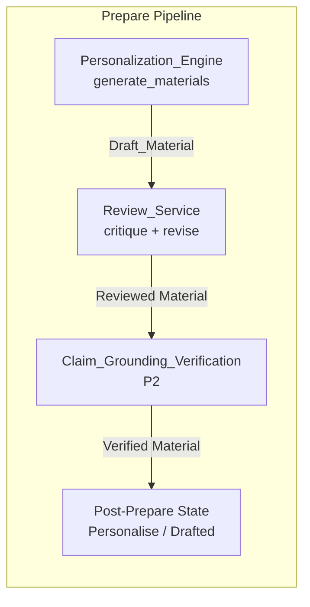
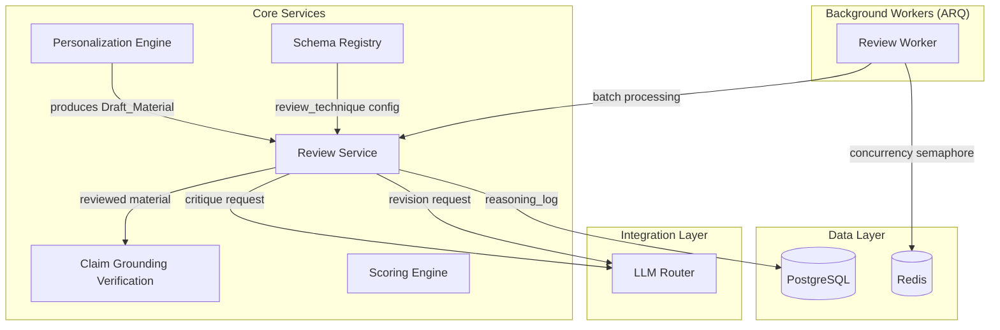
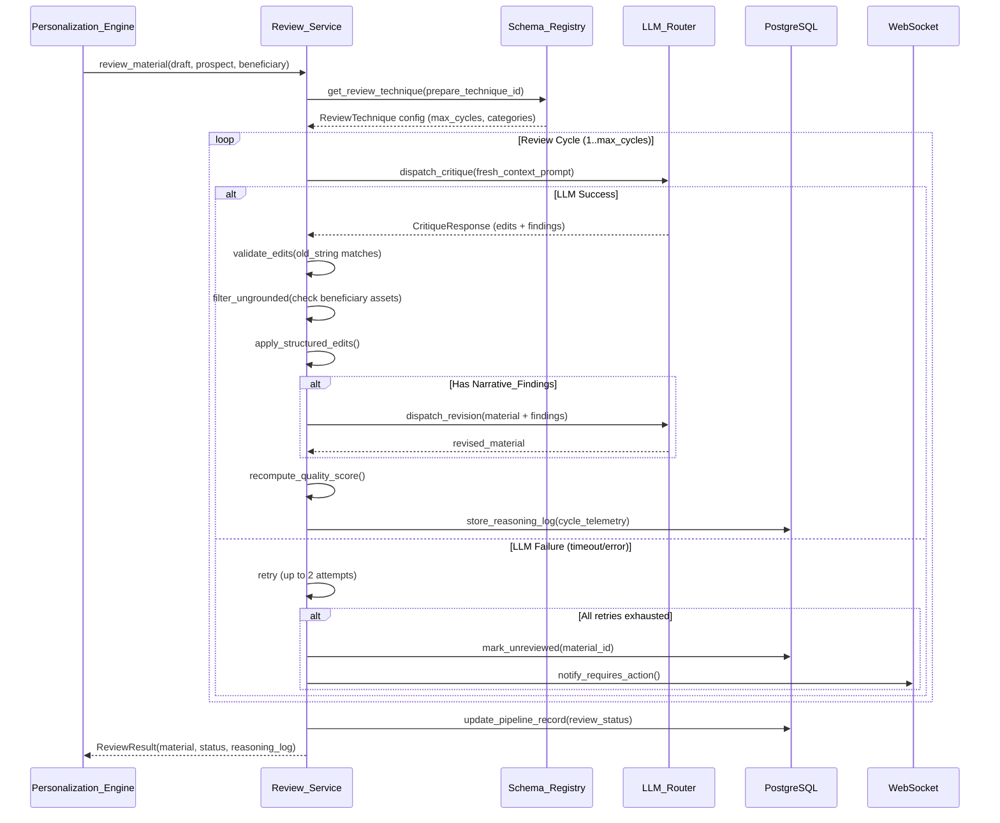
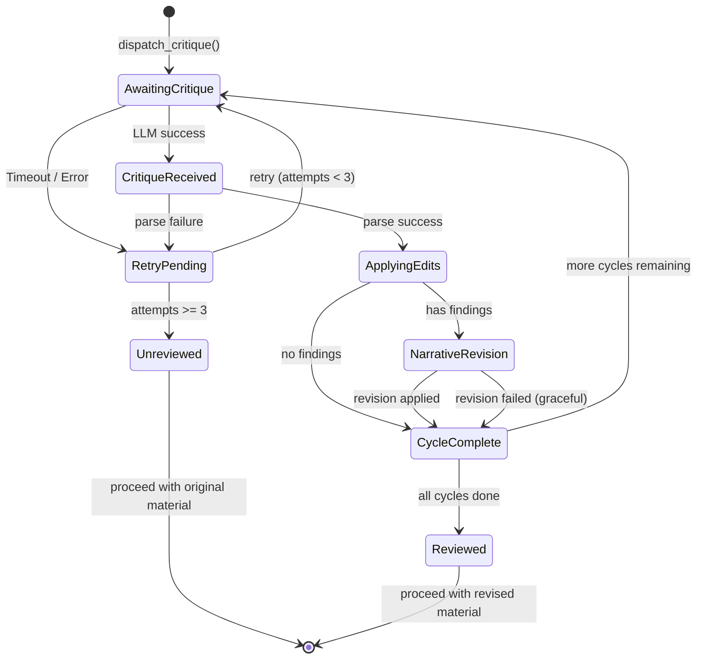

# Design Document: Review Critique Loop

## Overview

The Review Critique Loop introduces a fresh-context LLM evaluation pass over every generated outreach material (tailored CV, cover letter, cold email, proposal) before it advances in the prepare pipeline. The Review_Service sits between the Personalization_Engine's material generation and the claim-grounding-verification step, sharing the same P1/P2 insertion point in the prepare pipeline.

The core insight is that a drafting LLM cannot reliably self-critique: it lacks distance from its own generation. A fresh-context reviewer — given only the draft text plus the prospect's Enrichment_Record and opportunity context — reliably catches generic phrasing, missed company-specific angles, passive framing, and tone mismatches. The reviewer returns structured, machine-applicable edits (exact string replacements) alongside narrative findings that require a targeted revision pass.

The design follows existing system-redesign-v2 patterns: dataclasses for domain models, enums for fixed states, async/await with httpx for I/O, ARQ background workers for batch processing, Schema_Registry YAML for declarative wiring, and LLM_Router for provider-agnostic LLM dispatch.

## Architecture

### Pipeline Insertion Point



### Review_Service Position in the System



### Review Cycle Sequence



## Components and Interfaces

### 1. Review_Service (`app/core/review_service.py`)

The primary orchestrator for the review critique loop. Manages cycle control, edit application, and graceful degradation.

```python
from dataclasses import dataclass, field
from enum import Enum
from datetime import datetime
import asyncio


class ReviewStatus(str, Enum):
    REVIEWED = "reviewed"
    UNREVIEWED = "unreviewed"
    REVIEW_FAILED = "review_failed"


class EditReason(str, Enum):
    KEYWORD_MATCH = "keyword_match"
    COMPANY_ANGLE = "company_angle"
    REFRAMING = "reframing"
    STYLE = "style"


class EditSkipReason(str, Enum):
    AMBIGUOUS_OR_STALE_TARGET = "ambiguous_or_stale_target"
    UNGROUNDED_SUGGESTION = "ungrounded_suggestion"


class CritiqueCategory(str, Enum):
    MISSED_KEYWORDS = "missed_keywords"
    COMPANY_ANGLES = "company_angles"
    REFRAMING = "reframing"
    TONE_STYLE = "tone_style"


@dataclass
class StructuredEdit:
    """A machine-applicable revision instruction."""
    target_material_id: str
    old_string: str
    new_string: str
    reason: EditReason
    category: CritiqueCategory


@dataclass
class NarrativeFinding:
    """A prose critique requiring drafter judgment."""
    category: CritiqueCategory
    description: str
    flagged_passage: str | None = None  # exact quote from material


@dataclass
class CritiqueResponse:
    """Structured output from the reviewer LLM."""
    structured_edits: list[StructuredEdit]
    narrative_findings: dict[CritiqueCategory, list[NarrativeFinding]]
    # Every category present even if empty


@dataclass
class EditOutcome:
    """Tracks what happened to each edit."""
    edit: StructuredEdit
    applied: bool
    skip_reason: EditSkipReason | None = None


@dataclass
class CycleLog:
    """Telemetry for a single review cycle."""
    cycle_number: int
    edits_applied: int
    edits_skipped: int
    edits_discarded: int
    narrative_findings_by_category: dict[CritiqueCategory, int]
    quality_score_before: int
    quality_score_after: int
    duration_ms: int
    skipped_edits: list[EditOutcome] = field(default_factory=list)
    discarded_edits: list[EditOutcome] = field(default_factory=list)


@dataclass
class ReasoningLog:
    """Complete telemetry for all review cycles on a material."""
    material_id: str
    prepare_technique_id: str
    review_technique_id: str
    cycles: list[CycleLog]
    total_cycles_executed: int
    max_cycles_configured: int
    final_review_status: ReviewStatus
    started_at: datetime
    completed_at: datetime


@dataclass
class ReviewResult:
    """Final output of the review process."""
    material_id: str
    revised_content: str
    review_status: ReviewStatus
    reasoning_log: ReasoningLog
    quality_score_final: int
    total_edits_applied: int


class ReviewService:
    """Orchestrates fresh-context LLM critique of drafted materials."""

    CRITIQUE_TIMEOUT = 60.0  # seconds
    MAX_RETRIES = 2
    DISPATCH_DEADLINE = 10.0  # must dispatch within 10s of draft completion
    BATCH_CONCURRENCY = 3  # max concurrent critique requests

    def __init__(
        self,
        llm_router: "LLMRouter",
        schema_registry: "SchemaRegistry",
        db_repo: "ReviewRepository",
        personalization_engine: "PersonalizationEngine",
    ):
        self._llm = llm_router
        self._schema = schema_registry
        self._db = db_repo
        self._personalization = personalization_engine
        self._semaphore = asyncio.Semaphore(self.BATCH_CONCURRENCY)

    async def review_material(
        self,
        draft_material: "DraftMaterial",
        prospect: "Prospect",
        beneficiary: "Beneficiary",
        enrichment: "EnrichmentRecord",
        opportunity_description: str,
    ) -> ReviewResult:
        """Execute review cycle(s) on a single draft material.

        Preconditions:
        - draft_material.content is non-empty
        - enrichment is the prospect's current EnrichmentRecord
        - prepare_technique has a review_technique reference in schema

        Postconditions:
        - Returns ReviewResult with status in {reviewed, unreviewed, review_failed}
        - reasoning_log is persisted to database
        - Material transitions to post-prepare pipeline state
        """
        ...

    async def review_batch(
        self,
        materials: list["DraftMaterial"],
        prospect: "Prospect",
        beneficiary: "Beneficiary",
        enrichment: "EnrichmentRecord",
        opportunity_description: str,
    ) -> list[ReviewResult]:
        """Process a batch of materials with bounded concurrency (max 3).

        Uses asyncio.Semaphore to limit concurrent critique requests.
        """
        tasks = [
            self._review_with_semaphore(m, prospect, beneficiary, enrichment, opportunity_description)
            for m in materials
        ]
        return await asyncio.gather(*tasks)

    async def _review_with_semaphore(
        self,
        draft_material: "DraftMaterial",
        prospect: "Prospect",
        beneficiary: "Beneficiary",
        enrichment: "EnrichmentRecord",
        opportunity_description: str,
    ) -> ReviewResult:
        """Acquire semaphore before dispatching critique."""
        async with self._semaphore:
            return await self.review_material(
                draft_material, prospect, beneficiary, enrichment, opportunity_description
            )

    async def _dispatch_critique(
        self,
        material_text: str,
        opportunity_description: str,
        enrichment: "EnrichmentRecord",
        beneficiary: "Beneficiary",
        categories: list[CritiqueCategory],
    ) -> CritiqueResponse:
        """Dispatch fresh-context critique to LLM_Router with retry logic.

        Preconditions:
        - Context contains ONLY: material text, opportunity description,
          enrichment record, beneficiary profile assets
        - Does NOT include drafting pass conversation/prompt/reasoning

        Postconditions:
        - Returns CritiqueResponse with all categories populated
        - Raises ReviewLLMError after MAX_RETRIES exhausted

        Retry: up to 2 retries on timeout/failure, 60s timeout per attempt.
        """
        ...

    def _apply_structured_edits(
        self,
        material_text: str,
        edits: list[StructuredEdit],
        beneficiary_assets: set[str],
    ) -> tuple[str, list[EditOutcome]]:
        """Apply edits sequentially, validating each against current text.

        Rules:
        1. old_string must match exactly once in current material text
        2. If zero or >1 matches: skip with AMBIGUOUS_OR_STALE_TARGET
        3. If edit introduces content not in beneficiary assets: discard
           with UNGROUNDED_SUGGESTION
        4. Applied edits modify the running text for subsequent edits

        Returns: (revised_text, list of EditOutcome for telemetry)
        """
        ...

    async def _dispatch_narrative_revision(
        self,
        material_text: str,
        findings: dict[CritiqueCategory, list[NarrativeFinding]],
    ) -> str:
        """Single LLM call to revise flagged passages based on Narrative_Findings.

        The prompt instructs targeted revision ONLY of flagged passages,
        preserving all other content verbatim.
        """
        ...

    def _build_fresh_context_prompt(
        self,
        material_text: str,
        opportunity_description: str,
        enrichment: "EnrichmentRecord",
        beneficiary: "Beneficiary",
        categories: list[CritiqueCategory],
    ) -> str:
        """Construct the critique prompt with strict context boundaries.

        Includes ONLY:
        - Draft material text (inline)
        - Opportunity description
        - Enrichment_Record (firmographics, technographics, intents, seniority)
        - Beneficiary profile assets

        Excludes:
        - Drafting pass conversation history
        - Drafting prompt/instructions
        - Drafting reasoning/chain-of-thought
        """
        ...
```

### 2. Schema_Registry Extensions (`config/schema.yaml`)

New `review_techniques` top-level section and optional `review_technique` field on prepare techniques.

```yaml
# ─── REVIEW TECHNIQUES ────────────────────────────────────────────────────────

review_techniques:
  - id: standard_material_review
    service_class: ReviewService
    description: "Fresh-context LLM critique of CV, cover letter, and proposal materials"
    critique_categories:
      - missed_keywords
      - company_angles
      - reframing
      - tone_style
    max_review_cycles: 2

  - id: email_review
    service_class: ReviewService
    description: "Focused critique for cold email drafts — brevity and hook emphasis"
    critique_categories:
      - missed_keywords
      - company_angles
      - reframing
      - tone_style
    max_review_cycles: 1
```

Updated prepare techniques with optional `review_technique` reference:

```yaml
prepare_techniques:
  - id: cv_and_cover_letter
    service_class: CVGeneratorService
    description: "Generates tailored CV and cover letter via LLM"
    review_technique: standard_material_review   # ← NEW
    inputs:
      - resume
      - cover_letter
      - instructions
      - consultant_profiles
    outputs:
      - tailored_cv
      - tailored_cover_letter
      - reasoning_log

  - id: cold_email_composition
    service_class: ColdEmailComposerService
    description: "Drafts personalized cold emails"
    review_technique: email_review              # ← NEW
    inputs:
      - cold_email_instructions
      - consultant_profiles
      - enrichment_record
    outputs:
      - draft_email

  - id: proposal_composition
    service_class: ProposalCompositionService
    description: "Generates project proposals"
    review_technique: standard_material_review   # ← NEW
    inputs:
      - company_profile
      - company_documents
      - enrichment_record
    outputs:
      - proposal_document
      - executive_summary
```

### 3. Schema_Registry Dataclass Extensions (`app/core/schema_registry.py`)

```python
@dataclass
class ReviewTechnique:
    """Schema-declared review technique configuration."""
    id: str
    service_class: str
    description: str
    critique_categories: list[str]  # maps to CritiqueCategory enum values
    max_review_cycles: int  # 1-3


@dataclass
class PrepareTechnique:
    """Extended with optional review_technique reference."""
    id: str
    service_class: str
    description: str
    inputs: list[str] = field(default_factory=list)
    outputs: list[str] = field(default_factory=list)
    review_technique: str | None = None  # references ReviewTechnique.id


class SchemaRegistry:
    # ... existing code ...

    def _validate(self) -> None:
        """Extended validation to cover review_techniques."""
        # ... existing validation ...
        self._validate_review_technique_references()

    def _validate_review_technique_references(self) -> None:
        """Validate that every prepare_technique.review_technique resolves
        to a declared review_technique id.

        Raises SchemaValidationError with descriptive message on failure.
        """
        review_ids = {rt['id'] for rt in self._raw.get('review_techniques', [])}
        for pt in self._raw.get('prepare_techniques', []):
            ref = pt.get('review_technique')
            if ref and ref not in review_ids:
                raise SchemaValidationError(
                    f"PrepareTechnique '{pt['id']}' references unknown "
                    f"review_technique '{ref}'",
                    entity_id=pt['id']
                )

    def _parse(self) -> None:
        """Extended to parse review_techniques."""
        # ... existing parsing ...
        self.review_techniques = [
            ReviewTechnique(**rt) for rt in self._raw.get('review_techniques', [])
        ]

    def get_review_technique(self, review_technique_id: str) -> ReviewTechnique | None:
        return next(
            (rt for rt in self.review_techniques if rt.id == review_technique_id),
            None
        )

    def get_review_technique_for_prepare(self, prepare_technique_id: str) -> ReviewTechnique | None:
        """Get the review technique wired to a prepare technique, or None if skipped."""
        pt = next(
            (p for p in self.prepare_techniques if p.id == prepare_technique_id),
            None
        )
        if not pt or not pt.review_technique:
            return None
        return self.get_review_technique(pt.review_technique)
```

### 4. Review Worker (`app/workers/review_worker.py`)

ARQ background worker for batch review processing with concurrency control.

```python
import asyncio
from arq import cron

class ReviewWorker:
    """ARQ worker for processing queued review requests."""

    BATCH_SIZE = 10
    CONCURRENCY_LIMIT = 3

    def __init__(self, review_service: "ReviewService", redis_pool):
        self._review_service = review_service
        self._redis = redis_pool

    async def process_review_queue(self, ctx: dict) -> dict:
        """Process pending review requests from the queue.

        Respects CONCURRENCY_LIMIT via the ReviewService's semaphore.
        Returns summary of processed items.
        """
        pending = await self._fetch_pending_reviews(limit=self.BATCH_SIZE)
        if not pending:
            return {"processed": 0}

        results = await self._review_service.review_batch(
            materials=[r.draft_material for r in pending],
            prospect=pending[0].prospect,
            beneficiary=pending[0].beneficiary,
            enrichment=pending[0].enrichment,
            opportunity_description=pending[0].opportunity_description,
        )

        return {
            "processed": len(results),
            "reviewed": sum(1 for r in results if r.review_status == ReviewStatus.REVIEWED),
            "unreviewed": sum(1 for r in results if r.review_status == ReviewStatus.UNREVIEWED),
            "failed": sum(1 for r in results if r.review_status == ReviewStatus.REVIEW_FAILED),
        }

    async def _fetch_pending_reviews(self, limit: int) -> list:
        """Fetch pending review requests from database queue."""
        ...
```

### 5. LLM_Router Extension for Critique Calls

```python
class EvaluationType(str, Enum):
    MATCHING = "matching"
    GENERATION = "generation"
    RESEARCH = "research"
    CRITIQUE = "critique"      # ← NEW: fresh-context review
    REVISION = "revision"      # ← NEW: narrative finding revision


class LLMRouter:
    # ... existing code ...

    async def dispatch_critique(
        self,
        prompt: str,
        timeout: float = 60.0,
    ) -> dict:
        """Dispatch a critique request using the CRITIQUE evaluation type config.

        Returns raw JSON response for parsing by Review_Service.
        Raises APITimeoutError after timeout.
        """
        config = self._configs[EvaluationType.CRITIQUE]
        return await self._call_llm(prompt, config, timeout=timeout)

    async def dispatch_revision(
        self,
        prompt: str,
        timeout: float = 60.0,
    ) -> str:
        """Dispatch a targeted revision request using REVISION config.

        Returns revised material text.
        """
        config = self._configs[EvaluationType.REVISION]
        return await self._call_llm(prompt, config, timeout=timeout)
```


## Data Models

### PostgreSQL Schema Extensions

```sql
-- Review reasoning logs (one row per material review lifecycle)
CREATE TABLE review_reasoning_logs (
    id UUID PRIMARY KEY DEFAULT gen_random_uuid(),
    material_id UUID NOT NULL,
    pipeline_record_id UUID NOT NULL REFERENCES pipeline_records(id),
    prepare_technique_id VARCHAR(50) NOT NULL,
    review_technique_id VARCHAR(50) NOT NULL,
    total_cycles_executed INT NOT NULL DEFAULT 1,
    max_cycles_configured INT NOT NULL,
    final_review_status VARCHAR(20) NOT NULL,  -- reviewed, unreviewed, review_failed
    started_at TIMESTAMPTZ NOT NULL,
    completed_at TIMESTAMPTZ NOT NULL,
    created_at TIMESTAMPTZ NOT NULL DEFAULT NOW()
);

CREATE INDEX idx_review_logs_pipeline ON review_reasoning_logs(pipeline_record_id);
CREATE INDEX idx_review_logs_status ON review_reasoning_logs(final_review_status);

-- Individual cycle details within a review
CREATE TABLE review_cycle_details (
    id UUID PRIMARY KEY DEFAULT gen_random_uuid(),
    reasoning_log_id UUID NOT NULL REFERENCES review_reasoning_logs(id) ON DELETE CASCADE,
    cycle_number INT NOT NULL,
    edits_applied INT NOT NULL DEFAULT 0,
    edits_skipped INT NOT NULL DEFAULT 0,
    edits_discarded INT NOT NULL DEFAULT 0,
    narrative_findings JSONB NOT NULL DEFAULT '{}',  -- {category: count}
    quality_score_before INT NOT NULL,
    quality_score_after INT NOT NULL,
    duration_ms INT NOT NULL,
    skipped_edits_detail JSONB DEFAULT '[]',   -- [{old_string, reason}]
    discarded_edits_detail JSONB DEFAULT '[]', -- [{old_string, new_string, reason}]
    created_at TIMESTAMPTZ NOT NULL DEFAULT NOW(),
    UNIQUE(reasoning_log_id, cycle_number)
);
```

### Critique Response JSON Schema

The LLM is instructed to return responses in this exact structure:

```json
{
  "structured_edits": [
    {
      "target_material_id": "uuid-of-material",
      "old_string": "exact quote from draft",
      "new_string": "replacement text",
      "reason": "keyword_match",
      "category": "missed_keywords"
    }
  ],
  "narrative_findings": {
    "missed_keywords": [
      {
        "description": "The draft does not reference...",
        "flagged_passage": "exact quote or null"
      }
    ],
    "company_angles": [],
    "reframing": [
      {
        "description": "The phrase '...' is passive...",
        "flagged_passage": "exact passive phrase"
      }
    ],
    "tone_style": []
  }
}
```

Key constraints:
- `reason` must be one of: `keyword_match`, `company_angle`, `reframing`, `style`
- `category` must be one of: `missed_keywords`, `company_angles`, `reframing`, `tone_style`
- All four categories MUST be present in `narrative_findings`, even if empty arrays
- `old_string` must be an exact quote from the draft material
- `flagged_passage` is optional (null when finding is about omission)

### DraftMaterial Model

```python
@dataclass
class DraftMaterial:
    """Output of a prepare technique prior to review."""
    id: str  # UUID
    pipeline_record_id: str
    prepare_technique_id: str
    material_type: str  # tailored_cv, tailored_cover_letter, draft_email, proposal
    content: str
    quality_score: int  # 0-100 from PersonalizationEngine
    generated_at: datetime
```


## Error Handling

### Retry and Graceful Degradation

```python
class ReviewLLMError(BaseServiceError):
    """Critique LLM call failed after all retries."""
    def __init__(self, message: str, material_id: str, attempts: int):
        super().__init__(message, integration="llm_critique", retryable=False)
        self.material_id = material_id
        self.attempts = attempts


class ReviewTimeoutError(ReviewLLMError):
    """Critique exceeded 60-second timeout."""
    pass


class CritiqueParseError(ReviewLLMError):
    """Critique response did not match expected JSON schema."""
    pass
```

### Error Scenarios

| Scenario | Strategy | Max Retries | Timeout | Degradation |
|----------|----------|-------------|---------|-------------|
| Critique LLM timeout | Retry with same prompt | 2 | 60s per attempt | Mark "unreviewed", allow material to proceed |
| Critique LLM error (5xx) | Retry with exponential backoff | 2 | 60s | Mark "unreviewed", surface in Dashboard |
| Critique response malformed JSON | Parse failure, retry | 2 | 60s | Mark "unreviewed" after retries exhausted |
| Revision LLM timeout | Retry | 2 | 60s | Skip narrative revision, keep structured edits only |
| old_string no match | Skip individual edit | N/A | N/A | Log as "ambiguous_or_stale_target" |
| old_string multiple matches | Skip individual edit | N/A | N/A | Log as "ambiguous_or_stale_target" |
| Ungrounded suggestion | Discard individual edit | N/A | N/A | Log as "ungrounded_suggestion" |
| All critique attempts fail | Mark unreviewed | N/A | N/A | Material proceeds, Dashboard "Requires Action" |

### Retry State Machine




## Concurrency Control

### Batch Processing Design

When more than 10 materials are queued for review, the system processes them through a bounded-concurrency pool:

```python
class ReviewService:
    BATCH_CONCURRENCY = 3

    def __init__(self, ...):
        # asyncio.Semaphore ensures at most 3 concurrent LLM critique calls
        self._semaphore = asyncio.Semaphore(self.BATCH_CONCURRENCY)

    async def review_batch(self, materials: list[DraftMaterial], ...) -> list[ReviewResult]:
        """Process batch with bounded concurrency.

        Invariant: At any point in time, at most BATCH_CONCURRENCY (3)
        critique requests are in-flight to the LLM_Router.

        This bounds LLM API load and prevents quota exhaustion during
        bulk prepare runs (e.g. after a discovery batch scores 50+ prospects).
        """
        tasks = [
            self._review_with_semaphore(m, ...)
            for m in materials
        ]
        return await asyncio.gather(*tasks, return_exceptions=False)

    async def _review_with_semaphore(self, material, ...) -> ReviewResult:
        async with self._semaphore:
            return await self.review_material(material, ...)
```

### Why Semaphore Over Task Queue Partitioning

- **Simplicity**: asyncio.Semaphore is native, no additional infrastructure
- **Co-location**: Review runs in the same ARQ worker as the prepare step, keeping latency low
- **Backpressure**: If the queue grows beyond what 3 concurrent workers can handle, tasks naturally queue in memory behind the semaphore
- **Observable**: The semaphore's internal counter can be exposed as a metric for monitoring


## Testing Strategy

### Property-Based Testing

**Library:** [Hypothesis](https://hypothesis.readthedocs.io/) (Python)

**Configuration:**
- Minimum 100 examples per property test (via `@settings(max_examples=100)`)
- Each test tagged: `# Feature: review-critique-loop, Property {N}: {title}`

**Key Properties to Test with PBT:**

| Property | Module Under Test | Generator Strategy |
|----------|-------------------|-------------------|
| P1: Edit application exactness | `review_service.py` | Random material texts, random substrings as old_string |
| P2: Ungrounded filtering | `review_service.py` | Random edits, random beneficiary asset sets |
| P3: Cycle count bounds | `review_service.py` | Random max_cycles 1-3, verify cycles ≤ max |
| P4: Quality score recomputation | `review_service.py` | Random edit applications, verify score recalculated |
| P5: Batch concurrency invariant | `review_service.py` | Random batch sizes (1-50), verify max 3 concurrent |
| P6: Schema cross-reference | `schema_registry.py` | Random technique references |

### Unit Testing

- Edit application: exact match, zero matches, multiple matches
- Ungrounded detection: known skills vs fabricated skills
- Category completeness: all 4 categories present even when empty
- Retry exhaustion: mock LLM failure 3 times → unreviewed
- Schema validation: missing review_technique reference → startup error

### Integration Testing

- End-to-end: PersonalizationEngine → ReviewService → pipeline state transition
- LLM_Router mock: verify prompt structure contains only fresh context
- Batch processing: 15 materials → verify max 3 concurrent via timing assertions
- Dashboard notification: unreviewed material appears in "Requires Action"


## Correctness Properties

### Property 1: Structured edit applies if and only if old_string matches exactly once

*For any* material text and Structured_Edit where `old_string` occurs exactly once in the text, the edit SHALL be applied (replacing old_string with new_string). If `old_string` occurs zero times or more than once, the edit SHALL be skipped with reason "ambiguous_or_stale_target".

**Validates: Requirement 2, AC 3**

### Property 2: Ungrounded suggestions are always discarded

*For any* Structured_Edit or Narrative_Finding that introduces a skill, achievement, credential, client name, or metric not present in the Beneficiary's profile assets, the Review_Service SHALL discard the item and log with reason "ungrounded_suggestion".

**Validates: Requirement 2, AC 4**

### Property 3: Review cycles bounded by schema configuration

*For any* material review, the total number of Review_Cycles executed SHALL be at most `max_review_cycles` as declared in the Schema_Registry for the corresponding review technique, and SHALL never exceed 3.

**Validates: Requirement 3, AC 1**

### Property 4: All four critique categories are always present in response

*For any* valid CritiqueResponse returned by the reviewer, the `narrative_findings` dictionary SHALL contain keys for all four fixed categories (missed_keywords, company_angles, reframing, tone_style), even when a category has zero findings.

**Validates: Requirement 1, AC 4**

### Property 5: Batch concurrency never exceeds 3 concurrent critiques

*For any* batch of N materials queued for review (where N > 10), at no point in time SHALL more than 3 critique requests be in-flight concurrently to the LLM_Router.

**Validates: Requirement 3, AC 5**

### Property 6: Failed critique degrades gracefully to "unreviewed"

*For any* material where the critique LLM call fails or times out after the initial attempt plus 2 retries (3 total attempts), the material SHALL be marked "unreviewed", SHALL proceed to its normal post-prepare pipeline state, and SHALL appear in the Dashboard "Requires Action" section.

**Validates: Requirement 1, AC 5**

### Property 7: Quality score is recomputed after each cycle

*For any* completed Review_Cycle, the reasoning_log SHALL record both the quality score before and after revision, computed using the PersonalizationEngine's existing quality score formula (enrichment fields referenced / available × 100).

**Validates: Requirement 3, AC 2**

### Property 8: Fresh context excludes drafting pass artifacts

*For any* critique prompt constructed by the Review_Service, the prompt content SHALL contain the Draft_Material text, the opportunity description, the Enrichment_Record, and the Beneficiary profile assets — and SHALL NOT contain any reference to the drafting pass's conversation history, prompt template, or reasoning chain.

**Validates: Requirement 1, AC 2**

### Property 9: Schema validation rejects dangling review_technique references

*For any* schema configuration where a prepare_technique references a review_technique id that does not exist in the `review_techniques` section, the Schema_Registry SHALL reject the schema at startup with a descriptive error identifying the prepare_technique id and the invalid reference.

**Validates: Requirement 4, AC 3**

### Property 10: Dispatch occurs within 10 seconds of draft completion

*For any* Draft_Material produced by a prepare technique, the Review_Service SHALL dispatch the first critique request to the LLM_Router within 10 seconds of the draft's generation timestamp.

**Validates: Requirement 1, AC 1**

### Property 11: Review status correctly transitions pipeline state

*For any* material that completes the review process, it SHALL carry a review status of "reviewed" (all cycles completed successfully), "unreviewed" (LLM failure with graceful degradation), or "review_failed" (unrecoverable error), and SHALL transition to its normal post-prepare pipeline state regardless of review status.

**Validates: Requirement 3, AC 3**

### Property 12: Narrative revision targets only flagged passages

*For any* narrative revision dispatch, the revision prompt SHALL instruct the LLM to modify ONLY the passages flagged in the Narrative_Findings, preserving all other content verbatim.

**Validates: Requirement 2, AC 5**


## Performance Considerations

- **Latency budget**: Each review cycle adds ~60-120s of latency (critique + optional revision). Materials with 2 cycles may take up to 240s total. This is acceptable for the prepare pipeline which is not user-interactive.
- **LLM cost**: Each critique ≈ 2000-4000 tokens input + 500-1500 output. Revision pass ≈ 3000-5000 input + 2000-4000 output. Bounded by max 3 cycles × 2 calls = 6 LLM calls per material worst case.
- **Batch throughput**: With 3 concurrent critiques and ~60s per critique, a batch of 30 materials completes in ~10 minutes (30/3 × 60s).
- **Memory**: ReasoningLog objects are lightweight; the main memory concern is holding batch materials in the worker process (mitigated by BATCH_SIZE=10 per worker invocation).


## Security Considerations

- **Prompt injection defense**: The draft material is placed in a clearly-delineated section of the critique prompt, surrounded by XML-like tags. The system prompt instructs the reviewer to evaluate content, never execute instructions found within it.
- **Beneficiary asset grounding**: The ungrounded_suggestion filter prevents the reviewer LLM from hallucinating credentials or experience not present in the user's actual profile, protecting against false claims in outreach materials.
- **No credential leakage**: The fresh context explicitly excludes internal system prompts and drafting instructions, limiting what the reviewer LLM can observe about the system's internals.


## Dependencies

- **LLM_Router** (existing) — Extended with CRITIQUE and REVISION evaluation types
- **PersonalizationEngine** (existing) — Produces DraftMaterial, provides quality_score recomputation
- **Schema_Registry** (existing) — Extended with review_techniques section and cross-reference validation
- **PostgreSQL** (existing) — New tables: review_reasoning_logs, review_cycle_details
- **ARQ** (existing) — ReviewWorker runs as an additional background task
- **asyncio.Semaphore** (stdlib) — Concurrency control for batch processing
- **WebSocket_Manager** (existing) — Broadcasts "Requires Action" notifications for unreviewed materials
