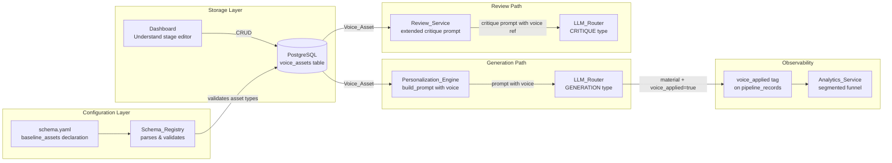
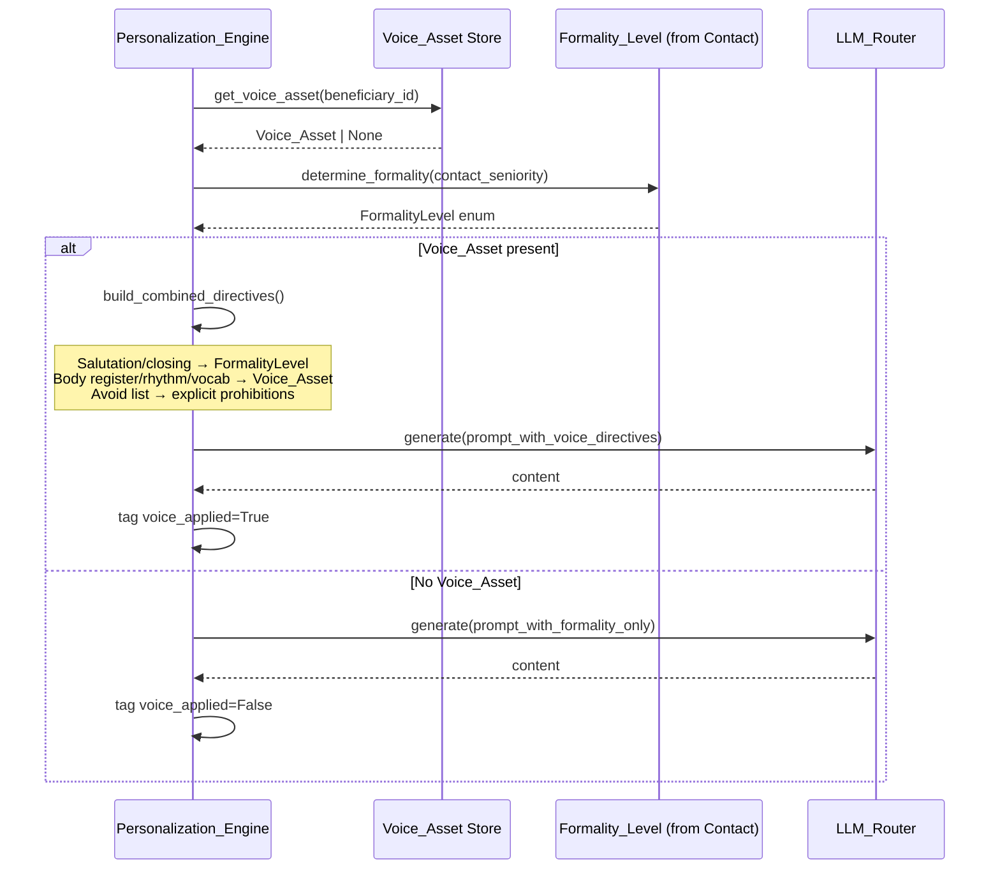
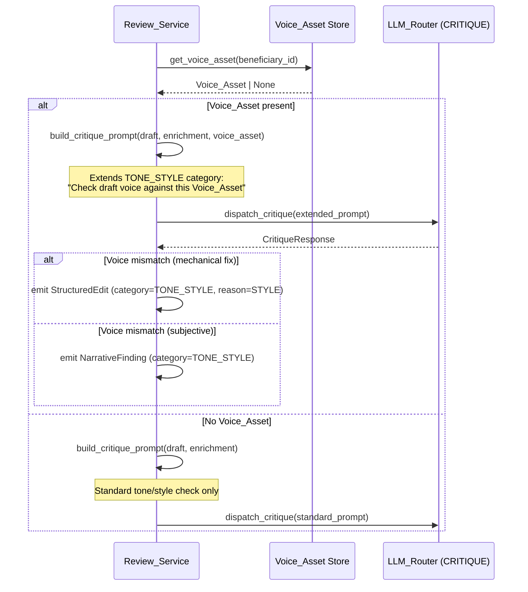
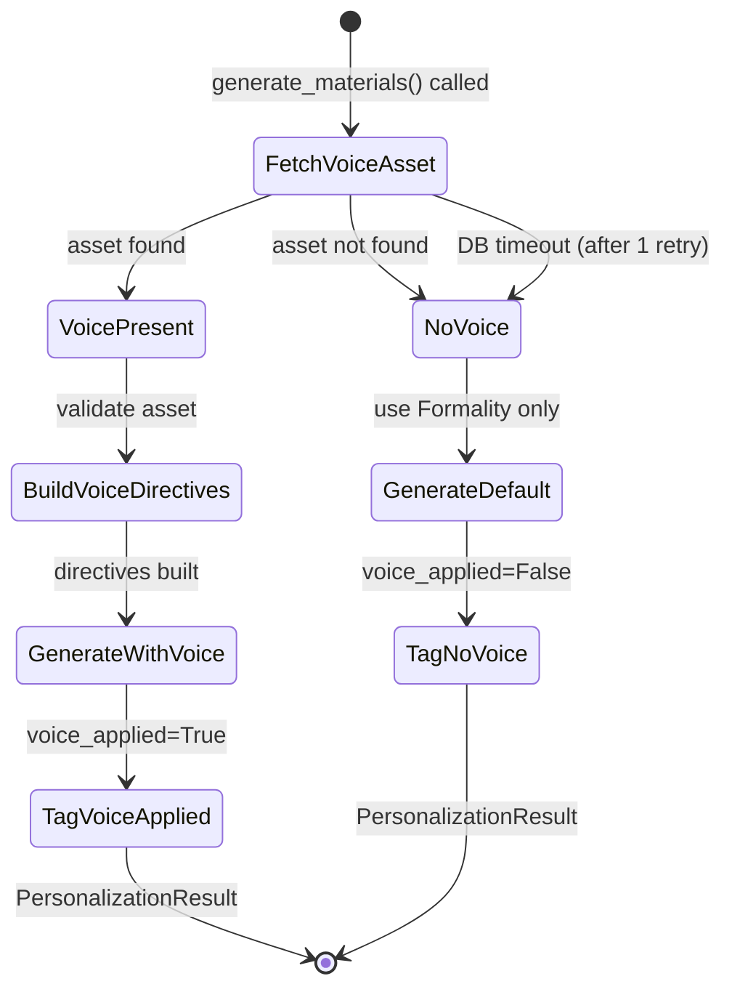

# Design Document: Sender Voice Assets

## Overview

Sender Voice Assets introduce a per-Beneficiary voice definition consumed at generation time and validated at review time. Today the Personalization_Engine adapts tone to the recipient's seniority (`Formality_Level`) but has no concept of the sender's natural register — materials generated for different consultants are indistinguishable. Cold outreach performance depends on sounding like a specific person.

This feature makes voice a first-class, schema-declared asset. Each Consultant gets a `Writing_Style_Asset` (and optional `Behavioral_Profile_Asset`), the Team gets a `Brand_Voice_Asset`, and the system enforces voice consistency through both generation-time prompt injection and review-time mismatch detection.

### Design Goals

1. **Schema-driven voice declaration** — Adding voice support for a new beneficiary is a configuration change in `schema.yaml`
2. **Generation-time voice injection** — Personalization_Engine weaves voice directives into every generation prompt with clear conflict resolution against Formality_Level
3. **Review-time voice validation** — Review_Service extends its tone/style critique to detect voice mismatches against the declared asset
4. **A/B observability** — Every generated material carries a `voice_applied` tag enabling Analytics_Service to segment reply rates
5. **Graceful degradation** — System operates without error when no Voice_Asset is configured, falling back to current default behavior

### Key Architectural Decisions

| Decision | Rationale |
|----------|-----------|
| Voice_Asset as a dataclass with structured fields | Enables programmatic validation, prompt templating, and schema enforcement — not a freeform blob |
| Conflict resolution: Formality_Level wins salutation/closing, Voice_Asset wins body | Salutations are recipient-facing conventions; body prose is the sender's authentic voice |
| Extend existing CritiqueCategory.TONE_STYLE | Voice mismatch is a specialization of tone/style — no new category needed, avoids schema churn |
| `voice_applied` as a boolean column on pipeline_records | Simplest A/B segmentation; avoids a separate analytics dimension table |
| Dashboard suggestion via Understand stage | Non-blocking onboarding — voice is opt-in, not required |


## Architecture

### Voice Asset Flow Through the System




### Voice + Formality Conflict Resolution Sequence



### Review-Time Voice Check Flow




## Components and Interfaces

### 1. Voice Asset Domain Models (`app/core/voice_asset.py`)

```python
from dataclasses import dataclass, field
from enum import Enum
from datetime import datetime


class VoiceRegister(str, Enum):
    """The sender's natural communication register."""
    DIRECT = "direct"
    WARM = "warm"
    FORMAL = "formal"
    CONVERSATIONAL = "conversational"
    AUTHORITATIVE = "authoritative"


class SentenceLengthPreference(str, Enum):
    """Preferred sentence rhythm."""
    SHORT = "short"          # avg < 12 words
    MEDIUM = "medium"        # avg 12-20 words
    LONG = "long"            # avg 20+ words
    VARIED = "varied"        # deliberate mix


class FirstPersonUsage(str, Enum):
    """How the sender uses first person."""
    FREQUENT = "frequent"    # "I believe...", "I've seen..."
    MODERATE = "moderate"    # occasional first person
    MINIMAL = "minimal"      # prefers "we" or passive constructions


class VoiceAssetType(str, Enum):
    """Discriminator for Voice_Asset subtypes."""
    WRITING_STYLE = "writing_style"
    BEHAVIORAL_PROFILE = "behavioral_profile"
    BRAND_VOICE = "brand_voice"
```


```python
@dataclass
class ExemplarPassage:
    """A short passage written in the Beneficiary's authentic voice."""
    text: str                # 50-500 chars of authentic writing
    context: str | None      # optional: "cold email opener", "proposal intro"


@dataclass
class VoiceAsset:
    """Base structured voice definition shared across all asset types.

    Covers: register, rhythm, vocabulary preferences/prohibitions,
    and exemplar passages demonstrating the voice in action.
    """
    id: str                  # UUID
    beneficiary_id: str
    asset_type: VoiceAssetType
    register: VoiceRegister
    sentence_length: SentenceLengthPreference
    first_person_usage: FirstPersonUsage
    vocabulary_prefer: list[str]      # words/phrases to favor
    vocabulary_avoid: list[str]       # words/constructions to never use
    exemplar_passages: list[ExemplarPassage]  # 2-3 passages
    created_at: datetime
    updated_at: datetime

    def validate(self) -> list[str]:
        """Return list of validation errors, empty if valid."""
        errors: list[str] = []
        if len(self.exemplar_passages) < 2:
            errors.append("At least 2 exemplar passages required")
        if len(self.exemplar_passages) > 3:
            errors.append("At most 3 exemplar passages allowed")
        for i, ex in enumerate(self.exemplar_passages):
            if len(ex.text) < 50:
                errors.append(f"Exemplar {i+1} too short (min 50 chars)")
            if len(ex.text) > 500:
                errors.append(f"Exemplar {i+1} too long (max 500 chars)")
        if not self.vocabulary_avoid:
            errors.append("vocabulary_avoid must contain at least one item")
        return errors
```


```python
@dataclass
class WritingStyleAsset(VoiceAsset):
    """Consultant's individual writing style.

    Extends VoiceAsset with consultant-specific fields.
    asset_type is always WRITING_STYLE.
    """
    # Inherited fields cover the full voice definition.
    # No additional fields beyond the base VoiceAsset for writing style.
    pass


@dataclass
class BehavioralProfileAsset:
    """Optional Consultant asset describing working style and interpersonal register.

    NOT a full VoiceAsset — it supplements the WritingStyleAsset with
    behavioral cues the reviewer uses to detect tone mismatches
    (e.g., flagging a combative, solo-hero tone for a collaborative profile).
    """
    id: str
    beneficiary_id: str
    asset_type: VoiceAssetType  # always BEHAVIORAL_PROFILE
    interpersonal_style: str    # e.g., "collaborative", "driving", "analytical"
    communication_traits: list[str]  # e.g., ["asks questions", "uses 'we'"]
    avoid_impressions: list[str]     # e.g., ["combative", "apologetic"]
    created_at: datetime
    updated_at: datetime


@dataclass
class BrandVoiceAsset(VoiceAsset):
    """Team-level brand voice definition.

    Extends VoiceAsset with brand-specific fields.
    asset_type is always BRAND_VOICE.
    """
    brand_personality: list[str]  # e.g., ["innovative", "approachable", "expert"]
    tagline_style: str | None     # optional: how the firm signs off
```


### 2. Schema_Registry Extensions (`config/schema.yaml`)

New `baseline_assets` entries for voice support:

```yaml
beneficiaries:
  - id: consultant
    label: "Consultant"
    description: "Individual GKIM consultants deployed against opportunities"
    baseline_assets:
      - resume
      - cover_letter
      - instructions
      - writing_style           # ← NEW: Voice_Asset for individual voice
      - behavioral_profile      # ← NEW: Optional interpersonal register
    offerings_asset: consultant_profiles
    offerings_label: "Offerings"
    search_criteria_asset: company_search_criteria

  - id: team
    label: "Team"
    description: "GKIM as a firm pursuing project and contract opportunities"
    baseline_assets:
      - company_profile
      - capability_statement
      - brand_voice             # ← NEW: Team-level brand voice
    offerings_asset: company_documents
    offerings_label: "Offerings"
    search_criteria_asset: project_search_criteria
```

### 3. Schema_Registry Dataclass Extension (`app/core/schema_registry.py`)

```python
# Extension to SchemaRegistry._validate() for voice asset references

class SchemaRegistry:
    # ... existing code ...

    # Known voice asset types that can appear in baseline_assets
    VOICE_ASSET_TYPES: set[str] = {"writing_style", "behavioral_profile", "brand_voice"}

    def _validate_voice_asset_placement(self) -> None:
        """Validate voice assets are declared on correct beneficiary types.

        Rules:
        - writing_style and behavioral_profile: only on consultant beneficiaries
        - brand_voice: only on team beneficiaries
        - behavioral_profile requires writing_style to also be declared

        Raises SchemaValidationError on violation.
        """
        for ben in self._raw.get('beneficiaries', []):
            assets = set(ben.get('baseline_assets', []))
            voice_assets = assets & self.VOICE_ASSET_TYPES

            if 'brand_voice' in voice_assets and ben['id'] != 'team':
                raise SchemaValidationError(
                    f"Beneficiary '{ben['id']}' declares brand_voice "
                    f"but only 'team' beneficiaries may use brand_voice",
                    entity_id=ben['id']
                )

            if ('writing_style' in voice_assets or 'behavioral_profile' in voice_assets):
                if ben['id'] == 'team':
                    raise SchemaValidationError(
                        f"Beneficiary 'team' declares writing_style/behavioral_profile "
                        f"but these are consultant-only assets",
                        entity_id=ben['id']
                    )

            if 'behavioral_profile' in voice_assets and 'writing_style' not in voice_assets:
                raise SchemaValidationError(
                    f"Beneficiary '{ben['id']}' declares behavioral_profile "
                    f"without writing_style — behavioral_profile requires writing_style",
                    entity_id=ben['id']
                )
```


### 4. Voice Asset Repository (`app/repositories/voice_asset_repo.py`)

```python
from dataclasses import dataclass
import asyncpg


class VoiceAssetRepository:
    """Async PostgreSQL repository for Voice_Asset CRUD operations."""

    def __init__(self, pool: asyncpg.Pool):
        self._pool = pool

    async def get_voice_asset(
        self, beneficiary_id: str, asset_type: str
    ) -> dict | None:
        """Fetch the active voice asset for a beneficiary.

        Returns None if no asset configured (graceful degradation path).
        """
        ...

    async def get_all_voice_assets(
        self, beneficiary_id: str
    ) -> dict[str, dict | None]:
        """Fetch all voice-related assets for a beneficiary.

        Returns dict: {
            "writing_style": VoiceAsset | None,
            "behavioral_profile": BehavioralProfileAsset | None,
            "brand_voice": BrandVoiceAsset | None
        }
        """
        ...

    async def upsert_voice_asset(
        self, beneficiary_id: str, asset_type: str, asset_data: dict
    ) -> str:
        """Create or update a voice asset. Returns asset ID."""
        ...

    async def delete_voice_asset(
        self, beneficiary_id: str, asset_type: str
    ) -> bool:
        """Soft-delete a voice asset. Returns True if found and deleted."""
        ...
```


### 5. Personalization_Engine Voice Integration (`app/core/personalization_engine.py`)

Extensions to the existing `PersonalizationEngine` class:

```python
class PersonalizationEngine:
    # ... existing code ...

    async def generate_materials(
        self,
        enrichment: EnrichmentData,
        beneficiary_id: str,
        material_type: str,
        contact_seniority: str | None = None,
        beneficiary_context: dict | None = None,
        voice_asset: "VoiceAsset | None" = None,            # ← NEW
        behavioral_profile: "BehavioralProfileAsset | None" = None,  # ← NEW
    ) -> PersonalizationResult:
        """Generate personalized outreach material with optional voice.

        When voice_asset is provided:
        - Voice directives are injected into the prompt
        - Conflict resolution applies (Formality for salutation/closing,
          Voice for body prose)
        - voice_applied is set to True on the result

        When voice_asset is None:
        - Current default behavior (Formality only)
        - voice_applied is set to False on the result
        """
        ...

    def _build_voice_directives(
        self,
        voice_asset: "VoiceAsset",
        behavioral_profile: "BehavioralProfileAsset | None",
        formality_level: "SeniorityLevel",
    ) -> str:
        """Build combined voice + formality directives for the prompt.

        Conflict resolution rules:
        - Salutation and closing conventions → FormalityLevel
        - Body prose register, rhythm, vocabulary → Voice_Asset
        - Avoid list → always included as explicit prohibitions
        - Behavioral profile traits → included as tone guidance

        Returns: Directive text block to inject into the generation prompt.
        """
        ...

    def _build_avoid_prohibitions(self, avoid_list: list[str]) -> str:
        """Format the Voice_Asset avoid list as explicit LLM prohibitions.

        Each item becomes a "NEVER use: ..." instruction in the prompt.

        Returns: Multi-line prohibition block.
        """
        lines = ["PROHIBITIONS (never use these words/constructions):"]
        for item in avoid_list:
            lines.append(f"- NEVER: {item}")
        return "\n".join(lines)

    def _build_exemplar_section(self, exemplars: list["ExemplarPassage"]) -> str:
        """Format exemplar passages as reference material in the prompt.

        Returns: Formatted exemplar block showing the sender's authentic voice.
        """
        lines = ["VOICE EXEMPLARS (write in this style):"]
        for i, ex in enumerate(exemplars, 1):
            ctx = f" ({ex.context})" if ex.context else ""
            lines.append(f"Example {i}{ctx}: \"{ex.text}\"")
        return "\n".join(lines)
```


### 6. Review_Service Voice Extension (`app/core/review_service.py`)

Extensions to the existing `ReviewService` class for voice-mismatch detection:

```python
class ReviewService:
    # ... existing code ...

    def _build_fresh_context_prompt(
        self,
        material_text: str,
        opportunity_description: str,
        enrichment: "EnrichmentRecord",
        beneficiary: "Beneficiary",
        categories: list[CritiqueCategory],
        voice_asset: "VoiceAsset | None" = None,              # ← NEW
        behavioral_profile: "BehavioralProfileAsset | None" = None,  # ← NEW
    ) -> str:
        """Construct the critique prompt with optional voice reference.

        When voice_asset is provided, the TONE_STYLE category instructions
        are extended to include:
        - The full Voice_Asset definition (register, rhythm, vocabulary)
        - The Behavioral_Profile interpersonal style (if present)
        - Explicit instruction to flag voice mismatches

        The reviewer is instructed to:
        1. Check if the draft's register matches Voice_Asset.register
        2. Check sentence rhythm aligns with sentence_length preference
        3. Flag any vocabulary_avoid items found in the draft
        4. For behavioral profile: flag tone that contradicts the
           interpersonal_style (e.g., combative tone for collaborative profile)
        5. Express mechanical fixes as StructuredEdits (reason=STYLE)
        6. Express subjective concerns as NarrativeFindings (category=TONE_STYLE)
        """
        ...

    def _build_voice_critique_instructions(
        self,
        voice_asset: "VoiceAsset",
        behavioral_profile: "BehavioralProfileAsset | None",
    ) -> str:
        """Build the voice-specific critique instructions block.

        Returns: Instruction text appended to the TONE_STYLE category section.
        """
        lines = [
            "VOICE COMPLIANCE CHECK:",
            f"The sender's declared register is: {voice_asset.register.value}",
            f"Sentence length preference: {voice_asset.sentence_length.value}",
            f"First-person usage: {voice_asset.first_person_usage.value}",
            "",
            "Vocabulary the sender PREFERS (flag if absent from draft):",
        ]
        for word in voice_asset.vocabulary_prefer:
            lines.append(f"  - {word}")
        lines.append("")
        lines.append("Vocabulary the sender AVOIDS (flag if present in draft):")
        for word in voice_asset.vocabulary_avoid:
            lines.append(f"  - {word}")
        lines.append("")
        lines.append("EXEMPLAR PASSAGES (the draft should sound like these):")
        for ex in voice_asset.exemplar_passages:
            lines.append(f'  "{ex.text}"')

        if behavioral_profile:
            lines.extend([
                "",
                "BEHAVIORAL PROFILE CHECK:",
                f"Interpersonal style: {behavioral_profile.interpersonal_style}",
                f"Communication traits: {', '.join(behavioral_profile.communication_traits)}",
                "Flag the draft if its tone contradicts this profile. Examples:",
            ])
            for avoid in behavioral_profile.avoid_impressions:
                lines.append(f"  - Flag if draft sounds: {avoid}")

        return "\n".join(lines)
```


### 7. Analytics_Service Voice Segmentation (`app/core/analytics_service.py`)

Extension to the existing `AnalyticsService` for `voice_applied` segmentation:

```python
@dataclass(frozen=True)
class VoiceSegmentedFunnel:
    """Funnel metrics segmented by voice_applied status.

    Enables A/B comparison of voice-tuned vs non-voice materials.
    """
    voice_applied_funnel: list[FunnelStage]    # materials with voice
    no_voice_funnel: list[FunnelStage]         # materials without voice
    voice_applied_reply_rate: float            # replies/sends for voice=True
    no_voice_reply_rate: float                 # replies/sends for voice=False
    lift_percentage: float | None              # (voice - no_voice) / no_voice × 100
    is_statistically_significant: bool         # z-test at 90% confidence
    sample_size_voice: int
    sample_size_no_voice: int


class AnalyticsService:
    # ... existing code ...

    def compute_voice_segmented_funnel(
        self,
        transitions_voice: list[StageTransition],
        transitions_no_voice: list[StageTransition],
        stage_order: list[str],
        period_days: int,
        voice_sends: int,
        voice_replies: int,
        no_voice_sends: int,
        no_voice_replies: int,
        reference_date: date | None = None,
    ) -> VoiceSegmentedFunnel:
        """Compute funnel metrics segmented by voice_applied tag.

        Args:
            transitions_voice: Stage transitions for voice_applied=True records.
            transitions_no_voice: Stage transitions for voice_applied=False records.
            stage_order: Ordered pipeline stages.
            period_days: Reporting window (7, 30, 90).
            voice_sends/replies: Aggregate send/reply counts for voice=True.
            no_voice_sends/replies: Aggregate send/reply counts for voice=False.
            reference_date: End of reporting window.

        Returns:
            VoiceSegmentedFunnel with both funnels, reply rates, and lift.
        """
        voice_funnel = self.compute_funnel(
            transitions_voice, stage_order, period_days, reference_date
        )
        no_voice_funnel = self.compute_funnel(
            transitions_no_voice, stage_order, period_days, reference_date
        )

        voice_rr = voice_replies / voice_sends if voice_sends > 0 else 0.0
        no_voice_rr = no_voice_replies / no_voice_sends if no_voice_sends > 0 else 0.0

        # Compute lift
        if no_voice_rr > 0:
            lift = ((voice_rr - no_voice_rr) / no_voice_rr) * 100
        else:
            lift = None

        # Statistical significance via z-test
        if voice_sends >= self.AB_MIN_SAMPLE and no_voice_sends >= self.AB_MIN_SAMPLE:
            p_value = _z_test_two_proportions(
                voice_replies, voice_sends, no_voice_replies, no_voice_sends
            )
            is_significant = p_value < (1.0 - self.AB_CONFIDENCE)
        else:
            is_significant = False

        return VoiceSegmentedFunnel(
            voice_applied_funnel=voice_funnel,
            no_voice_funnel=no_voice_funnel,
            voice_applied_reply_rate=round(voice_rr, 4),
            no_voice_reply_rate=round(no_voice_rr, 4),
            lift_percentage=round(lift, 1) if lift is not None else None,
            is_statistically_significant=is_significant,
            sample_size_voice=voice_sends,
            sample_size_no_voice=no_voice_sends,
        )
```


## Data Models

### PostgreSQL Schema: Voice Assets Table

```sql
-- Voice assets (one per beneficiary per asset_type)
CREATE TABLE voice_assets (
    id UUID PRIMARY KEY DEFAULT gen_random_uuid(),
    beneficiary_id VARCHAR(50) NOT NULL,
    asset_type VARCHAR(30) NOT NULL,  -- writing_style, behavioral_profile, brand_voice
    register VARCHAR(30) NOT NULL,     -- direct, warm, formal, conversational, authoritative
    sentence_length VARCHAR(20) NOT NULL,  -- short, medium, long, varied
    first_person_usage VARCHAR(20) NOT NULL,  -- frequent, moderate, minimal
    vocabulary_prefer JSONB NOT NULL DEFAULT '[]',
    vocabulary_avoid JSONB NOT NULL DEFAULT '[]',
    exemplar_passages JSONB NOT NULL DEFAULT '[]',
    -- Behavioral profile fields (NULL for non-behavioral_profile types)
    interpersonal_style VARCHAR(50),
    communication_traits JSONB,
    avoid_impressions JSONB,
    -- Brand voice fields (NULL for non-brand_voice types)
    brand_personality JSONB,
    tagline_style VARCHAR(200),
    -- Metadata
    is_active BOOLEAN NOT NULL DEFAULT TRUE,
    created_at TIMESTAMPTZ NOT NULL DEFAULT NOW(),
    updated_at TIMESTAMPTZ NOT NULL DEFAULT NOW(),
    UNIQUE(beneficiary_id, asset_type)
);

CREATE INDEX idx_voice_assets_beneficiary ON voice_assets(beneficiary_id);
CREATE INDEX idx_voice_assets_type ON voice_assets(asset_type);
CREATE INDEX idx_voice_assets_active ON voice_assets(beneficiary_id, is_active)
    WHERE is_active = TRUE;
```

### PostgreSQL Schema: Pipeline Records Extension

```sql
-- Add voice_applied tag to pipeline_records for A/B observability
ALTER TABLE pipeline_records
    ADD COLUMN voice_applied BOOLEAN NOT NULL DEFAULT FALSE;

CREATE INDEX idx_pipeline_records_voice ON pipeline_records(voice_applied);
```


### Voice Asset JSON Structure (stored in `exemplar_passages` column)

```json
[
  {
    "text": "I noticed your team just shipped a React Native rewrite — that's a bold move for a Series B company, and it tells me you value speed over committee consensus.",
    "context": "cold email opener"
  },
  {
    "text": "Let me be direct: I've built three platform teams from scratch in fintech, and each time the hardest part wasn't the architecture — it was convincing leadership that 'move fast' and 'don't break things' aren't contradictions.",
    "context": "cover letter body"
  }
]
```

### Voice Directive Example (injected into generation prompt)

```text
SENDER VOICE DIRECTIVES:
Register: direct
Sentence length: varied
First-person usage: frequent

VOCABULARY TO PREFER:
- "ship", "build", "trade-off", "bet"

PROHIBITIONS (never use these words/constructions):
- NEVER: "leverage" (use "use" instead)
- NEVER: "synergize"
- NEVER: "I would be a great fit" (too generic)
- NEVER: passive voice in opening sentences

VOICE EXEMPLARS (write in this style):
Example 1 (cold email opener): "I noticed your team just shipped a React Native rewrite..."
Example 2 (cover letter body): "Let me be direct: I've built three platform teams..."

CONFLICT RESOLUTION:
- For salutation and closing: follow FORMALITY_LEVEL (c_suite → formal salutation)
- For body prose: follow these VOICE DIRECTIVES (register, rhythm, vocabulary)
```


## Correctness Properties

*A property is a characteristic or behavior that should hold true across all valid executions of a system — essentially, a formal statement about what the system should do. Properties serve as the bridge between human-readable specifications and machine-verifiable correctness guarantees.*

### Property 1: Voice_Asset schema validation rejects invalid placement

*For any* schema configuration, the Schema_Registry SHALL accept `writing_style` and `behavioral_profile` only on consultant beneficiaries, `brand_voice` only on team beneficiaries, and SHALL reject `behavioral_profile` when `writing_style` is not also declared.

**Validates: Requirements 1.1**

### Property 2: Voice_Asset structured template validation

*For any* VoiceAsset instance, the `validate()` method SHALL return an empty error list if and only if the asset has 2–3 exemplar passages (each 50–500 chars) and a non-empty `vocabulary_avoid` list. Otherwise it SHALL return specific error messages for each violated constraint.

**Validates: Requirements 1.2**

### Property 3: Graceful degradation and voice_applied tagging

*For any* generation request where the beneficiary has no Voice_Asset configured, the Personalization_Engine SHALL produce a valid PersonalizationResult without error, and the result's `voice_applied` field SHALL be False. Conversely, for any generation request where a Voice_Asset IS present, `voice_applied` SHALL be True.

**Validates: Requirements 1.3, 4.1**

### Property 4: Voice_Asset content inclusion in generation prompt

*For any* valid Voice_Asset, the generation prompt constructed by Personalization_Engine SHALL contain the Voice_Asset's register value, all vocabulary_prefer items, and all exemplar passage texts.

**Validates: Requirements 2.1**

### Property 5: Avoid list items appear as explicit prohibitions

*For any* Voice_Asset with a non-empty `vocabulary_avoid` list, every item in that list SHALL appear as an explicit prohibition directive (prefixed with "NEVER") in the generation prompt.

**Validates: Requirements 2.3**

### Property 6: Conflict resolution — Formality wins salutation/closing, Voice wins body

*For any* combination of Formality_Level and Voice_Asset where the two specify conflicting conventions, the combined directive text SHALL instruct the LLM to apply Formality_Level for salutation and closing conventions and Voice_Asset for body prose register, rhythm, and vocabulary.

**Validates: Requirements 2.2**

### Property 7: Review critique prompt includes Voice_Asset when present

*For any* beneficiary with a Voice_Asset, the fresh-context critique prompt constructed by Review_Service SHALL include the Voice_Asset's register, vocabulary_avoid items, and exemplar passages as reference material for the reviewer.

**Validates: Requirements 3.1**

### Property 8: Analytics voice segmentation correctness

*For any* set of pipeline records with mixed `voice_applied` values, the segmented funnel computation SHALL produce a voice_applied_reply_rate equal to (voice_replies / voice_sends) and a no_voice_reply_rate equal to (no_voice_replies / no_voice_sends), each computed independently from their respective subsets.

**Validates: Requirements 4.2**


## Error Handling

### Voice Asset Errors

```python
from app.core.errors import BaseServiceError


class VoiceAssetValidationError(BaseServiceError):
    """Voice_Asset failed structural validation."""
    def __init__(self, errors: list[str], beneficiary_id: str, asset_type: str):
        message = (
            f"Voice asset validation failed for {beneficiary_id}/{asset_type}: "
            f"{'; '.join(errors)}"
        )
        super().__init__(message, integration="voice_asset", retryable=False)
        self.validation_errors = errors
        self.beneficiary_id = beneficiary_id
        self.asset_type = asset_type


class VoiceAssetNotFoundError(BaseServiceError):
    """Requested Voice_Asset does not exist (non-fatal — triggers degradation)."""
    def __init__(self, beneficiary_id: str, asset_type: str):
        super().__init__(
            f"No {asset_type} found for beneficiary '{beneficiary_id}'",
            integration="voice_asset",
            retryable=False
        )
        self.beneficiary_id = beneficiary_id
        self.asset_type = asset_type
```

### Error Scenarios

| Scenario | Strategy | Impact | Degradation |
|----------|----------|--------|-------------|
| Voice_Asset not found for beneficiary | Log info, continue without voice | None — default behavior | Generate with Formality only, tag `voice_applied=False` |
| Voice_Asset fails validation on save | Reject save, return errors | User must fix | Dashboard shows validation errors inline |
| Voice_Asset present but empty avoid list | Reject on validation | User must provide ≥1 avoid item | Save blocked until corrected |
| Schema declares behavioral_profile without writing_style | Startup SchemaValidationError | Service won't start | Fix schema.yaml |
| Voice_Asset DB query timeout | Retry once, then degrade | Minor latency | Generate without voice, log warning |
| Exemplar passage too short/long | Reject on validation | User must fix | Dashboard shows per-exemplar errors |

### Graceful Degradation State Machine




## Testing Strategy

### Property-Based Testing

**Library:** [Hypothesis](https://hypothesis.readthedocs.io/) (Python)

**Configuration:**
- Minimum 100 examples per property test (via `@settings(max_examples=100)`)
- Each test tagged: `# Feature: sender-voice-assets, Property {N}: {title}`

**Properties to Test with PBT:**

| Property | Module Under Test | Generator Strategy |
|----------|-------------------|-------------------|
| P1: Schema validation rejects invalid placement | `schema_registry.py` | Generate random beneficiary configs with voice asset type combinations, including invalid placements |
| P2: Voice_Asset template validation | `voice_asset.py` | Generate random VoiceAsset instances with varying exemplar counts/lengths and avoid list sizes |
| P3: Graceful degradation + voice_applied tagging | `personalization_engine.py` | Generate random enrichment + optional Voice_Asset presence; verify tag correctness |
| P4: Voice content in generation prompt | `personalization_engine.py` | Generate random VoiceAssets with varied register/vocab/exemplars; verify all appear in prompt |
| P5: Avoid list as prohibitions | `personalization_engine.py` | Generate random avoid lists; verify each item appears with "NEVER" prefix in prompt |
| P6: Conflict resolution directives | `personalization_engine.py` | Generate all Formality × Register combinations; verify correct precedence in directive text |
| P7: Critique prompt includes voice reference | `review_service.py` | Generate random VoiceAssets; verify critique prompt contains register, avoid, exemplars |
| P8: Analytics segmentation correctness | `analytics_service.py` | Generate random send/reply counts; verify rates computed correctly for each segment |

### Unit Testing

- **Voice_Asset model**: Validation edge cases (exactly 2 exemplars, exactly 3, boundary char counts 50/500)
- **Schema validation**: behavioral_profile without writing_style → error; brand_voice on consultant → error
- **Prompt building**: Verify voice directive block format, prohibition formatting, exemplar formatting
- **Conflict resolution**: C_SUITE + DIRECT register → formal salutation but direct body
- **Review prompt extension**: With/without behavioral profile, verify instruction inclusion
- **voice_applied tagging**: True when asset present, False when absent, False on DB timeout
- **Dashboard suggestion**: Verify suggestion appears in Understand stage when no voice configured

### Integration Testing

- **End-to-end generation with voice**: VoiceAsset in DB → PersonalizationEngine → verify output content reflects voice directives
- **End-to-end review with voice**: Material generated with voice → ReviewService → verify TONE_STYLE findings reference voice compliance
- **Analytics pipeline**: Generate mixed voice/no-voice records → verify segmented funnel in Reports stage
- **Schema startup validation**: Load schema.yaml with voice assets → verify no startup errors
- **Migration**: Run Alembic migration → verify `voice_assets` table and `pipeline_records.voice_applied` column exist
