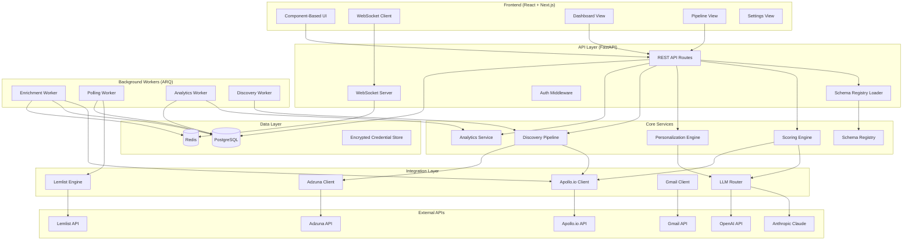
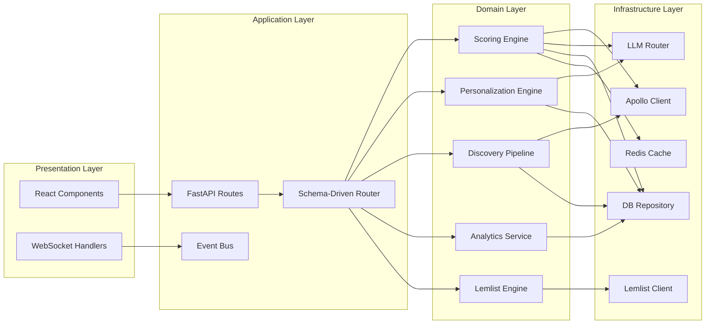
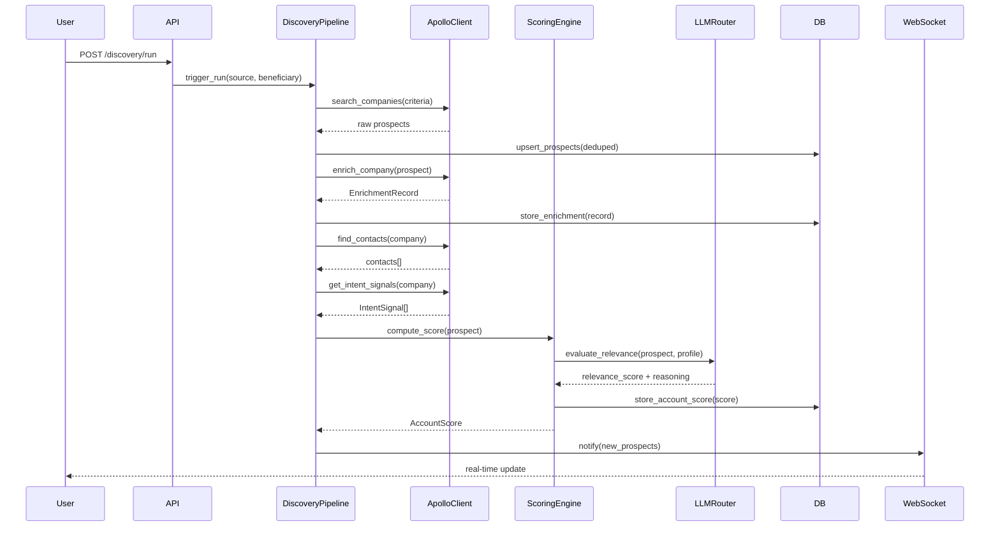
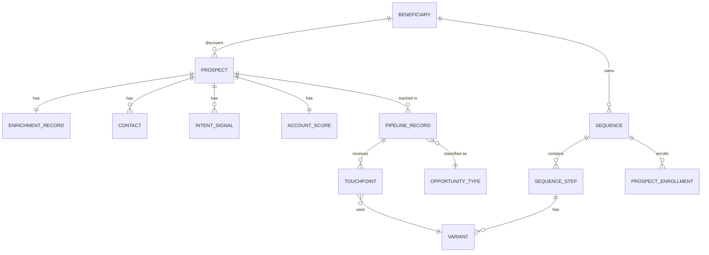
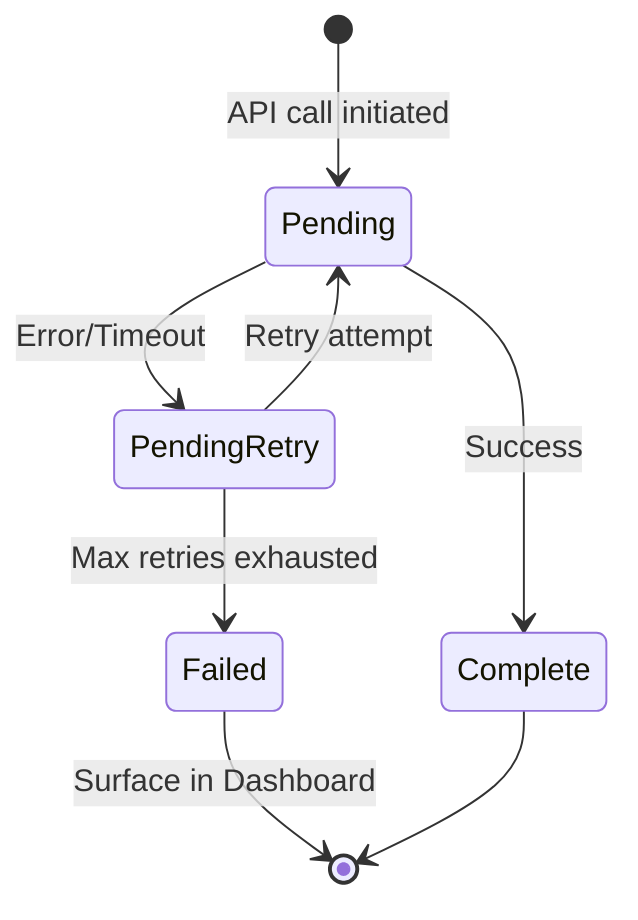

# Technical Design Document: System Redesign v2

## Overview

GKIM Opportunity Finder v2 is a full-stack redesign of the existing local opportunity-finding platform. It retains the proven **schema-driven architecture** (YAML as single source of truth) while introducing Apollo.io B2B enrichment, enhanced Lemlist multi-channel sequencing, a dashboard-first UX, conversion analytics, and a modern component-based frontend with real-time updates.

### Design Goals

1. **Schema-driven extensibility** — New beneficiaries, opportunity types, and pipeline states are configuration changes, not code changes
2. **Intelligent scoring** — Multi-factor account scoring combining firmographic, technographic, intent, LLM relevance, and historical data
3. **Automated outreach** — Multi-channel sequences with A/B testing and automated follow-ups via Lemlist
4. **Data-driven decisions** — Conversion funnel analytics, ROI tracking, and channel effectiveness metrics
5. **Modern UX** — Dashboard-first, real-time WebSocket updates, responsive component-based frontend

### Key Architectural Decisions

| Decision | Rationale |
|----------|-----------|
| Retain YAML schema registry | Proven pattern from v1; enables config-driven navigation and pipeline states |
| PostgreSQL over SQLite | v2 needs concurrent access, complex queries, JSON columns, and background workers |
| FastAPI + async | High concurrency for WebSocket connections and external API polling |
| Component-based frontend (React) | Rich interactivity, component reuse, SSR support for performance |
| Background task queue (Celery/ARQ) | External API polling, scheduled enrichment, and analytics computation |
| WebSocket for real-time | Dashboard updates without polling; sub-second pipeline state reflection |


## Architecture

### High-Level System Diagram




### Layered Architecture



### Request Flow: Discovery → Enrichment → Scoring




## Components and Interfaces

### 1. Schema Registry (`app/core/schema_registry.py`)

The schema registry loads and validates the YAML configuration at startup, providing typed access to all schema-defined entities.

```python
from dataclasses import dataclass, field
from typing import Optional
from pathlib import Path
import yaml

@dataclass
class Beneficiary:
    id: str
    label: str
    description: str
    baseline_assets: list[str]
    offerings_asset: str
    offerings_label: str
    search_criteria_asset: str

@dataclass
class OpportunityType:
    id: str
    label: str
    beneficiaries: list[str]
    source_asset: str
    source_label: str
    find_technique: str
    find_label: str
    prepare_technique: str
    outreach_technique: str
    pipeline_states: list[str]

@dataclass
class Technique:
    id: str
    service_class: str
    description: str
    inputs: list[str] = field(default_factory=list)
    outputs: list[str] = field(default_factory=list)

@dataclass
class Stage:
    id: str
    label: str
    description: str

class SchemaRegistry:
    """Single source of truth loaded from YAML at startup."""

    def __init__(self, schema_path: Path):
        self._raw = yaml.safe_load(schema_path.read_text())
        self._validate()
        self._parse()

    def _validate(self) -> None:
        """Validate schema structure, cross-references, and required fields.
        Raises SchemaValidationError with specific failure details."""
        required_keys = ['stages', 'beneficiaries', 'opportunity_types',
                         'find_techniques', 'prepare_techniques', 'outreach_techniques']
        for key in required_keys:
            if key not in self._raw:
                raise SchemaValidationError(f"Missing required top-level key: {key}")
        # Cross-reference validation...
        self._validate_cross_references()

    def _validate_cross_references(self) -> None:
        """Ensure opportunity types reference valid beneficiaries and techniques."""
        beneficiary_ids = {b['id'] for b in self._raw['beneficiaries']}
        find_ids = {t['id'] for t in self._raw['find_techniques']}
        prepare_ids = {t['id'] for t in self._raw['prepare_techniques']}
        outreach_ids = {t['id'] for t in self._raw['outreach_techniques']}

        for ot in self._raw['opportunity_types']:
            for ben_id in ot['beneficiaries']:
                if ben_id not in beneficiary_ids:
                    raise SchemaValidationError(
                        f"OpportunityType '{ot['id']}' references unknown beneficiary '{ben_id}'"
                    )
            if ot['find_technique'] not in find_ids:
                raise SchemaValidationError(
                    f"OpportunityType '{ot['id']}' references unknown find_technique '{ot['find_technique']}'"
                )
            if not ot.get('pipeline_states'):
                raise SchemaValidationError(
                    f"OpportunityType '{ot['id']}' declares no pipeline states"
                )

    def _parse(self) -> None:
        """Parse raw YAML into typed dataclass instances."""
        self.stages = [Stage(**s) for s in self._raw['stages']]
        self.beneficiaries = [Beneficiary(**b) for b in self._raw['beneficiaries']]
        self.opportunity_types = [OpportunityType(**ot) for ot in self._raw['opportunity_types']]
        # ... parse techniques similarly

    def get_beneficiary(self, id: str) -> Optional[Beneficiary]:
        return next((b for b in self.beneficiaries if b.id == id), None)

    def get_opportunity_types_for_beneficiary(self, beneficiary_id: str) -> list[OpportunityType]:
        return [ot for ot in self.opportunity_types if beneficiary_id in ot.beneficiaries]

    def get_pipeline_states(self, opportunity_type_id: str) -> list[str]:
        ot = next((o for o in self.opportunity_types if o.id == opportunity_type_id), None)
        return ot.pipeline_states if ot else []

    def derive_navigation(self) -> dict:
        """Derive full navigation structure from schema for frontend consumption."""
        nav = {}
        for stage in self.stages:
            nav[stage.id] = {
                'label': stage.label,
                'sub_tabs': self._derive_sub_tabs(stage)
            }
        return nav
```


### 2. Apollo.io Client (`app/integrations/apollo_client.py`)

Handles all communication with the Apollo.io API including enrichment, contact discovery, and intent signals.

```python
from dataclasses import dataclass
from datetime import datetime
from enum import Enum
import httpx

class EnrichmentStatus(str, Enum):
    COMPLETE = "complete"
    PENDING_RETRY = "pending_retry"
    ENRICHMENT_FAILED = "enrichment_failed"
    NOT_FOUND = "not_found"

class ContactSearchStatus(str, Enum):
    COMPLETE = "complete"
    BROADENED_SEARCH = "broadened_search"
    CONTACTS_UNAVAILABLE = "contacts_unavailable"
    PENDING_RETRY = "pending_retry"

class EmailVerificationStatus(str, Enum):
    VERIFIED = "verified"
    UNVERIFIED = "unverified"
    CATCH_ALL = "catch_all"

class SignalStrength(str, Enum):
    STRONG = "strong"
    MODERATE = "moderate"
    WEAK = "weak"

@dataclass
class EnrichmentRecord:
    company_id: str
    employee_count: int | None
    revenue_range: str | None
    industry: str | None
    tech_stack: list[str]
    funding_stage: str | None
    headquarters_city: str | None
    headquarters_country: str | None
    status: EnrichmentStatus
    enriched_at: datetime
    expires_at: datetime  # enriched_at + 30 days

@dataclass
class Contact:
    full_name: str
    job_title: str
    email: str | None
    linkedin_url: str | None
    phone: str | None
    email_verification: EmailVerificationStatus | None
    seniority_level: str | None  # c_suite, director, manager, other

@dataclass
class IntentSignal:
    topic: str
    strength: SignalStrength
    detected_at: datetime

class ApolloClient:
    """Integration layer for Apollo.io API."""

    BASE_URL = "https://api.apollo.io/v1"
    TIMEOUT = 15.0  # seconds
    MAX_RETRIES = 3
    RETRY_DELAY = 300  # 5 minutes
    RATE_LIMIT = 5  # requests per second for batch operations

    DECISION_MAKER_TITLES = [
        "CEO", "CTO", "VP Engineering", "Founder", "Head of Delivery"
    ]
    BROADENED_TITLES = [
        "Director of Engineering", "Director of Technology",
        "Director of Operations", "Director of Sales", "Director of Delivery"
    ]

    def __init__(self, api_key: str, http_client: httpx.AsyncClient):
        self._api_key = api_key
        self._client = http_client

    async def enrich_company(self, company_domain: str) -> EnrichmentRecord:
        """Enrich a company via Apollo.io. Returns EnrichmentRecord."""
        ...

    async def find_contacts(
        self, company_id: str, max_contacts: int = 5
    ) -> tuple[list[Contact], ContactSearchStatus]:
        """Find decision-maker contacts. Broadens search if needed."""
        ...

    async def get_intent_signals(
        self, company_id: str, topic_keywords: list[str], max_signals: int = 20
    ) -> list[IntentSignal]:
        """Query intent signals for configured topics."""
        ...

    async def enrich_batch(
        self, company_domains: list[str]
    ) -> list[EnrichmentRecord]:
        """Batch enrichment with rate limiting (max 5 req/sec)."""
        ...
```


### 3. Scoring Engine (`app/core/scoring_engine.py`)

Computes composite Account Scores by combining multiple weighted factors.

```python
from dataclasses import dataclass
from enum import Enum

class ScoreTier(str, Enum):
    A = "A-tier"  # 75-100
    B = "B-tier"  # 50-74
    C = "C-tier"  # 25-49
    D = "D-tier"  # 0-24

@dataclass
class ScoringWeights:
    firmographic: int = 30
    technographic: int = 25
    intent: int = 20
    llm_relevance: int = 15
    historical: int = 10

    def validate(self) -> bool:
        weights = [self.firmographic, self.technographic, self.intent,
                   self.llm_relevance, self.historical]
        return all(0 <= w <= 100 for w in weights) and sum(weights) == 100

@dataclass
class ScoreResult:
    total_score: int  # 0-100
    tier: ScoreTier
    factor_scores: dict[str, int]  # factor_name -> sub_score (0-100)
    missing_factors: list[str]
    is_partial: bool
    multi_source_bonus: int  # 0, 10, 20, or 30

class ScoringEngine:
    """Computes composite Account Scores from multiple signal sources."""

    INTENT_STRONG_BOOST = 15
    MULTI_SOURCE_BONUS = 10  # per additional source, max 30

    def __init__(self, weights: ScoringWeights, llm_router, db_repo):
        self._weights = weights
        self._llm = llm_router
        self._db = db_repo

    def compute_score(
        self,
        enrichment: "EnrichmentRecord",
        intent_signals: list["IntentSignal"],
        llm_score: int | None,
        historical_rate: float | None,
        source_count: int,
        beneficiary_profile: dict
    ) -> ScoreResult:
        """Compute weighted composite score with proportional redistribution
        for missing factors."""
        factors = {}
        missing = []

        # Firmographic sub-score
        if enrichment and enrichment.status == EnrichmentStatus.COMPLETE:
            factors['firmographic'] = self._score_firmographic(enrichment, beneficiary_profile)
        else:
            missing.append('firmographic')

        # Technographic sub-score
        if enrichment and enrichment.tech_stack:
            factors['technographic'] = self._score_technographic(
                enrichment.tech_stack, beneficiary_profile
            )
        else:
            missing.append('technographic')

        # Intent sub-score
        if intent_signals:
            factors['intent'] = self._score_intent(intent_signals)
        else:
            missing.append('intent')

        # LLM relevance sub-score
        if llm_score is not None:
            factors['llm_relevance'] = llm_score
        else:
            missing.append('llm_relevance')

        # Historical conversion sub-score
        if historical_rate is not None:
            factors['historical'] = int(historical_rate * 100)
        else:
            missing.append('historical')

        # Compute weighted total with proportional redistribution
        total = self._weighted_total(factors, missing)

        # Apply multi-source bonus (max 30)
        bonus = min((source_count - 1) * self.MULTI_SOURCE_BONUS, 30) if source_count > 1 else 0
        total = min(total + bonus, 100)

        # Apply intent boost
        has_strong = any(s.strength == SignalStrength.STRONG for s in intent_signals)
        if has_strong:
            total = min(total + self.INTENT_STRONG_BOOST, 100)

        return ScoreResult(
            total_score=total,
            tier=self._classify_tier(total),
            factor_scores=factors,
            missing_factors=missing,
            is_partial=len(missing) > 0,
            multi_source_bonus=bonus
        )

    def _weighted_total(self, factors: dict, missing: list) -> int:
        """Redistribute missing weights proportionally among available factors."""
        weight_map = {
            'firmographic': self._weights.firmographic,
            'technographic': self._weights.technographic,
            'intent': self._weights.intent,
            'llm_relevance': self._weights.llm_relevance,
            'historical': self._weights.historical,
        }
        available_weight = sum(weight_map[f] for f in factors)
        if available_weight == 0:
            return 0
        total = sum(
            factors[f] * (weight_map[f] / available_weight)
            for f in factors
        )
        return int(round(total))

    @staticmethod
    def _classify_tier(score: int) -> ScoreTier:
        if score >= 75: return ScoreTier.A
        if score >= 50: return ScoreTier.B
        if score >= 25: return ScoreTier.C
        return ScoreTier.D
```


### 4. Lemlist Engine (`app/integrations/lemlist_engine.py`)

Manages multi-channel sequences, A/B testing, and response tracking through the Lemlist API.

```python
from dataclasses import dataclass
from enum import Enum
from datetime import datetime

class Channel(str, Enum):
    EMAIL = "email"
    LINKEDIN = "linkedin"
    MANUAL_TASK = "manual_task"

class SequenceSyncStatus(str, Enum):
    SYNCED = "synced"
    SYNC_FAILED = "sync_failed"
    PENDING = "pending"

class TouchpointStatus(str, Enum):
    PENDING = "pending"
    SENT = "sent"
    OPENED = "opened"
    CLICKED = "clicked"
    REPLIED = "replied"
    BOUNCED = "bounced"

class ProspectSequenceStatus(str, Enum):
    ACTIVE = "active"
    PAUSED = "paused"
    SEQUENCE_COMPLETE = "sequence_complete"

@dataclass
class SequenceStep:
    order: int  # 1-10
    channel: Channel
    delay_days: int  # 1-30
    content_template: str  # max 5000 chars
    variants: list["Variant"] | None = None  # 2-4 variants for A/B

@dataclass
class Variant:
    id: str  # A, B, C, D
    content: str
    sends: int = 0
    opens: int = 0
    clicks: int = 0
    replies: int = 0

@dataclass
class Sequence:
    id: str
    name: str
    beneficiary_id: str
    steps: list[SequenceStep]  # max 10 steps
    sync_status: SequenceSyncStatus
    created_at: datetime

class LemlistEngine:
    """Manages Lemlist sequences, A/B tests, and response tracking."""

    SYNC_TIMEOUT = 10.0
    MAX_BATCH_ENROLL = 200
    MAX_FOLLOWUPS = 3  # after initial touchpoint
    POLL_INTERVAL = 300  # 5 minutes
    MIN_SAMPLE_AB = 20  # minimum sends before computing A/B metrics
    SIGNIFICANCE_THRESHOLD = 0.90

    def __init__(self, api_key: str, http_client, db_repo):
        self._api_key = api_key
        self._client = http_client
        self._db = db_repo

    async def create_sequence(self, sequence: Sequence) -> SequenceSyncStatus:
        """Create and sync sequence to Lemlist API."""
        ...

    async def enroll_prospects(
        self, sequence_id: str, prospect_ids: list[str]
    ) -> int:
        """Enroll up to 200 prospects in a sequence."""
        ...

    async def enroll_by_filter(
        self, sequence_id: str,
        tier: ScoreTier | None = None,
        opportunity_type: str | None = None,
        has_intent: bool | None = None
    ) -> int:
        """Batch enroll prospects matching filter criteria."""
        ...

    async def poll_responses(self) -> list[dict]:
        """Poll Lemlist for response events. Called every 5 minutes."""
        ...

    async def pause_prospect(self, sequence_id: str, prospect_id: str) -> None:
        """Pause sequence for a prospect (on reply detection)."""
        ...

    async def promote_variant(
        self, sequence_id: str, step_order: int, variant_id: str
    ) -> None:
        """Promote winning variant to 100% for new enrollees."""
        ...

    def assign_variant(self, step: SequenceStep) -> str:
        """Random equal-distribution variant assignment."""
        ...
```


### 5. Discovery Pipeline (`app/core/discovery_pipeline.py`)

Orchestrates multi-source discovery with deduplication, scoring, and threshold filtering.

```python
from dataclasses import dataclass
from enum import Enum
from datetime import datetime

class SourceType(str, Enum):
    ADZUNA = "adzuna"
    APOLLO = "apollo"
    INTERNET_SEARCH = "internet_search"
    PROJECT_MARKETPLACE = "project_marketplace"

class SourceStatus(str, Enum):
    ACTIVE = "active"
    SUSPENDED = "suspended"
    PERMANENTLY_SUSPENDED = "permanently_suspended"

@dataclass
class DiscoveryConfig:
    source_type: SourceType
    schedule: str  # "hourly", "daily", "manual"
    min_score_threshold: int  # 0-100, default 25
    max_runtime: int = 300  # 5 minutes

@dataclass
class DiscoveryResult:
    prospects_found: int
    prospects_merged: int
    prospects_scored: int
    prospects_filtered: int  # below threshold
    source_type: SourceType
    duration_seconds: float

class DiscoveryPipeline:
    """Orchestrates multi-source discovery with deduplication and scoring."""

    CONSECUTIVE_FAILURE_THRESHOLD = 3
    BACKOFF_PERIOD = 3600  # 1 hour
    MAX_RECOVERY_ATTEMPTS = 3

    def __init__(self, schema_registry, apollo_client, adzuna_client,
                 scoring_engine, db_repo):
        self._schema = schema_registry
        self._apollo = apollo_client
        self._adzuna = adzuna_client
        self._scoring = scoring_engine
        self._db = db_repo

    async def run_discovery(
        self, source_type: SourceType, beneficiary_id: str
    ) -> DiscoveryResult:
        """Execute a discovery run for a specific source and beneficiary."""
        ...

    async def deduplicate_and_merge(
        self, new_prospects: list[dict]
    ) -> list[dict]:
        """Match by domain or normalized company name. Merge enrichment data."""
        ...

    def _normalize_company_name(self, name: str) -> str:
        """Normalize company name for deduplication matching."""
        ...

    async def check_source_health(self, source_type: SourceType) -> SourceStatus:
        """Track consecutive failures and manage suspension/recovery."""
        ...
```

### 6. Personalization Engine (`app/core/personalization_engine.py`)

```python
from dataclasses import dataclass
from enum import Enum

class SeniorityLevel(str, Enum):
    C_SUITE = "c_suite"
    DIRECTOR = "director"
    MANAGER = "manager"
    OTHER = "other"

@dataclass
class PersonalizationResult:
    content: str
    quality_score: int  # 0-100
    fields_used: list[str]
    fields_available_unused: list[str]
    tone_applied: SeniorityLevel
    hooks_referenced: list[str]
    is_low_quality: bool  # quality_score < 40

class PersonalizationEngine:
    """Generates personalized outreach materials using enrichment + LLM."""

    LOW_QUALITY_THRESHOLD = 40
    MIN_DATA_FIELDS = 3
    GENERATION_TIMEOUT = 30.0

    TONE_MAP = {
        SeniorityLevel.C_SUITE: "company-vision and ROI-focused",
        SeniorityLevel.DIRECTOR: "implementation-focused and team-impact",
        SeniorityLevel.MANAGER: "hands-on and collaboration-focused",
        SeniorityLevel.OTHER: "hands-on and collaboration-focused",
    }

    ENRICHMENT_FIELDS = [
        "industry", "tech_stack", "company_size",
        "recent_funding", "intent_signals", "hooks"
    ]

    def __init__(self, llm_router, schema_registry, db_repo):
        self._llm = llm_router
        self._schema = schema_registry
        self._db = db_repo

    async def generate_materials(
        self,
        prospect_id: str,
        beneficiary_id: str,
        material_type: str,  # "cv", "cover_letter", "proposal", "email"
        contact: "Contact | None" = None
    ) -> PersonalizationResult:
        """Generate personalized outreach material."""
        ...

    def _determine_tone(self, contact: "Contact | None") -> SeniorityLevel:
        """Determine tone from contact seniority. Defaults to DIRECTOR."""
        if not contact or not contact.seniority_level:
            return SeniorityLevel.DIRECTOR
        return SeniorityLevel(contact.seniority_level)

    def _compute_quality_score(
        self, content: str, enrichment: "EnrichmentRecord"
    ) -> tuple[int, list[str], list[str]]:
        """Compute personalization quality as % of available fields referenced."""
        ...
```


### 7. Analytics Service (`app/core/analytics_service.py`)

```python
from dataclasses import dataclass
from datetime import date

@dataclass
class FunnelStage:
    stage_name: str
    entered_count: int
    exited_count: int
    dropoff_percentage: float
    avg_days_in_stage: float
    has_insufficient_data: bool  # fewer than 5 records

@dataclass
class ConversionAlert:
    stage: str
    opportunity_type: str
    current_rate: float
    trailing_avg: float
    drop_percentage: float
    generated_at: date

@dataclass
class ChannelEffectiveness:
    source: str
    sequence_name: str | None
    beneficiary: str
    response_rate: float
    meeting_rate: float
    conversion_rate: float
    is_low_confidence: bool  # fewer than 10 prospects

@dataclass
class ABTestResult:
    variant_id: str
    sends: int
    open_rate: float
    click_rate: float
    reply_rate: float
    is_winner: bool
    is_inconclusive: bool

class AnalyticsService:
    """Computes funnel metrics, A/B outcomes, ROI tracking."""

    MIN_RECORDS_FOR_ALERT = 5
    ALERT_DROP_THRESHOLD = 0.20  # 20% below trailing avg
    AB_MIN_SAMPLE = 20
    AB_WINNER_MARGIN = 0.02  # 2 percentage points
    AB_CONFIDENCE = 0.90
    AB_INCONCLUSIVE_THRESHOLD = 100  # sends per variant
    LOW_RESPONSE_RATE = 0.02  # 2%
    LOW_RESPONSE_MIN_SENDS = 50
    LOW_CONFIDENCE_THRESHOLD = 10

    async def compute_funnel(
        self, opportunity_type: str, beneficiary: str,
        period_days: int  # 7, 30, or 90
    ) -> list[FunnelStage]:
        """Compute stage-to-stage conversion funnel."""
        ...

    async def compute_conversion_alerts(self) -> list[ConversionAlert]:
        """Generate alerts for stages dropping >20% below 30-day average."""
        ...

    async def compute_ab_results(
        self, sequence_id: str, step_order: int
    ) -> list[ABTestResult]:
        """Compute A/B test metrics per variant."""
        ...

    async def compute_channel_effectiveness(
        self, period_days: int = 30
    ) -> list[ChannelEffectiveness]:
        """Compute response/meeting/conversion rates by channel."""
        ...

    async def compute_effort_metrics(self, month: date) -> dict:
        """Monthly effort metrics: discovered, sent, responses, outcomes."""
        ...

    async def attribute_outcome(self, pipeline_record_id: str) -> dict:
        """Attribute positive outcome to source, sequence, and variant."""
        ...
```

### 8. LLM Router (`app/integrations/llm_router.py`)

```python
from enum import Enum

class LLMProvider(str, Enum):
    ANTHROPIC = "anthropic"
    OPENAI = "openai"

class EvaluationType(str, Enum):
    MATCHING = "matching"
    GENERATION = "generation"
    RESEARCH = "research"

@dataclass
class LLMConfig:
    provider: LLMProvider
    model: str
    timeout: int = 30
    max_retries: int = 3
    retry_delay: int = 300  # 5 minutes

class LLMRouter:
    """Routes LLM calls to configured provider per evaluation type."""

    CACHE_TTL = 7 * 24 * 3600  # 7 days

    def __init__(self, configs: dict[EvaluationType, LLMConfig], cache):
        self._configs = configs
        self._cache = cache

    async def evaluate_relevance(
        self, prospect: dict, profile: dict
    ) -> tuple[int, str]:
        """Returns (score 0-100, reasoning max 500 chars)."""
        ...

    async def generate_content(
        self, prompt: str, context: dict, material_type: str
    ) -> str:
        """Generate outreach material content."""
        ...

    def _get_cache_key(self, prospect_id: str, profile_hash: str) -> str:
        """Cache key invalidated when prospect or profile changes."""
        ...
```


### 9. WebSocket Manager (`app/core/websocket_manager.py`)

```python
from fastapi import WebSocket
import json

class WebSocketManager:
    """Manages WebSocket connections for real-time Dashboard updates."""

    def __init__(self, redis_client):
        self._connections: dict[str, list[WebSocket]] = {}
        self._redis = redis_client

    async def connect(self, user_id: str, websocket: WebSocket):
        await websocket.accept()
        self._connections.setdefault(user_id, []).append(websocket)

    async def disconnect(self, user_id: str, websocket: WebSocket):
        self._connections[user_id].remove(websocket)

    async def broadcast_pipeline_update(self, record_id: str, new_status: str):
        """Broadcast pipeline status change to all connected clients."""
        message = json.dumps({
            "type": "pipeline_update",
            "record_id": record_id,
            "status": new_status
        })
        # Publish to Redis pub/sub for multi-worker broadcast
        await self._redis.publish("pipeline_updates", message)

    async def broadcast_notification(self, notification: dict):
        """Broadcast dashboard notifications (alerts, actions needed)."""
        ...
```

### 10. Configuration & Integration Manager (`app/core/config_manager.py`)

```python
from dataclasses import dataclass
from enum import Enum

class IntegrationStatus(str, Enum):
    CONNECTED = "connected"
    DISCONNECTED = "disconnected"
    ERROR = "error"

@dataclass
class IntegrationHealth:
    name: str
    status: IntegrationStatus
    usage_current: int
    usage_limit: int
    usage_percentage: float
    warning_triggered: bool  # >= 80%
    critical_triggered: bool  # >= 100%
    last_validated: datetime

class ConfigManager:
    """Manages integration credentials, validation, and usage tracking."""

    USAGE_REFRESH_INTERVAL = 900  # 15 minutes
    WARNING_THRESHOLD = 0.80
    CRITICAL_THRESHOLD = 1.00
    VALIDATION_TIMEOUT = 10.0

    INTEGRATIONS = ["apollo", "lemlist", "adzuna", "gmail", "llm_provider"]

    async def validate_credentials(
        self, integration: str, credentials: dict
    ) -> tuple[IntegrationStatus, str | None]:
        """Test API call to validate credentials. Returns status + error."""
        ...

    async def get_health(self, integration: str) -> IntegrationHealth:
        """Get current health and usage for an integration."""
        ...

    async def check_quota(self, integration: str) -> bool:
        """Returns False if integration has hit 100% quota (blocks calls)."""
        ...
```


## Data Models

### Entity-Relationship Diagram



### PostgreSQL Schema

```sql
-- Core prospect table
CREATE TABLE prospects (
    id UUID PRIMARY KEY DEFAULT gen_random_uuid(),
    company_name VARCHAR(500) NOT NULL,
    company_domain VARCHAR(255),
    normalized_name VARCHAR(500) NOT NULL,
    beneficiary_id VARCHAR(50) NOT NULL,
    opportunity_type_id VARCHAR(50) NOT NULL,
    discovery_source VARCHAR(50) NOT NULL,  -- adzuna, apollo, internet_search, project_marketplace
    source_count INT DEFAULT 1,
    first_discovered_at TIMESTAMPTZ NOT NULL DEFAULT NOW(),
    created_at TIMESTAMPTZ NOT NULL DEFAULT NOW(),
    updated_at TIMESTAMPTZ NOT NULL DEFAULT NOW()
);

CREATE UNIQUE INDEX idx_prospects_domain_beneficiary
    ON prospects(company_domain, beneficiary_id) WHERE company_domain IS NOT NULL;
CREATE INDEX idx_prospects_normalized_name ON prospects(normalized_name);

-- Apollo enrichment data
CREATE TABLE enrichment_records (
    id UUID PRIMARY KEY DEFAULT gen_random_uuid(),
    prospect_id UUID NOT NULL REFERENCES prospects(id),
    employee_count INT,
    revenue_range VARCHAR(100),
    industry VARCHAR(200),
    tech_stack JSONB DEFAULT '[]',
    funding_stage VARCHAR(100),
    hq_city VARCHAR(200),
    hq_country VARCHAR(100),
    status VARCHAR(50) NOT NULL DEFAULT 'pending',  -- complete, pending_retry, enrichment_failed, not_found
    retry_count INT DEFAULT 0,
    enriched_at TIMESTAMPTZ,
    expires_at TIMESTAMPTZ,  -- enriched_at + 30 days
    created_at TIMESTAMPTZ NOT NULL DEFAULT NOW(),
    updated_at TIMESTAMPTZ NOT NULL DEFAULT NOW(),
    UNIQUE(prospect_id)
);

-- Contacts discovered via Apollo
CREATE TABLE contacts (
    id UUID PRIMARY KEY DEFAULT gen_random_uuid(),
    prospect_id UUID NOT NULL REFERENCES prospects(id),
    full_name VARCHAR(300) NOT NULL,
    job_title VARCHAR(300) NOT NULL,
    email VARCHAR(300),
    linkedin_url VARCHAR(500),
    phone VARCHAR(50),
    email_verification VARCHAR(20),  -- verified, unverified, catch_all
    seniority_level VARCHAR(20),  -- c_suite, director, manager, other
    search_status VARCHAR(30) DEFAULT 'standard',  -- standard, broadened_search
    created_at TIMESTAMPTZ NOT NULL DEFAULT NOW(),
    CONSTRAINT contacts_require_contact_method
        CHECK (email IS NOT NULL OR linkedin_url IS NOT NULL)
);

CREATE INDEX idx_contacts_prospect ON contacts(prospect_id);

-- Intent signals from Apollo
CREATE TABLE intent_signals (
    id UUID PRIMARY KEY DEFAULT gen_random_uuid(),
    prospect_id UUID NOT NULL REFERENCES prospects(id),
    topic VARCHAR(300) NOT NULL,
    strength VARCHAR(20) NOT NULL,  -- strong, moderate, weak
    detected_at TIMESTAMPTZ NOT NULL,
    created_at TIMESTAMPTZ NOT NULL DEFAULT NOW()
);

CREATE INDEX idx_intent_signals_prospect ON intent_signals(prospect_id);
CREATE INDEX idx_intent_signals_strength ON intent_signals(strength, detected_at);

-- Composite account scores
CREATE TABLE account_scores (
    id UUID PRIMARY KEY DEFAULT gen_random_uuid(),
    prospect_id UUID NOT NULL REFERENCES prospects(id),
    total_score INT NOT NULL CHECK (total_score BETWEEN 0 AND 100),
    tier VARCHAR(10) NOT NULL,  -- A-tier, B-tier, C-tier, D-tier
    factor_scores JSONB NOT NULL DEFAULT '{}',
    missing_factors JSONB DEFAULT '[]',
    is_partial BOOLEAN DEFAULT FALSE,
    multi_source_bonus INT DEFAULT 0,
    computed_at TIMESTAMPTZ NOT NULL DEFAULT NOW(),
    UNIQUE(prospect_id)
);

CREATE INDEX idx_account_scores_tier ON account_scores(tier);
CREATE INDEX idx_account_scores_total ON account_scores(total_score DESC);
```


```sql
-- Pipeline records (state machine per opportunity type)
CREATE TABLE pipeline_records (
    id UUID PRIMARY KEY DEFAULT gen_random_uuid(),
    prospect_id UUID NOT NULL REFERENCES prospects(id),
    opportunity_type_id VARCHAR(50) NOT NULL,
    beneficiary_id VARCHAR(50) NOT NULL,
    current_status VARCHAR(100) NOT NULL,
    previous_status VARCHAR(100),
    discovery_source VARCHAR(50),
    first_response_source VARCHAR(100),  -- sequence + variant that got first reply
    outcome_date TIMESTAMPTZ,
    is_terminal BOOLEAN DEFAULT FALSE,
    created_at TIMESTAMPTZ NOT NULL DEFAULT NOW(),
    updated_at TIMESTAMPTZ NOT NULL DEFAULT NOW()
);

CREATE INDEX idx_pipeline_status ON pipeline_records(current_status, opportunity_type_id);
CREATE INDEX idx_pipeline_beneficiary ON pipeline_records(beneficiary_id);
CREATE INDEX idx_pipeline_non_terminal ON pipeline_records(is_terminal) WHERE is_terminal = FALSE;

-- Sequences (Lemlist outreach)
CREATE TABLE sequences (
    id UUID PRIMARY KEY DEFAULT gen_random_uuid(),
    name VARCHAR(300) NOT NULL,
    beneficiary_id VARCHAR(50) NOT NULL,
    sync_status VARCHAR(20) NOT NULL DEFAULT 'pending',
    lemlist_campaign_id VARCHAR(100),
    created_at TIMESTAMPTZ NOT NULL DEFAULT NOW(),
    updated_at TIMESTAMPTZ NOT NULL DEFAULT NOW()
);

-- Sequence steps
CREATE TABLE sequence_steps (
    id UUID PRIMARY KEY DEFAULT gen_random_uuid(),
    sequence_id UUID NOT NULL REFERENCES sequences(id) ON DELETE CASCADE,
    step_order INT NOT NULL CHECK (step_order BETWEEN 1 AND 10),
    channel VARCHAR(20) NOT NULL,  -- email, linkedin, manual_task
    delay_days INT NOT NULL CHECK (delay_days BETWEEN 1 AND 30),
    content_template TEXT NOT NULL CHECK (length(content_template) <= 5000),
    UNIQUE(sequence_id, step_order)
);

-- A/B test variants
CREATE TABLE variants (
    id UUID PRIMARY KEY DEFAULT gen_random_uuid(),
    step_id UUID NOT NULL REFERENCES sequence_steps(id) ON DELETE CASCADE,
    variant_label VARCHAR(1) NOT NULL CHECK (variant_label IN ('A','B','C','D')),
    content TEXT NOT NULL,
    sends INT DEFAULT 0,
    opens INT DEFAULT 0,
    clicks INT DEFAULT 0,
    replies INT DEFAULT 0,
    is_winner BOOLEAN DEFAULT FALSE,
    is_promoted BOOLEAN DEFAULT FALSE,
    UNIQUE(step_id, variant_label)
);

-- Touchpoints (individual interactions)
CREATE TABLE touchpoints (
    id UUID PRIMARY KEY DEFAULT gen_random_uuid(),
    pipeline_record_id UUID NOT NULL REFERENCES pipeline_records(id),
    sequence_id UUID NOT NULL REFERENCES sequences(id),
    step_order INT NOT NULL,
    variant_id UUID REFERENCES variants(id),
    status VARCHAR(20) NOT NULL DEFAULT 'pending',  -- pending, sent, opened, clicked, replied, bounced
    sent_at TIMESTAMPTZ,
    opened_at TIMESTAMPTZ,
    replied_at TIMESTAMPTZ,
    created_at TIMESTAMPTZ NOT NULL DEFAULT NOW()
);

CREATE INDEX idx_touchpoints_pipeline ON touchpoints(pipeline_record_id);
CREATE INDEX idx_touchpoints_status ON touchpoints(status);

-- Prospect enrollment in sequences
CREATE TABLE prospect_enrollments (
    id UUID PRIMARY KEY DEFAULT gen_random_uuid(),
    prospect_id UUID NOT NULL REFERENCES prospects(id),
    sequence_id UUID NOT NULL REFERENCES sequences(id),
    status VARCHAR(30) NOT NULL DEFAULT 'active',  -- active, paused, sequence_complete
    followup_count INT DEFAULT 0,
    enrolled_at TIMESTAMPTZ NOT NULL DEFAULT NOW(),
    paused_at TIMESTAMPTZ,
    completed_at TIMESTAMPTZ,
    UNIQUE(prospect_id, sequence_id)
);

-- Scoring weights configuration
CREATE TABLE scoring_configs (
    id UUID PRIMARY KEY DEFAULT gen_random_uuid(),
    firmographic_weight INT NOT NULL DEFAULT 30 CHECK (firmographic_weight BETWEEN 0 AND 100),
    technographic_weight INT NOT NULL DEFAULT 25 CHECK (technographic_weight BETWEEN 0 AND 100),
    intent_weight INT NOT NULL DEFAULT 20 CHECK (intent_weight BETWEEN 0 AND 100),
    llm_relevance_weight INT NOT NULL DEFAULT 15 CHECK (llm_relevance_weight BETWEEN 0 AND 100),
    historical_weight INT NOT NULL DEFAULT 10 CHECK (historical_weight BETWEEN 0 AND 100),
    min_score_threshold INT NOT NULL DEFAULT 25 CHECK (min_score_threshold BETWEEN 0 AND 100),
    updated_at TIMESTAMPTZ NOT NULL DEFAULT NOW(),
    CONSTRAINT weights_sum_100
        CHECK (firmographic_weight + technographic_weight + intent_weight +
               llm_relevance_weight + historical_weight = 100)
);

-- LLM evaluation cache
CREATE TABLE llm_cache (
    id UUID PRIMARY KEY DEFAULT gen_random_uuid(),
    prospect_id UUID NOT NULL,
    profile_hash VARCHAR(64) NOT NULL,  -- SHA256 of prospect description + profile
    relevance_score INT NOT NULL CHECK (relevance_score BETWEEN 0 AND 100),
    reasoning VARCHAR(500),
    context_status VARCHAR(20) DEFAULT 'full',  -- full, partial_context
    cached_at TIMESTAMPTZ NOT NULL DEFAULT NOW(),
    expires_at TIMESTAMPTZ NOT NULL,  -- cached_at + 7 days
    UNIQUE(prospect_id, profile_hash)
);

-- Integration health tracking
CREATE TABLE integration_health (
    id UUID PRIMARY KEY DEFAULT gen_random_uuid(),
    integration_name VARCHAR(50) NOT NULL UNIQUE,
    status VARCHAR(20) NOT NULL DEFAULT 'disconnected',
    usage_current INT DEFAULT 0,
    usage_limit INT,
    last_validated_at TIMESTAMPTZ,
    last_error VARCHAR(500),
    updated_at TIMESTAMPTZ NOT NULL DEFAULT NOW()
);

-- Discovery source health
CREATE TABLE source_health (
    id UUID PRIMARY KEY DEFAULT gen_random_uuid(),
    source_type VARCHAR(50) NOT NULL UNIQUE,
    status VARCHAR(30) NOT NULL DEFAULT 'active',
    consecutive_failures INT DEFAULT 0,
    last_failure_at TIMESTAMPTZ,
    suspended_at TIMESTAMPTZ,
    recovery_attempts INT DEFAULT 0,
    updated_at TIMESTAMPTZ NOT NULL DEFAULT NOW()
);

-- Analytics: daily funnel snapshots
CREATE TABLE funnel_snapshots (
    id UUID PRIMARY KEY DEFAULT gen_random_uuid(),
    snapshot_date DATE NOT NULL,
    opportunity_type_id VARCHAR(50) NOT NULL,
    beneficiary_id VARCHAR(50) NOT NULL,
    stage_name VARCHAR(100) NOT NULL,
    entered_count INT NOT NULL DEFAULT 0,
    exited_count INT NOT NULL DEFAULT 0,
    avg_days_in_stage NUMERIC(5,1),
    UNIQUE(snapshot_date, opportunity_type_id, beneficiary_id, stage_name)
);
```


## Correctness Properties

*A property is a characteristic or behavior that should hold true across all valid executions of a system — essentially, a formal statement about what the system should do. Properties serve as the bridge between human-readable specifications and machine-verifiable correctness guarantees.*

### Property 1: Batch rate limiting respects maximum throughput

*For any* batch of N > 20 companies submitted for enrichment, the Apollo client SHALL space requests such that no more than 5 requests are initiated within any 1-second window.

**Validates: Requirements 1.6**

### Property 2: Stale record detection triggers refresh

*For any* EnrichmentRecord or IntentSignal data where the age exceeds 30 days (current time - enriched_at/detected_at > 30 days), the system SHALL flag that record for refresh on the next scheduled enrichment cycle.

**Validates: Requirements 1.7, 3.5**

### Property 3: Contact selection prioritizes seniority and requires contact method

*For any* list of candidate contacts returned from Apollo, the system SHALL select at most 5 contacts prioritized by title seniority (decision-maker > director > other), and every selected contact SHALL have at least one of email address or LinkedIn URL populated.

**Validates: Requirements 2.2**

### Property 4: Strong intent signal boost is exactly 15 points, applied once

*For any* prospect with one or more IntentSignals of strength "strong", the Scoring Engine SHALL add exactly 15 points to the Account Score regardless of the number of strong signals present.

**Validates: Requirements 3.3**


### Property 5: Hot Prospects sorted by strength then date, capped at 50

*For any* collection of IntentSignals, the "Hot Prospects" display SHALL include only signals detected within the last 30 days, sorted by signal strength descending (strong > moderate > weak) then by detection date descending, and limited to a maximum of 50 companies.

**Validates: Requirements 3.4**

### Property 6: Weighted scoring with proportional redistribution produces valid score

*For any* combination of available factor sub-scores (each 0–100) and missing factors, the Scoring Engine SHALL compute the Account Score by redistributing missing factors' weights proportionally among available factors, and the resulting total SHALL always be an integer in the range [0, 100].

**Validates: Requirements 4.1, 4.2, 4.6**

### Property 7: Scoring weight validation

*For any* set of 5 weight integers, the validation function SHALL accept if and only if each weight is in [0, 100] and the sum of all five weights equals exactly 100.

**Validates: Requirements 4.3**

### Property 8: Tier classification is deterministic and exhaustive

*For any* integer score in [0, 100], the tier classification SHALL produce exactly one tier: A-tier for 75–100, B-tier for 50–74, C-tier for 25–49, D-tier for 0–24.

**Validates: Requirements 4.5**

### Property 9: Sequence definition validation

*For any* sequence definition, validation SHALL accept if and only if: the number of steps is between 1 and 10, each step's delay is between 1 and 30 days, and each step's content template does not exceed 5000 characters.

**Validates: Requirements 5.1**

### Property 10: A/B variant assignment achieves equal distribution

*For any* set of N ≥ 40 random variant assignments across K variants (where 2 ≤ K ≤ 4), each variant's share of assignments SHALL be within ±5 percentage points of the ideal equal share (100/K percent).

**Validates: Requirements 6.2**


### Property 11: A/B winner detection requires 2pp margin with confidence

*For any* set of A/B test variant results, a variant SHALL be flagged as "winner" if and only if its reply rate exceeds every other variant's reply rate by at least 2 percentage points with 90% statistical confidence.

**Validates: Requirements 6.4**

### Property 12: Non-auto-reply advances pipeline to Replied

*For any* reply event classified as genuine (not an auto-reply, bounce, out-of-office, or unsubscribe), the pipeline record SHALL advance from "Sent" to "Replied".

**Validates: Requirements 7.2**

### Property 13: Meeting signal advances pipeline regardless of current status

*For any* meeting-booked signal (calendar link click or manual marking), the pipeline record SHALL advance to "Meeting Booked" from either "Sent" or "Replied" status.

**Validates: Requirements 7.3**

### Property 14: Low response rate triggers revision recommendation

*For any* Sequence with at least 50 successfully delivered sends and a response rate below 2%, the system SHALL generate a recommendation to revise messaging or targeting.

**Validates: Requirements 7.6**

### Property 15: Requires Action includes all actionable items

*For any* set of prospects, sequences, and enrichment records, the "Requires Action" section SHALL include: all prospects with no activity for 7+ days, all sequences with sync_failed status, and all enrichment records with enrichment_failed status.

**Validates: Requirements 8.2**

### Property 16: Funnel metrics computation

*For any* set of pipeline records within a selected time period, the funnel SHALL correctly compute: stage-to-stage conversion rate as (exited_to_next / entered) × 100 with 1 decimal place, and drop-off percentage as (entered - exited) / entered × 100 between consecutive stages.

**Validates: Requirements 9.1, 9.3**

### Property 17: Average time in stage computation

*For any* set of pipeline records that have completed a stage transition, the average time in stage SHALL equal the arithmetic mean of (exit_timestamp - entry_timestamp) in calendar days, rounded to 1 decimal place.

**Validates: Requirements 9.2**


### Property 18: Conversion alert fires on significant drop

*For any* pipeline stage where the current conversion rate drops more than 20% below its 30-day trailing average, exactly one alert SHALL be generated per stage per day.

**Validates: Requirements 9.4**

### Property 19: Source attribution assigns earliest discovery source

*For any* positive-outcome prospect discovered from multiple sources, attribution SHALL be assigned to the source with the earliest discovery date, along with the Sequence and variant that produced the first reply.

**Validates: Requirements 9.5, 15.6**

### Property 20: Insufficient data indicator for small samples

*For any* pipeline stage containing fewer than 5 records within the selected time period, the system SHALL display an "insufficient data" indicator and exclude that stage from alert threshold evaluation.

**Validates: Requirements 9.6**

### Property 21: Prospect deduplication merges records and awards multi-source bonus

*For any* two prospect records matching by company domain or normalized company name, the system SHALL merge them by retaining the most recent value for each field, combining enrichment from all sources, and adding 10 bonus points per additional source (maximum 30 bonus points).

**Validates: Requirements 10.2**

### Property 22: Score threshold filtering

*For any* set of scored prospects, only those with an Account Score at or above the configured minimum threshold SHALL be surfaced in the pipeline; all others SHALL be filtered out.

**Validates: Requirements 10.3**

### Property 23: Source suspension state machine

*For any* discovery source, 3 consecutive failures SHALL trigger suspension with a 1-hour backoff period; and if 3 consecutive recovery attempts fail, the source SHALL be marked as "permanently_suspended".

**Validates: Requirements 10.5, 10.6**

### Property 24: Personalization tone is determined by seniority with director default

*For any* contact, the Personalization Engine SHALL apply tone based on seniority level: C-suite → ROI-focused, director → implementation-focused, manager → collaboration-focused; and if seniority is unknown, SHALL default to director-level tone and flag "seniority_unknown".

**Validates: Requirements 11.4, 11.7**


### Property 25: Personalization quality score and low-quality flagging

*For any* generated outreach material, the personalization quality score SHALL equal (count of enrichment fields referenced in content / count of available enrichment fields) × 100; and if the score is below 40, the material SHALL be flagged as "low personalization" with up to 3 specific unused fields listed.

**Validates: Requirements 11.5, 11.6**

### Property 26: Schema-driven navigation derivation

*For any* valid opportunity type or beneficiary added to the Schema Registry, the system SHALL derive navigation routes, pipeline states, technique bindings, and sub-tab entries from the configuration without requiring code changes.

**Validates: Requirements 12.2, 12.7**

### Property 27: Schema entity validation

*For any* schema entity (beneficiary requiring id, label, description, baseline_assets, offerings_asset, offerings_label, search_criteria_asset; technique requiring id, service_class, description), validation SHALL pass if and only if all required fields are present with non-empty values.

**Validates: Requirements 12.3, 12.4**

### Property 28: Schema validation rejects invalid cross-references

*For any* schema containing invalid cross-references (opportunity type referencing unknown beneficiary, unknown technique, or declaring zero pipeline states), startup validation SHALL fail with an error message identifying the specific entity id and the nature of the failure.

**Validates: Requirements 12.5, 12.6**

### Property 29: Sequence auto-advance on no reply

*For any* prospect enrollment where the configured delay interval has elapsed without a reply, the Lemlist Engine SHALL automatically send the next Touchpoint in the sequence.

**Validates: Requirements 14.1**

### Property 30: Reply pauses all pending touchpoints

*For any* prospect enrollment where a reply is detected, all subsequent pending Touchpoints for that prospect in that Sequence SHALL be paused within 60 seconds of detection.

**Validates: Requirements 14.3**

### Property 31: Maximum 3 automated follow-ups then sequence complete

*For any* prospect enrollment, after the initial Touchpoint plus 3 automated follow-ups without a reply, the enrollment status SHALL become "sequence_complete" and no further Touchpoints SHALL be sent.

**Validates: Requirements 14.4**


### Property 32: Failed touchpoint is skipped, sequence continues

*For any* Touchpoint that fails to send (delivery error or bounce), the system SHALL skip that Touchpoint and continue with the next scheduled Touchpoint in the Sequence without blocking progression.

**Validates: Requirements 14.6**

### Property 33: Time-to-outcome computation

*For any* pipeline record with both a discovery date and a final outcome date, time-to-outcome SHALL equal (outcome_date - discovery_date) in calendar days.

**Validates: Requirements 15.1**

### Property 34: Channel effectiveness rates computed correctly

*For any* channel breakdown (by discovery source, sequence type, and beneficiary), response rate SHALL equal replies / touchpoints_sent, meeting-booked rate SHALL equal meetings_booked / touchpoints_sent, and conversion rate SHALL equal positive_outcomes / prospects_entered; with a "low confidence" indicator applied when fewer than 10 prospects have been sent outreach.

**Validates: Requirements 15.3, 15.4**

### Property 35: Monthly trend includes all 12 months with zero-fill

*For any* trailing 12-month period, the monthly trend chart SHALL contain exactly 12 entries (one per month), with months having no activity displaying zero for all metrics.

**Validates: Requirements 15.2, 15.5**

### Property 36: WebSocket reconnection exponential backoff

*For any* sequence of N reconnection attempts after a WebSocket disconnect, the delay before attempt N SHALL be min(2^(N-1), 30) seconds, starting at 1 second and capping at 30 seconds.

**Validates: Requirements 16.6**

### Property 37: LLM evaluation output constraints

*For any* LLM evaluation result, the relevance score SHALL be an integer in [0, 100] and the reasoning text SHALL not exceed 500 characters.

**Validates: Requirements 17.1**

### Property 38: LLM evaluation proceeds with partial context when enrichment unavailable

*For any* prospect whose Enrichment Record is unavailable or has status "pending_retry", the Scoring Engine SHALL proceed with LLM evaluation using only the job description and flag the result as "partial_context".

**Validates: Requirements 17.3**

### Property 39: LLM cache validity

*For any* cached LLM evaluation result, the cache entry SHALL be considered valid if and only if its age is less than 7 days AND the hash of (prospect description + beneficiary profile) matches the stored hash.

**Validates: Requirements 17.5**

### Property 40: Credential preservation on validation failure

*For any* credential validation attempt that fails, the previously stored credentials for that integration SHALL remain unchanged.

**Validates: Requirements 18.3**

### Property 41: Quota threshold warnings and blocking

*For any* integration's usage relative to its quota, the system SHALL display a warning when usage reaches 80% or above, and SHALL block further API calls to that integration when usage reaches 100%.

**Validates: Requirements 18.5**


## Error Handling

### External API Failures (Apollo, Lemlist, Adzuna, Gmail, LLM)

| Scenario | Strategy | Max Retries | Backoff | Terminal State |
|----------|----------|-------------|---------|----------------|
| API timeout (>15s for Apollo, >10s for Lemlist, >30s for LLM) | Queue for retry | 3 | 5 minutes | Mark as failed, surface in Dashboard |
| Authentication failure | Immediate alert | 0 | N/A | Mark integration as "error", notify user |
| Rate limit hit (429) | Exponential backoff | 5 | 1s, 2s, 4s, 8s, 16s | Suspend calls, notify via Dashboard |
| Network unreachable | Retry on next poll | Per poll cycle | Poll interval (5 min) | Log failure, no state mutation |
| Invalid response (malformed JSON) | Log and skip | 0 | N/A | Mark individual record as failed |

### Retry State Machine



### Graceful Degradation Rules

1. **Missing enrichment data**: Scoring proceeds with available factors using proportional weight redistribution. Score flagged as "partial".
2. **LLM unavailable**: Use cached score if available (within 7-day TTL). If no cache, mark as "evaluation_pending" for later processing.
3. **Lemlist sync failure**: Local sequence definition is preserved. User can retry. Sequence remains in "sync_failed" state.
4. **Discovery source failure**: Individual source suspends after 3 failures. Other sources continue independently. Pipeline continues with partial discovery.
5. **WebSocket disconnect**: Frontend displays connection indicator, attempts reconnection with exponential backoff (1s → 30s cap). Missed updates resynchronized on reconnect.
6. **Quota exhaustion**: Block calls to exhausted integration. Other integrations continue. Dashboard shows critical alert.

### Error Propagation

```python
class BaseServiceError(Exception):
    """Base error for all service-layer exceptions."""
    def __init__(self, message: str, integration: str, retryable: bool = True):
        self.message = message
        self.integration = integration
        self.retryable = retryable

class APITimeoutError(BaseServiceError):
    """External API did not respond within timeout."""
    pass

class APIAuthError(BaseServiceError):
    """Authentication failed — non-retryable."""
    def __init__(self, message: str, integration: str):
        super().__init__(message, integration, retryable=False)

class RateLimitError(BaseServiceError):
    """Rate limit reached — retryable with backoff."""
    def __init__(self, message: str, integration: str, retry_after: int = 60):
        super().__init__(message, integration, retryable=True)
        self.retry_after = retry_after

class QuotaExhaustedError(BaseServiceError):
    """Integration quota fully consumed — non-retryable until reset."""
    def __init__(self, message: str, integration: str):
        super().__init__(message, integration, retryable=False)

class SchemaValidationError(Exception):
    """Schema Registry validation failure — prevents startup."""
    def __init__(self, message: str, entity_id: str | None = None):
        self.message = message
        self.entity_id = entity_id
```


## Testing Strategy

### Overview

The testing strategy uses a dual approach combining property-based tests (PBT) for universal invariants and example-based unit tests for specific scenarios. Integration tests validate external API interactions using mocked responses.

### Property-Based Testing

**Library:** [Hypothesis](https://hypothesis.readthedocs.io/) (Python)

**Configuration:**
- Minimum 100 examples per property test (via `@settings(max_examples=100)`)
- Each test tagged with a comment referencing the design property
- Tag format: `# Feature: system-redesign-v2, Property {N}: {title}`

**Key Properties to Test with PBT:**

| Property | Module Under Test | Generator Strategy |
|----------|-------------------|-------------------|
| P6: Weighted scoring | `scoring_engine.py` | Random sub-scores (0-100), random missing factor subsets |
| P7: Weight validation | `scoring_engine.py` | Random 5-tuples of integers |
| P8: Tier classification | `scoring_engine.py` | Random integers 0-100 |
| P10: Variant distribution | `lemlist_engine.py` | Random N (40-500), random K (2-4) |
| P16: Funnel metrics | `analytics_service.py` | Random pipeline record sets with timestamps |
| P17: Avg time in stage | `analytics_service.py` | Random timestamp pairs |
| P21: Deduplication merge | `discovery_pipeline.py` | Random prospect pairs with overlapping domains |
| P25: Quality score | `personalization_engine.py` | Random enrichment records and content strings |
| P27: Schema validation | `schema_registry.py` | Random schema entities with field presence/absence |
| P28: Cross-ref validation | `schema_registry.py` | Random schemas with valid/invalid references |
| P36: Exponential backoff | `websocket_manager.py` | Random attempt counts (1-20) |
| P39: Cache validity | `llm_router.py` | Random ages and hash comparisons |

### Unit Tests (Example-Based)

**Framework:** pytest

**Coverage Targets:**
- All retry logic (Apollo, Lemlist, LLM) — happy path + exhausted retries
- State transitions (pipeline advancement, enrollment pausing)
- Edge cases: empty results, partial data, zero counts
- Configuration validation: API credential test calls
- Error classification: auto-reply vs genuine reply detection

### Integration Tests

**Approach:** Mock external APIs using `respx` (for httpx) or `responses` (for requests)

**Scope:**
- Apollo enrichment → mock response → verify record creation
- Lemlist sync → mock response → verify campaign creation
- LLM evaluation → mock response → verify score extraction
- Discovery run end-to-end with mocked sources
- WebSocket event propagation

### Test Organization

```
tests/
├── unit/
│   ├── test_scoring_engine.py       # Properties 4, 6, 7, 8
│   ├── test_discovery_pipeline.py   # Properties 21, 22, 23
│   ├── test_lemlist_engine.py       # Properties 9, 10, 11, 29-32
│   ├── test_personalization.py      # Properties 24, 25
│   ├── test_analytics.py           # Properties 16, 17, 18, 19, 20, 33-35
│   ├── test_schema_registry.py     # Properties 26, 27, 28
│   ├── test_apollo_client.py       # Properties 1, 2, 3, 4, 5
│   ├── test_llm_router.py          # Properties 37, 38, 39
│   ├── test_config_manager.py      # Properties 40, 41
│   └── test_websocket.py           # Property 36
├── integration/
│   ├── test_apollo_integration.py
│   ├── test_lemlist_integration.py
│   ├── test_discovery_e2e.py
│   └── test_realtime_updates.py
├── property/
│   ├── test_scoring_properties.py   # PBT: scoring, tiers, weights
│   ├── test_analytics_properties.py # PBT: funnel, rates, trends
│   ├── test_schema_properties.py    # PBT: validation, derivation
│   ├── test_sequence_properties.py  # PBT: variant distribution, validation
│   ├── test_personalization_properties.py  # PBT: quality score, tone
│   └── test_pipeline_properties.py  # PBT: dedup, thresholds, backoff
└── conftest.py                      # Shared fixtures, factories
```

### Example Property Test

```python
from hypothesis import given, settings, strategies as st
from app.core.scoring_engine import ScoringEngine, ScoringWeights, ScoreTier

# Feature: system-redesign-v2, Property 6: Weighted scoring with proportional redistribution
@given(
    firmographic=st.integers(0, 100),
    technographic=st.integers(0, 100),
    intent=st.integers(0, 100),
    llm_relevance=st.integers(0, 100),
    historical=st.integers(0, 100),
    missing=st.sets(st.sampled_from([
        'firmographic', 'technographic', 'intent', 'llm_relevance', 'historical'
    ]))
)
@settings(max_examples=200)
def test_weighted_scoring_produces_valid_range(
    firmographic, technographic, intent, llm_relevance, historical, missing
):
    engine = ScoringEngine(weights=ScoringWeights(), llm_router=None, db_repo=None)
    factors = {
        'firmographic': firmographic,
        'technographic': technographic,
        'intent': intent,
        'llm_relevance': llm_relevance,
        'historical': historical,
    }
    # Remove missing factors
    available_factors = {k: v for k, v in factors.items() if k not in missing}
    
    if available_factors:
        result = engine._weighted_total(available_factors, list(missing))
        assert 0 <= result <= 100
        assert isinstance(result, int)


# Feature: system-redesign-v2, Property 8: Tier classification
@given(score=st.integers(0, 100))
@settings(max_examples=101)
def test_tier_classification_is_exhaustive(score):
    tier = ScoringEngine._classify_tier(score)
    if score >= 75:
        assert tier == ScoreTier.A
    elif score >= 50:
        assert tier == ScoreTier.B
    elif score >= 25:
        assert tier == ScoreTier.C
    else:
        assert tier == ScoreTier.D
```

